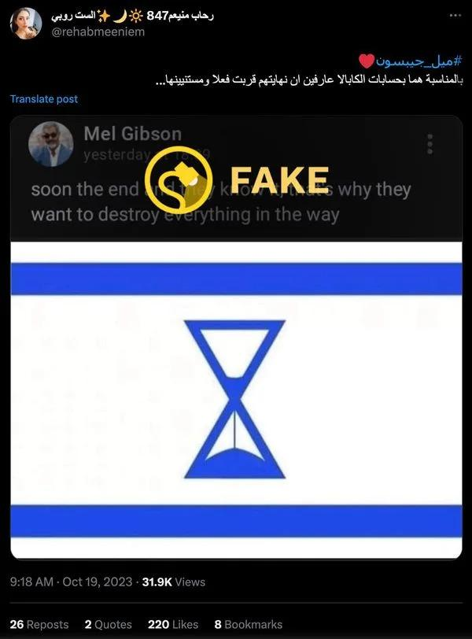

## Claim
Claim: " The image shows a screenshot of an authentic social media post from Mel Gibson saying that Israel will end soon and therefore destroy everything in its way together with a flag in the color of Israel that shows an hourglass."

## Actions
```
web_search("Mel Gibson Israel end destroy")
image_search("Mel Gibson Israel hourglass flag")
```

## Evidence
### Evidence from `web_search`
The Associated Press ([Source](https://apnews.com/article/fact-check-mel-gibson-israel-post-342335121493)) and Yahoo ([Source](https://www.yahoo.com/entertainment/fact-check-mel-gibson-posted-200700554.html)) both state that the image of Mel Gibson's post is fake. The Daily Dot ([Source](https://www.dailydot.com/debug/mel-gibson-the-end-of-israel-fake-post/)) also confirms that the social media post attributed to Mel Gibson is fake, and that Gibson does not have any social media accounts. The post includes an altered Israeli flag with an hourglass. , , 

The Daily Dot article was written by Mikael Thalen , .


### Evidence from `image_search`
Yahoo Entertainment fact-checked a social media post attributed to Mel Gibson (). Al Jazeera published an article about Mel Gibson ().

Relevant URLs: [https://www.yahoo.com/entertainment/fact-check-mel-gibson-posted-235600604.html](https://www.yahoo.com/entertainment/fact-check-mel-gibson-posted-235600604.html), [https://www.aljazeera.com/news/2004/4/4/palestinians-love-mel-gibsons-film](https://www.aljazeera.com/news/2004/4/4/palestinians-love-mel-gibsons-film).


## Elaboration
The claim is false. Multiple sources, including the Associated Press ([https://apnews.com/article/fact-check-mel-gibson-israel-post-342335121493](https://apnews.com/article/fact-check-mel-gibson-israel-post-342335121493)), Yahoo ([https://www.yahoo.com/entertainment/fact-check-mel-gibson-posted-200700554.html](https://www.yahoo.com/entertainment/fact-check-mel-gibson-posted-200700554.html)), and The Daily Dot ([https://www.dailydot.com/debug/mel-gibson-the-end-of-israel-fake-post/](https://www.dailydot.com/debug/mel-gibson-the-end-of-israel-fake-post/)), confirm that the social media post attributed to Mel Gibson is fake. The post includes an altered Israeli flag with an hourglass. Furthermore, Gibson does not have any social media accounts.


## Final Judgement
The claim is demonstrably false. Multiple reliable sources confirm that the social media post attributed to Mel Gibson is fake. The post includes an altered Israeli flag with an hourglass, and Gibson does not have any social media accounts.

`false`

### Verdict: FALSE

### Justification
The claim is false. Multiple sources, including the Associated Press ([https://apnews.com/article/fact-check-mel-gibson-israel-post-342335121493](https://apnews.com/article/fact-check-mel-gibson-israel-post-342335121493)), Yahoo ([https://www.yahoo.com/entertainment/fact-check-mel-gibson-posted-200700554.html](https://www.yahoo.com/entertainment/fact-check-mel-gibson-posted-200700554.html)), and The Daily Dot ([https://www.dailydot.com/debug/mel-gibson-the-end-of-israel-fake-post/](https://www.dailydot.com/debug/mel-gibson-the-end-of-israel-fake-post/)), confirm that the social media post attributed to Mel Gibson is fake.
