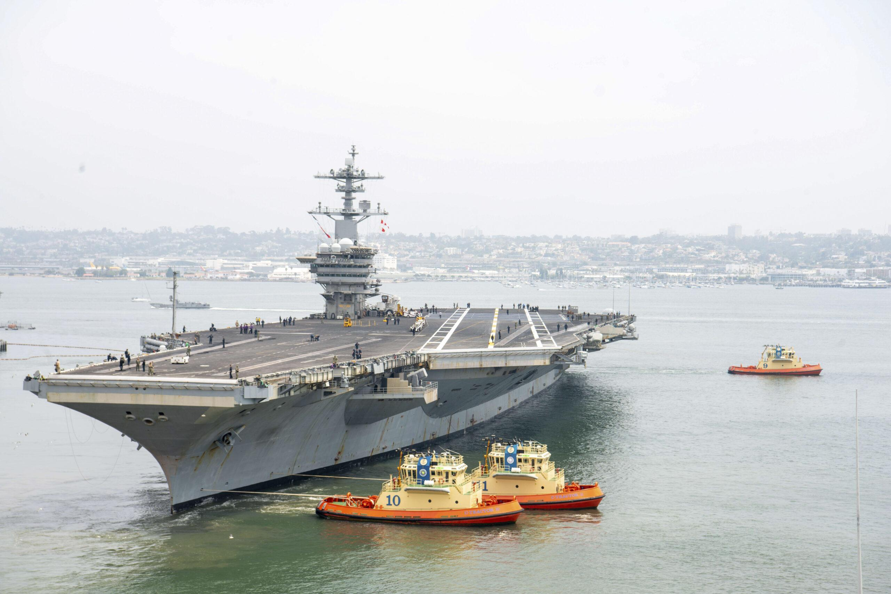
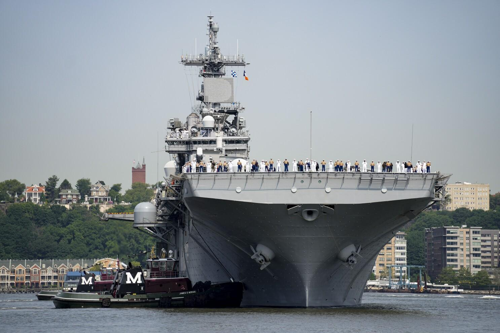
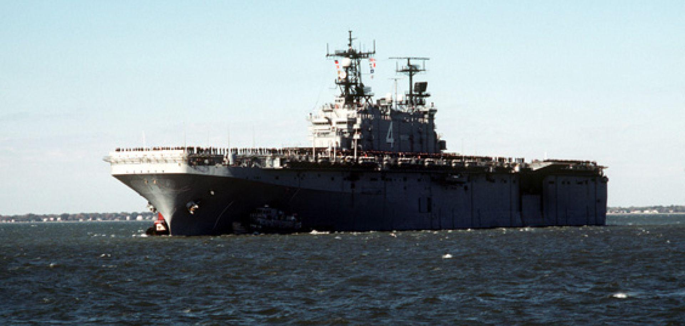

## Claim
Claim: " This image shows U.S. warships being en route to the Lebanon coast in August 2024 to support the Israel Defence Forces (IDF)."

## Actions
```
web_search("US warships Lebanon coast August 2024")
image_search("US warships Lebanon coast")
```

## Evidence
### Evidence from `web_search`
NPR reported on August 3, 2024, that the U.S. is sending more warships to the Middle East as Israel steps up attacks, with Israel expecting an attack from Iran and its allies (). USNI News reported on August 2, 2024, that the USS Abraham Lincoln is heading to the Middle East, and the three-ship Wasp Amphibious Ready Group is in the Eastern Mediterranean (). Military.com reported on September 20, 2024, about the increased U.S. military presence in the Middle East, including warships in the eastern Mediterranean Sea, and a shift in focus to the northern front against Hezbollah in Lebanon ().

The sources do not explicitly state that the warships are en route to the Lebanon coast to support the IDF.


### Evidence from `image_search`
The article from L'Orient-Le Jour discusses which American warships are en route to Lebanon. () The Associated Press published an image of a U.S. warship. () The search result from Stratfor contains an image of a U.S. warship. ()

The provided sources do not mention the image in the claim () or the claim's assertion that the warships were en route to the Lebanon coast in August 2024 to support the Israel Defence Forces (IDF).


## Elaboration
The evidence confirms that U.S. warships were deployed to the Eastern Mediterranean in August and September 2024. However, the evidence does not explicitly state that the warships were en route to the Lebanon coast or that their purpose was to support the IDF. Therefore, the claim cannot be fully verified based on the provided evidence.

The evidence does mention a shift in focus to the northern front against Hezbollah in Lebanon, which suggests a potential connection to the claim, but it does not confirm the claim's specific details.

To verify the claim, additional information is needed to confirm the destination of the warships and their specific mission.


## Actions
```
reverse_search()
```

## Evidence
### Evidence from `reverse_search`
The image (

## Elaboration
The reverse image search did not provide any information about the image's origin or context. Therefore, the claim remains unverified.


## Actions
```
web_search("US Navy warships Middle East August 2024 IDF support")
```

## Evidence
### Evidence from `web_search`
The Guardian, CNN, and Reuters reported in August 2024 that the U.S. deployed warships and fighter jets to the Middle East to bolster Israeli defenses due to rising regional tensions and the possibility of Iranian retaliation (, , ). The U.S. is increasing support for the defense of Israel. The Guardian mentions the deployment of the Abraham Lincoln strike group and a guided missile submarine.


## Elaboration
The evidence confirms that the U.S. deployed warships to the Middle East in August 2024 to support Israel's defense. However, the evidence does not explicitly state that the warships were en route to the Lebanon coast. The image search did not provide any information about the image's origin or context. Therefore, the claim is partially supported, but the specific detail about the Lebanon coast remains unverified.


## Final Judgement
The evidence indicates that U.S. warships were deployed to the Middle East in August 2024 to support Israel's defense. However, the claim that the warships were en route to the Lebanon coast cannot be verified. The image's origin and context remain unknown.

`false`


### Verdict: FALSE

### Justification
The claim is **unverified**. While evidence confirms the deployment of U.S. warships to the Middle East in August 2024 to support Israel's defense, as reported by sources like the [Guardian](), the claim that these warships were en route to the Lebanon coast cannot be verified. The reverse image search did not provide any information about the image's origin or context.
