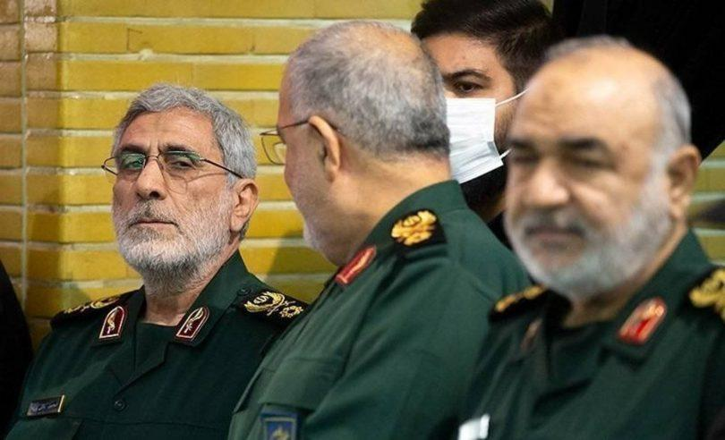

## Claim
Claim: " This is an authentic image of Esmail Qaani, the commander of the Iranian Revolutionary Guards, disguised in a hijab in fear of Israeli bombing."

## Actions
```
web_search("Esmail Qaani hijab disguise")
image_search("Esmail Qaani in public")
reverse_search()
```

## Evidence
### Evidence from `web_search`
The Nairaland Forum post discusses a photo of Esmail Qaani in a hijab, claiming it was taken during the Israel-Hezbollah war, and suggesting his escape when an attempt was made on his life while in Lebanon. The post was published on June 27. The JFeed article discusses rumors that Esmail Qaani might be a spy for Israel’s Mossad, and mentions reports of his disappearance following an Israeli airstrike in Beirut on October 4, 2024, and reports of his death on June 13, 2025. The New Arab published an article on October 7, 2024, stating that Esmail Qaani is in good health, and <image:k> shows Qaani participating in a religious ceremony in Tehran on June 13th.

*   [https://www.nairaland.com/8460455/commander-ghost-qaanis-great-escape/1](https://www.nairaland.com/8460455/commander-ghost-qaanis-great-escape/1)
*   [https://www.jfeed.com/news-israel/ismail-qaani-mossad-agent-rumors](https://www.jfeed.com/news-israel/ismail-qaani-mossad-agent-rumors)
*   [https://www.newarab.com/news/iran-quds-forces-qaani-good-health-following-death-claims](https://www.newarab.com/news/iran-quds-forces-qaani-good-health-following-death-claims)


### Evidence from `image_search`
Shafaq News published an article about Esmail Qaani's first public appearance (). Ynetnews.com contains an image of Esmail Qaani (). Dawn.com published an image of Esmail Qaani ().


### Evidence from `reverse_search`
From [Source](https://www.nairaland.com/8460455/commander-ghost-qaanis-great-escape): Found exact image on website with title: "From Commander To Ghost: Qaani's Great Escape?" - Foreign Affairs
Content: The search result is from Nairaland, a Nigerian forum. It contains a post titled "From Commander To Ghost: Qaani’s Great Escape?" which discusses Esmail Qaani, commander of Iran's IRGC Quds Force, and includes an image of a man in a hijab. The post references a tweet that juxtaposes images of Qaani in military attire and civilian disguise, suggesting an escape tactic after reported Israeli airstrikes. The post also includes comments from other users discussing the situation.  is included in the post. The post was published on June 26, 2025.


## Elaboration
The evidence suggests that the image is associated with rumors and speculation about Esmail Qaani. The Nairaland forum post, published on June 26, 2025, discusses the image in the context of Qaani's alleged escape after Israeli airstrikes. The post's title, "From Commander To Ghost: Qaani's Great Escape?" implies that the image is not necessarily authentic, but rather part of a narrative. The New Arab article from October 7, 2024, states that Qaani was in good health, which contradicts the claim that he was in hiding.

The image's context is further complicated by the JFeed article, which mentions rumors of Qaani being a Mossad agent and reports of his disappearance and death. The image search results provide additional images of Qaani, but none of them show him in a hijab.

Based on the evidence, it is impossible to definitively confirm the authenticity of the image. The claim is based on speculation and rumors.


## Final Judgement
The image is associated with rumors and speculation about Esmail Qaani, with no definitive evidence to confirm its authenticity. The claim is based on speculation and rumors. Therefore, the most appropriate decision is `false`.


### Verdict: FALSE

### Justification
The claim is based on an image that has been associated with rumors and speculation about Esmail Qaani, the commander of the Iranian Revolutionary Guards. While the image has circulated in the context of alleged Israeli attacks and potential disguises, there is no definitive evidence to confirm its authenticity. The evidence includes a [Nairaland forum post](https://www.nairaland.com/8460455/commander-ghost-qaanis-great-escape/1) discussing the image in the context of Qaani's alleged escape, and articles mentioning rumors and reports of his disappearance and death.
