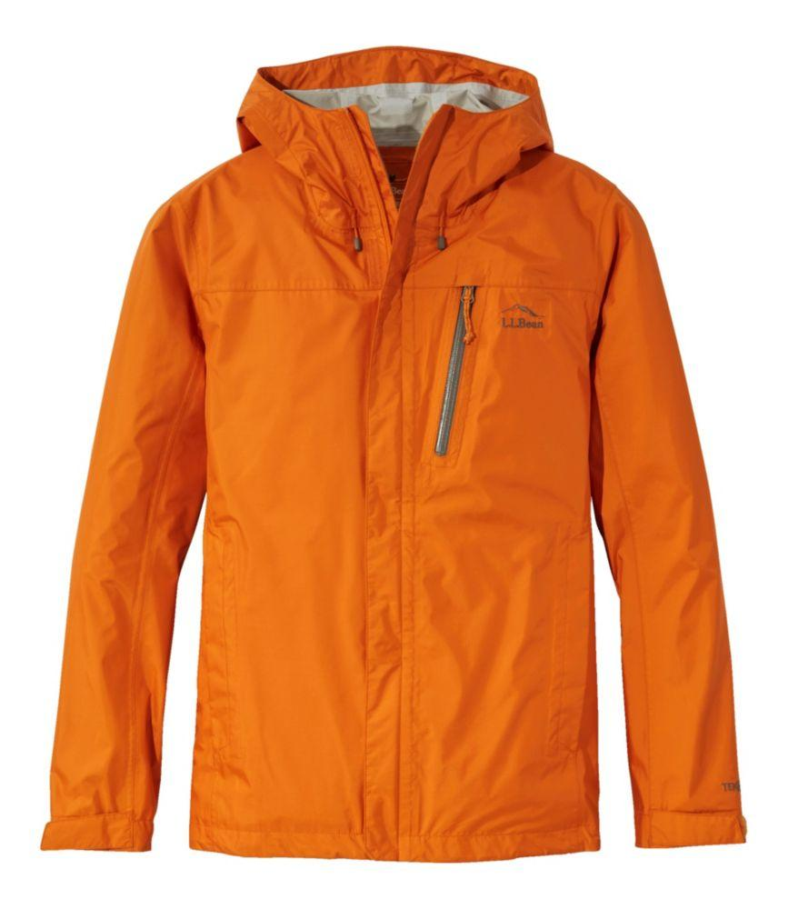
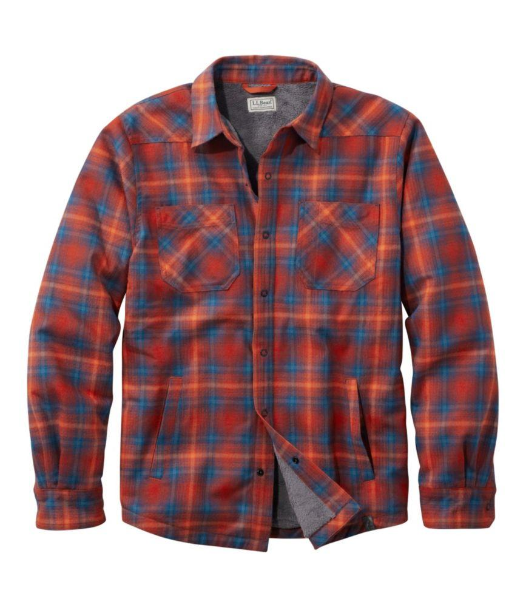
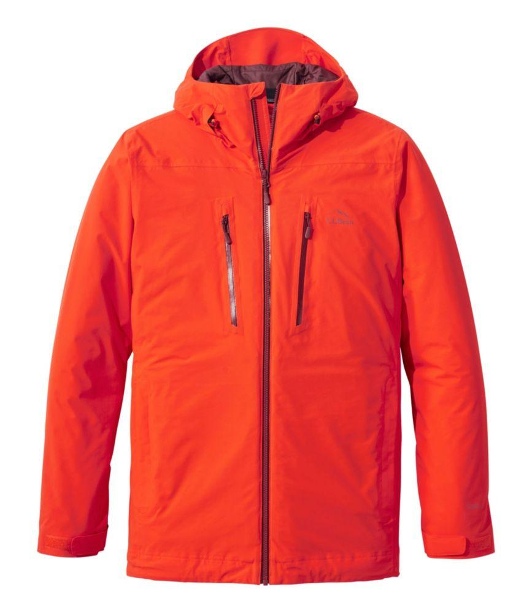
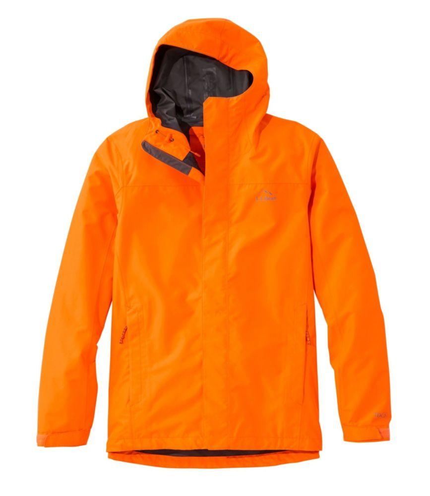
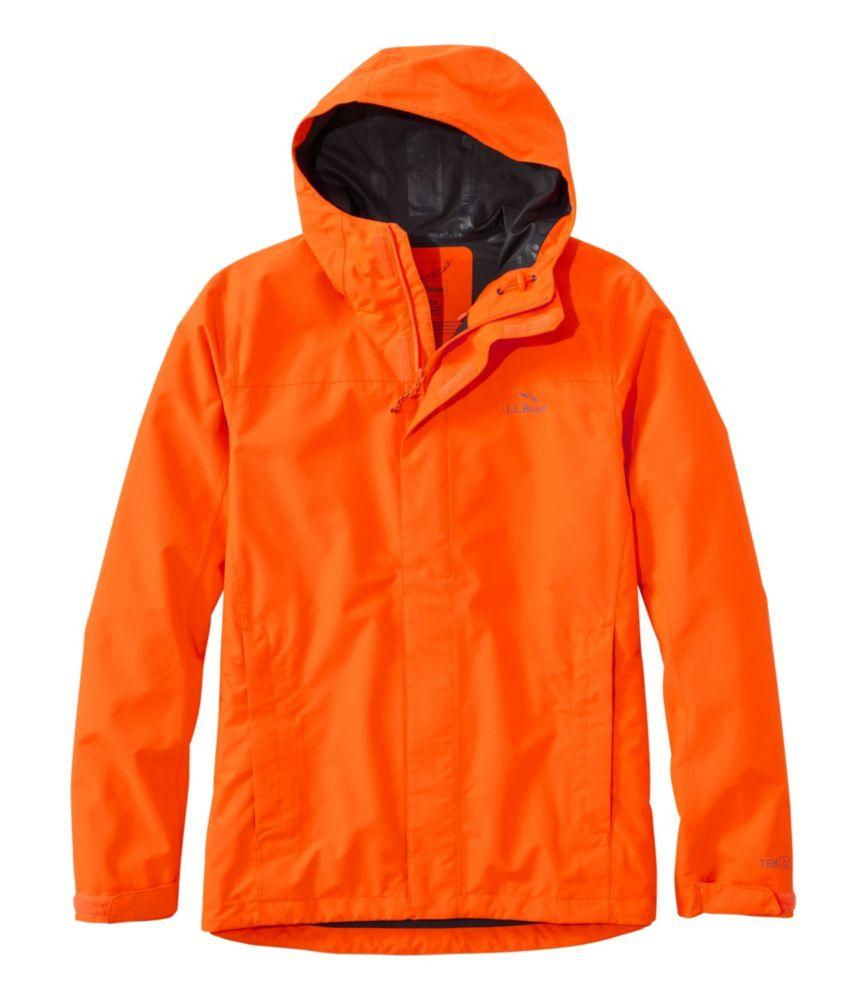
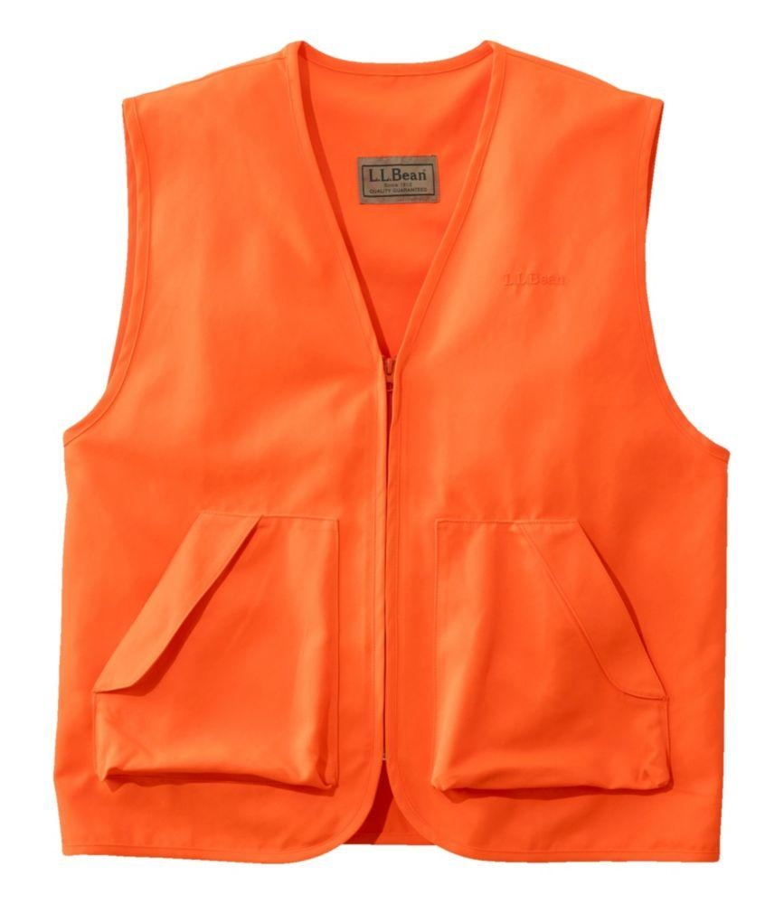
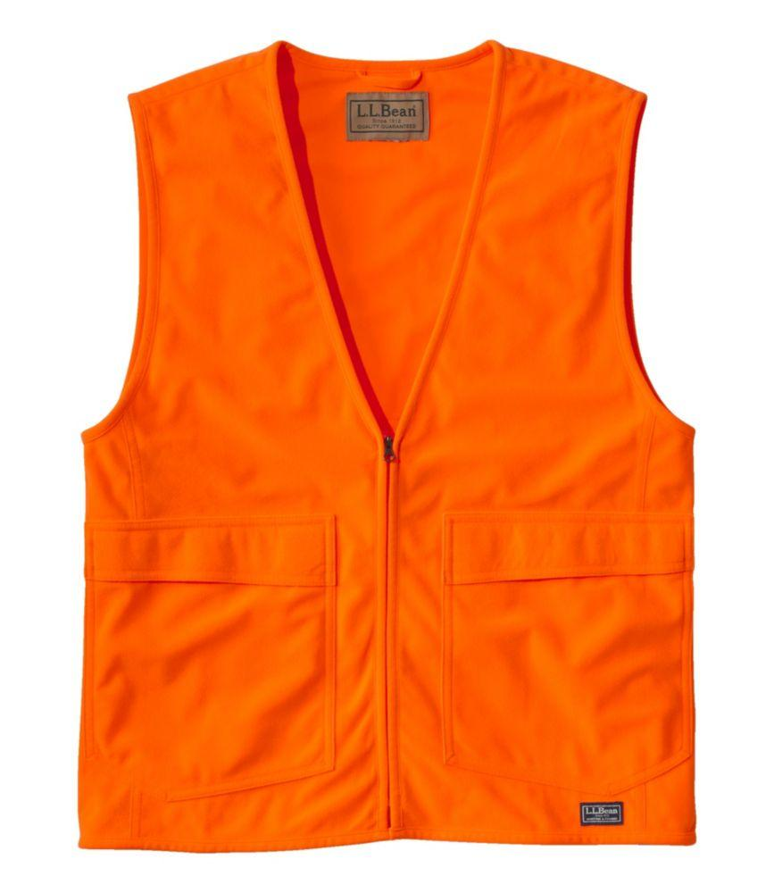
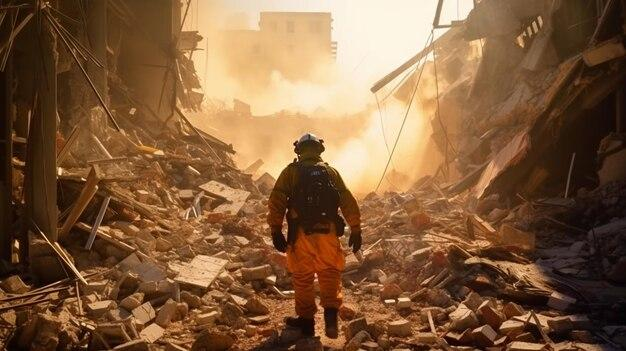

## Claim
Claim: " This image shows a man from Gaza holding the hand of his son killed in an Israeli bombing in July, 2024."

## Actions
```
reverse_search()
web_search("man orange jacket rubble")
```

## Evidence
### Evidence from `reverse_search`
The image shows Mesut Hancer holding the hand of his 15-year-old daughter, Irmak, who died in an earthquake in Kahramanmaras, Turkey. The earthquake occurred on February 6 or 7, 2023. The photo was taken by Adem Altan, a photographer with AFP.

The image was published by The Independent ([https://www.independent.co.uk/news/world/middle-east/turkey-earthquake-father-daughter-hold-hands-b2277655.html](https://www.independent.co.uk/news/world/middle-east/turkey-earthquake-father-daughter-hold-hands-b2277655.html)), SBS News ([https://www.sbs.com.au/news/article/the-story-behind-this-turkey-earthquake-photo-that-many-will-never-forget/2ijedstvo](https://www.sbs.com.au/news/article/the-story-behind-this-turkey-earthquake-photo-that-many-will-never-forget/2ijedstvo)), and CNN ([https://www.cnn.com/2023/02/13/middleeast/turkey-quake-man-daughter-hand-photo-intl](https://www.cnn.com/2023/02/13/middleeast/turkey-quake-man-daughter-hand-photo-intl)). 


### Evidence from `web_search`
The search results include a photo of a man in an orange jacket walking through rubble, available on Vecteezy ([https://www.vecteezy.com/photo/59962955-a-man-in-an-orange-jacket-and-hard-hat-is-walking-through-rubble](https://www.vecteezy.com/photo/59962955-a-man-in-an-orange-jacket-and-hard-hat-is-walking-through-rubble)). The search also shows various orange jackets and vests for men from LLBean.com (, , , , , , , , , , , , , , , , , , , ).

Additionally, Freepik provides an AI-generated image of a man in an orange and black jacket walking through rubble ().


## Elaboration
The claim is false. The image depicts Mesut Hancer holding the hand of his deceased daughter, Irmak, after an earthquake in Turkey in February 2023, not a bombing in Gaza in July 2024.


## Final Judgement
The image shows a man holding the hand of his deceased daughter after an earthquake in Turkey in February 2023. The claim misrepresents the context of the image, stating it depicts a man from Gaza holding the hand of his son killed in an Israeli bombing in July 2024.

`false`

### Verdict: FALSE

### Justification
The image in the claim is of a father in Turkey holding his deceased daughter's hand after an earthquake in February 2023, not a bombing in Gaza in July 2024, as stated in the claim. The photo was taken by Adem Altan and published by multiple news sources, including The Independent ([https://www.independent.co.uk/news/world/middle-east/turkey-earthquake-father-daughter-hold-hands-b2277655.html](https://www.independent.co.uk/news/world/middle-east/turkey-earthquake-father-daughter-hold-hands-b2277655.html)).
