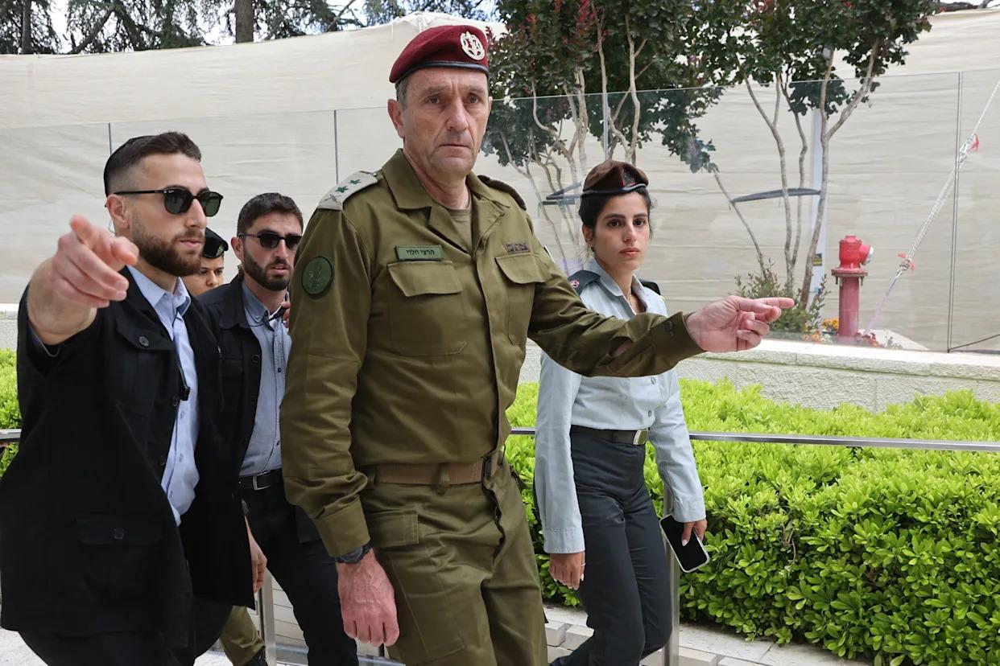
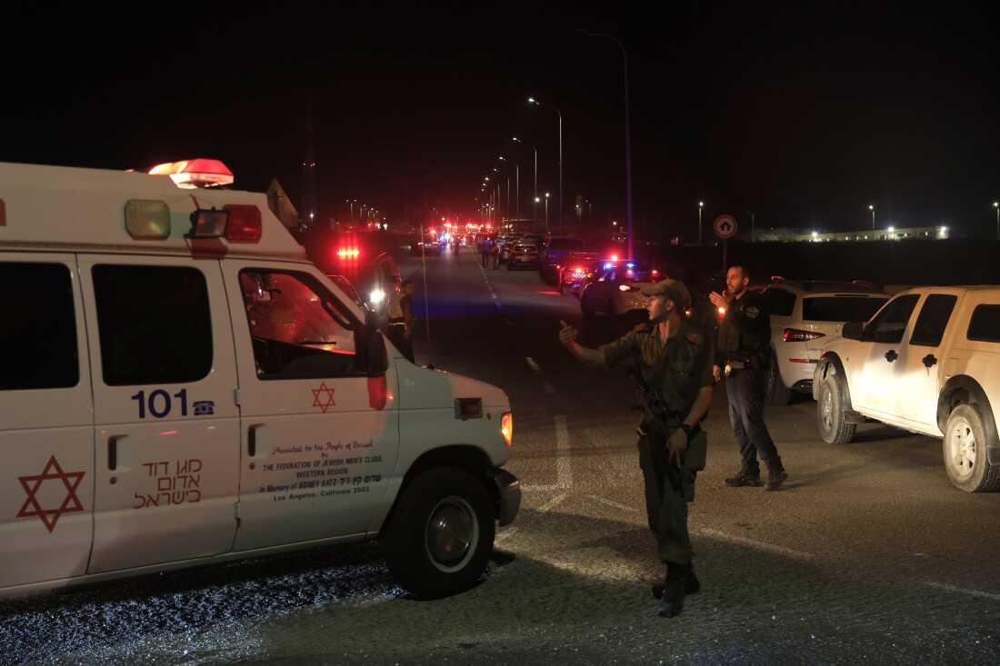

## Claim
Claim: "The chief of the Israeli Defense Forces (IDF), Herzi Halevi, was assassinated in a Hezbollah drone attack on an Israeli military base on October 13, 2024."

## Actions
```
web_search("Herzi Halevi assassination Hezbollah drone attack")
web_search("IDF military base drone attack October 13 2024")
```

## Evidence
### Evidence from `web_search`
CNN reports on a Hezbollah drone attack on an Israeli military base, which resulted in the death of four soldiers and injuries to over 60 others. The attack occurred on a Sunday and hit the Golani Brigade’s base. The article includes a photo of IDF chief of staff Herzi Halevi visiting the military base (<image:k>). The article was updated on October 14, 2024. [Source](https://www.cnn.com/2024/10/14/middleeast/hezbollah-attack-israel-weaknesses-drones-intl-cmd)

Yahoo News, originally from USA TODAY, fact-checks the claim that Herzi Halevi was assassinated in a Hezbollah drone attack and states that the claim is false. The article includes photos of Halevi visiting the military base after the drone attack (). The article was published on October 18, 2024. [Source](https://www.yahoo.com/news/no-israels-defense-chief-not-213141242.html)


### Evidence from `web_search`
On October 13, 2024, Hezbollah launched a drone attack on an Israeli army base near Binyamina, Israel. The attack resulted in the death of four Israeli soldiers and injuries to dozens more. The attack targeted the Golani Brigade's Zar’it barracks. The attack was in retaliation for an Israeli strike on Beirut.

The sources include a CNN article ([https://www.cnn.com/world/live-news/israel-war-iran-palestine-lebanon-10-13-24](https://www.cnn.com/world/live-news/israel-war-iran-palestine-lebanon-10-13-24)), a Wikipedia article ([https://en.wikipedia.org/wiki/2024_Hezbollah_drone_strike_on_Binyamina](https://en.wikipedia.org/wiki/2024_Hezbollah_drone_strike_on_Binyamina)), and an NPR report ([https://www.npr.org/2024/10/13/g-s1-28089/hezbollah-drone-strike-israel-binyamina](https://www.npr.org/2024/10/13/g-s1-28089/hezbollah-drone-strike-israel-binyamina)). The CNN article mentions the attack resulted in the death of four Israeli soldiers and injuries to over 60 others <image:k>. The Wikipedia article states the attack resulted in 4 deaths and 58 injuries <image:k>. The NPR report states the attack killed four IDF soldiers and injured dozens , .


## Elaboration
The claim that Herzi Halevi was assassinated in a Hezbollah drone attack is false. A Yahoo News article, originally from USA TODAY, explicitly states that the claim is false and includes photos of Halevi visiting the military base after the drone attack. The drone attack did occur on October 13, 2024, on an Israeli army base near Binyamina, resulting in the death of four soldiers and injuries to dozens more.


## Final Judgement
The claim that Herzi Halevi was assassinated in a Hezbollah drone attack is demonstrably false. Multiple reliable sources, including a Yahoo News article, confirm that the claim is false and provide evidence, such as photos of Halevi visiting the military base after the attack. The drone attack did occur, but Halevi was not killed.

`false`

### Verdict: FALSE

### Justification
The claim is false. While a Hezbollah drone attack did occur on an Israeli military base on October 13, 2024, resulting in casualties, the IDF chief of staff, Herzi Halevi, was not assassinated. A fact-check by Yahoo News, originally from USA TODAY, explicitly states that the claim is false and provides evidence, including photos of Halevi visiting the base after the attack ([https://www.yahoo.com/news/no-israels-defense-chief-not-213141242.html](https://www.yahoo.com/news/no-israels-defense-chief-not-213141242.html)).
