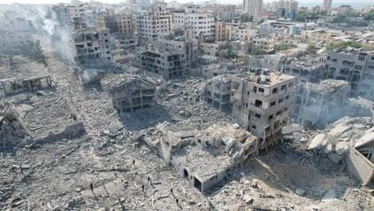
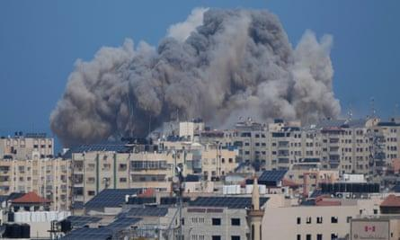
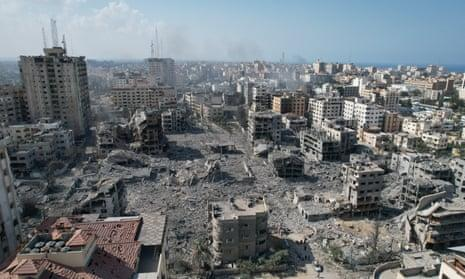

## Claim
Claim: "The Guardian published an article with the headline: 'Gaza will rise from the ashes to become a city of the future to rival Bradford.'"

## Actions
```
web_search("Guardian Gaza city of the future")
```

## Evidence
### Evidence from `web_search`
From [Source](https://www.theguardian.com/commentisfree/2025/aug/20/the-guardian-view-on-gazas-future-israel-should-end-the-killing-its-allies-must-not-remain-complicit): 
Content: The Guardian published an article on August 20, 2025, discussing the future of Gaza. The article mentions the Israel-Gaza war and the suffering of Palestinians. It also refers to a plan for Gaza City and includes a photograph. <image:k>


## Elaboration
1.  The evidence confirms that The Guardian published an article about Gaza's future.
2.  The evidence does not mention the specific headline "Gaza will rise from the ashes to become a city of the future to rival Bradford."
3.  The evidence is insufficient to verify the claim.


## Actions
```
web_search("Guardian Gaza rise from ashes Bradford")
```

## Evidence
### Evidence from `web_search`
The Guardian published an article on October 12, 2023, with the headline "‘The buildings are now ashes’: nowhere feels safe from Israeli bombs in Gaza" ([https://www.theguardian.com/world/2023/oct/12/the-buildings-are-now-ashes-gazans-feel-nowhere-is-safe-from-israeli-bombs](https://www.theguardian.com/world/2023/oct/12/the-buildings-are-now-ashes-gazans-feel-nowhere-is-safe-from-israeli-bombs)). The article includes photographs of the destruction in Gaza , ,  and does not mention Bradford.

The BBC published an article on July 11, 2024, about a debate in Bradford Council regarding a ceasefire in Gaza ([https://www.bbc.com/news/articles/cyx0w9d74ylo](https://www.bbc.com/news/articles/cyx0w9d74ylo)). The article includes images of Bradford Town Hall  and does not mention the headline "Gaza will rise from the ashes to become a city of the future to rival Bradford."


## Elaboration
1.  The Guardian published an article on October 12, 2023, with the headline "‘The buildings are now ashes’: nowhere feels safe from Israeli bombs in Gaza" ([https://www.theguardian.com/world/2023/oct/12/the-buildings-are-now-ashes-gazans-feel-nowhere-is-safe-from-israeli-bombs](https://www.theguardian.com/world/2023/oct/12/the-buildings-are-now-ashes-gazans-feel-nowhere-is-safe-from-israeli-bombs)). This article does not match the claim.
2.  The BBC published an article on July 11, 2024, about a debate in Bradford Council regarding a ceasefire in Gaza ([https://www.bbc.com/news/articles/cyx0w9d74ylo](https://www.bbc.com/news/articles/cyx0w9d74ylo)). This article does not match the claim.
3.  The evidence does not support the claim.


## Final Judgement
The search results show that The Guardian published articles about Gaza, but none with the specific headline mentioned in the claim. The search also revealed an article about a debate in Bradford regarding a ceasefire in Gaza, but it does not match the claim either. Therefore, there is no evidence to support the claim. `false`


### Verdict: FALSE

### Justification
The Guardian published articles about Gaza, including one with the headline "‘The buildings are now ashes’: nowhere feels safe from Israeli bombs in Gaza" ([https://www.theguardian.com/world/2023/oct/12/the-buildings-are-now-ashes-gazans-feel-nowhere-is-safe-from-israeli-bombs](https://www.theguardian.com/world/2023/oct/12/the-buildings-are-now-ashes-gazans-feel-nowhere-is-safe-from-israeli-bombs)), but none with the headline "Gaza will rise from the ashes to become a city of the future to rival Bradford." Therefore, the claim is not supported by the evidence.
