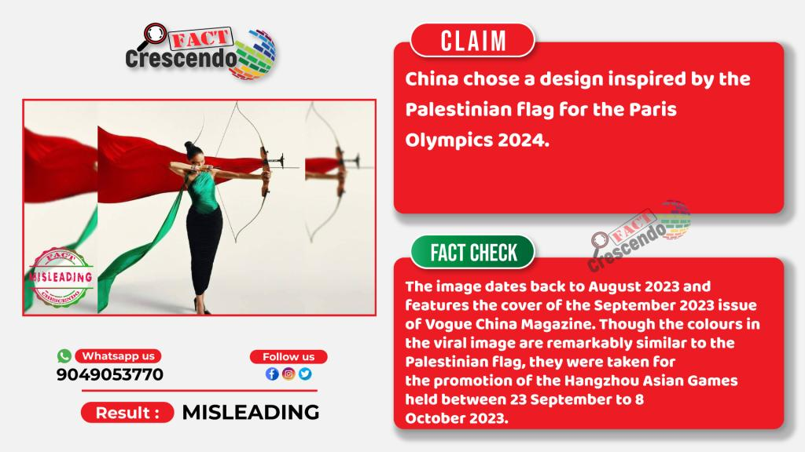

## Claim
Claim: " This image shows an athlete of China which has chosen a design of the Palestinian flag for the Paris 2024 Olympics."

## Actions
```
reverse_search()
web_search("China Paris 2024 Olympics Palestinian flag design")
```

## Evidence
### Evidence from `web_search`
The image in the claim is from the September 2023 issue of Vogue China Magazine and was taken for the promotion of the Hangzhou Asian Games, not the Paris 2024 Olympics. The claim is misleading. China's uniform for the Paris Olympics features red and white colors.

The sources are: [Source](https://srilanka.factcrescendo.com/english/china-has-not-chosen-a-design-inspired-by-the-palestinian-flag-for-the-paris-olympics-2024/) and [Source](https://factly.in/an-old-photo-from-vogue-china-magazine-is-being-falsely-shared-as-showing-chinese-athletes-wearing-the-colours-of-the-palestinian-flag/). , , , , , , , , 


## Elaboration
The claim is misleading. The image is from Vogue China Magazine and was taken for the Hangzhou Asian Games, not the Paris 2024 Olympics. The uniform for the Paris Olympics features red and white colors.


## Final Judgement
The claim is false because the image is from Vogue China Magazine and was taken for the Hangzhou Asian Games, not the Paris 2024 Olympics. The uniform for the Paris Olympics features red and white colors. `false`

### Verdict: FALSE

### Justification
The claim is false. The image originates from the September 2023 issue of Vogue China Magazine and was created to promote the Hangzhou Asian Games, not the Paris 2024 Olympics, as stated by [Fact Crescendo](https://srilanka.factcrescendo.com/english/china-has-not-chosen-a-design-inspired-by-the-palestinian-flag-for-the-paris-olympics-2024/) and [Factly](https://factly.in/an-old-photo-from-vogue-china-magazine-is-being-falsely-shared-as-showing-chinese-athletes-wearing-the-colours-of-the-palestinian-flag/).
