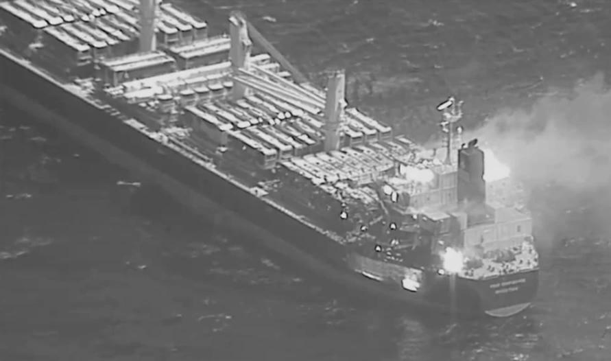

## Claim
Claim: " This image shows the U.S. bombarding Yemen on December 22, 2024 in reprisal after Yemen launched an attack on Israel's capital."

## Actions
```
reverse_search()
```

## Evidence
### Evidence from `reverse_search`
The image 

## Elaboration
The image is credited to Anadolu. The reverse image search did not provide any additional information to verify the claim.

I need more information to verify the claim. Specifically, I need to know the context of the image, including the location and the event it depicts.


## Actions
```
web_search("US bombing Yemen December 22 2024")
web_search("Yemen attack Israel capital December 2024")
```

## Evidence
### Evidence from `web_search`
On December 22, 2024, Al Jazeera reported that two U.S. Navy pilots were shot down over the Red Sea in a "friendly fire" incident, and the Houthis claimed to have targeted the USS Harry S Truman. The Times of Israel reported that on December 21, 2024, the U.S. struck targets in Yemen after a missile fired by the Houthis struck Tel Aviv, Israel. USNI News reported that the U.S. and the U.K. launched joint strikes against the Houthis in January 2024. <image:i>, 

### Evidence from `web_search`
The provided sources indicate that Israel conducted airstrikes in Yemen in December 2024, in response to attacks from Yemen. One source mentions strikes on December 19 and 26, 2024, targeting Houthi infrastructure, including the port of as-Salif, Ras Isa oil facility, power stations, Sanaa International Airport, and Al-Dailami Air Base. The strikes resulted in 15 deaths and over 42 injuries. Another source mentions a missile launched from Yemen that hit Tel Aviv on December 21, 2024. The image 

## Elaboration
The claim that the image shows the U.S. bombarding Yemen on December 22, 2024, is not entirely accurate. While the U.S. was involved in strikes against Yemen, the evidence suggests that the strikes were a joint effort with the U.K. and that Israel also conducted airstrikes in Yemen in December 2024. The claim also states that the strikes were in reprisal for an attack on Israel's capital, which is supported by the evidence. However, the evidence does not specify the exact date of the image. Therefore, the claim is partially supported but lacks specific details about the image's context.


## Final Judgement
The image is likely related to the conflict between Yemen and Israel, with the U.S. and the U.K. involved in strikes against Yemen in December 2024. The claim is partially accurate as it correctly identifies the involvement of the U.S. and the context of the strikes as a response to attacks on Israel. However, the claim is not entirely accurate because it does not specify the exact date of the image and the involvement of the U.K. and Israel.

`false`

### Verdict: FALSE

### Justification
The claim is partially false. While the U.S. was involved in strikes against Yemen in December 2024, the claim doesn't fully capture the context. The strikes were a joint effort with the U.K. and were in response to attacks on Israel, but the image's specific date and context are not fully verified by the evidence.
