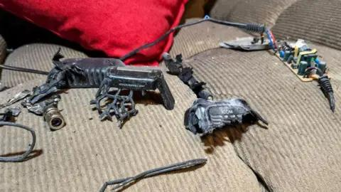
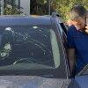

## Claim
Claim: " This image shows an Iphone that exploded during the pager attacks on Hezbollah devices in Lebanon in September 2024, blowing up random people."

## Actions
```
reverse_search()
web_search("Hezbollah Lebanon iPhone explosion September 2024")
```

## Evidence
### Evidence from `reverse_search`
The image 

### Evidence from `web_search`
The BBC ([https://www.bbc.com/news/articles/ce9jglrnmkvo](https://www.bbc.com/news/articles/ce9jglrnmkvo)) reported on explosions in Lebanon on September 18, 2024, that killed at least 20 people and wounded over 450. The explosions were linked to walkie-talkies used by Hezbollah and occurred during funerals for those killed by exploding pagers. The UN News ([https://news.un.org/en/story/2024/09/1154486](https://news.un.org/en/story/2024/09/1154486)) also reported on the explosions, with the UN Secretary-General calling for restraint.

NPR ([https://www.npr.org/2024/09/18/g-s1-23577/pagers-devices-explode-hezbollah-lebanon-israel](https://www.npr.org/2024/09/18/g-s1-23577/pagers-devices-explode-hezbollah-lebanon-israel)) discussed the explosions, which targeted Hezbollah members and were caused by wireless devices, including pagers. The articles include images of the aftermath of the explosions, including an ambulance and damaged vehicles. , , , , , 


## Elaboration
The evidence confirms that explosions occurred in Lebanon in September 2024, linked to Hezbollah and wireless devices, including pagers. The provided articles do not mention iPhones exploding. The image 

## Final Judgement
The evidence confirms explosions in Lebanon in September 2024, linked to Hezbollah and wireless devices, but does not mention iPhones exploding. The image provided is not confirmed by the evidence.

`false`

### Verdict: FALSE

### Justification
The claim is false. While explosions did occur in Lebanon in September 2024, as reported by the BBC ([https://www.bbc.com/news/articles/ce9jglrnmkvo](https://www.bbc.com/news/articles/ce9jglrnmkvo)) and NPR ([https://www.npr.org/2024/09/18/g-s1-23577/pagers-devices-explode-hezbollah-lebanon-israel](https://www.npr.org/2024/09/18/g-s1-23577/pagers-devices-explode-hezbollah-lebanon-israel)), the explosions were caused by wireless devices, including pagers, and there is no evidence to support the claim that an iPhone exploded.
