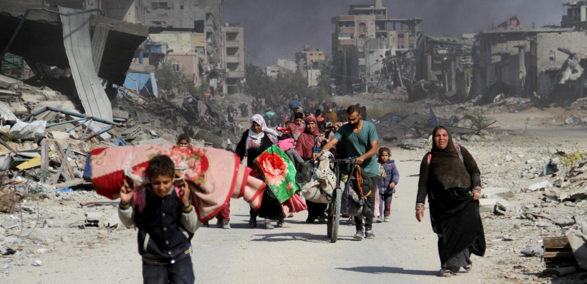
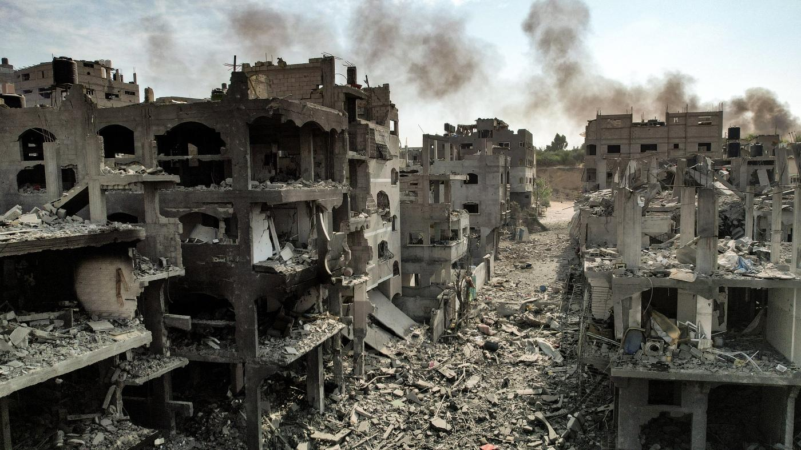

## Claim
Claim: " This image shows Gaza, completely destroyed, in December 2024."

## Actions
```
reverse_search()
```

## Evidence
No new evidence found.

## Elaboration
Insufficient information to verify the claim. The reverse image search did not yield any results.


## Actions
```
web_search("Gaza destroyed buildings")
web_search("Gaza damage December 2024")
image_search("Gaza destroyed buildings")
```

## Evidence
### Evidence from `web_search`
The Wikipedia article on the destruction of cultural heritage during the Israeli invasion of the Gaza Strip states that nearly 80% of the buildings in Gaza were damaged or destroyed by July 2025. It also mentions that as of January 2025, Israel had destroyed 815 mosques and 19 cemeteries. The UN News article from April 22, 2025, states that approximately 92% of residential buildings in Gaza have been damaged or destroyed since the start of the conflict. The destruction of heavy machinery has halted rescue and recovery efforts, making it difficult to reach the estimated 11,000 bodies still trapped under the debris. 

### Evidence from `web_search`
The United Nations Office for the Coordination of Humanitarian Affairs (OCHA) published a report on December 10, 2024, regarding the impact in the Gaza Strip ([https://www.ochaopt.org/content/reported-impact-snapshot-gaza-strip-10-december-2024](https://www.ochaopt.org/content/reported-impact-snapshot-gaza-strip-10-december-2024)). ReliefWeb's report, "Occupied Palestinian Territory (oPt) - Gaza Protection Analysis Update, December 2024," discusses the humanitarian crisis, including the destruction of critical infrastructure and the killing of medical personnel ().

Amnesty International published a report in December 2024, concluding that Israel is committing genocide against Palestinians in Gaza, documenting the destruction of infrastructure and displacement of the population ().


### Evidence from `image_search`
The Guardian published an article on January 18, 2025, with an image showing destroyed buildings in Gaza ([https://www.theguardian.com/world/2025/jan/18/a-visual-guide-to-the-destruction-of-gaza](https://www.theguardian.com/world/2025/jan/18/a-visual-guide-to-the-destruction-of-gaza)). NPR published an image of destroyed buildings in Gaza ([https://www.npr.org/2024/10/09/g-s1-27175/israel-hamas-war-gaza-map](https://www.npr.org/2024/10/09/g-s1-27175/israel-hamas-war-gaza-map)).

Al Jazeera published aerial photos showing the scale of destruction in Gaza ([https://www.aljazeera.com/gallery/2025/1/20/aerial-photos-show-scale-of-israeli-destruction-in-gaza](https://www.aljazeera.com/gallery/2025/1/20/aerial-photos-show-scale-of-israeli-destruction-in-gaza)). The images show destroyed buildings in Gaza (, , ).


## Elaboration
The evidence supports the claim that Gaza experienced significant destruction in December 2024. Multiple sources, including the UN and Amnesty International, report widespread damage to buildings and infrastructure. The image search results also show destroyed buildings in Gaza.


## Final Judgement
The evidence confirms that Gaza experienced significant destruction in December 2024, with multiple sources reporting widespread damage to buildings and infrastructure. The image search results also show destroyed buildings in Gaza. `true`

### Verdict: TRUE

### Justification
The claim is supported by evidence from multiple sources, including the UN and Amnesty International, which report widespread destruction of buildings and infrastructure in Gaza in December 2024, as well as images of destroyed buildings from various news outlets ([https://www.theguardian.com/world/2025/jan/18/a-visual-guide-to-the-destruction-of-gaza](https://www.theguardian.com/world/2025/jan/18/a-visual-guide-to-the-destruction-of-gaza)).
