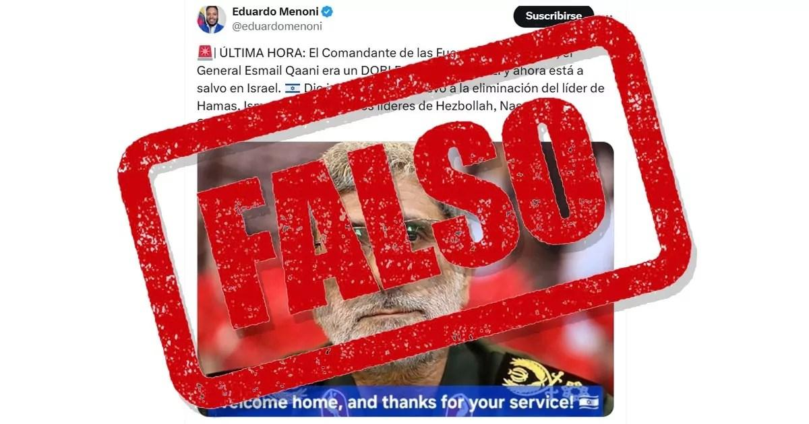
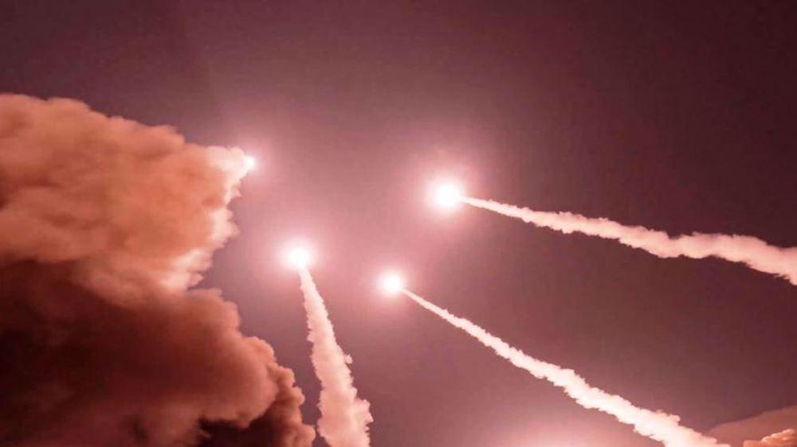

## Claim
Claim: "Iran's IRGC Quds Force commander Gen. Esmail Qaani has fled Iran in April 2025 and is confirmed safe in Israel."

## Actions
```
web_search("Esmail Qaani Israel April 2025")
web_search("IRGC Quds Force commander Esmail Qaani location")
```

## Evidence
### Evidence from `web_search`
According to a fact-check published on April 1, 2025, by Enlace Judío ([https://www.enlacejudio.com/fact-check/es-falso-que-el-general-irani-email-qaani-este-en-israel/](https://www.enlacejudio.com/fact-check/es-falso-que-el-general-irani-email-qaani-este-en-israel/)), the claim that Esmail Qaani was in Israel was an April Fool's Day joke. The article states that Qaani was last seen in Tehran. , 

Press TV ([https://www.presstv.ir/Detail/2025/04/10/745914/Iran-IRGC-Esmail-Qaani-Resistance-Front-missiles-precision-US-Israel-Gaza-Yemen-navy-Shahram-Irani](https://www.presstv.ir/Detail/2025/04/10/745914/Iran-IRGC-Esmail-Qaani-Resistance-Front-missiles-precision-US-Israel-Gaza-Yemen-navy-Shahram-Irani)) reported on April 10, 2025, that Qaani discussed the US and Israel's powerlessness against Iran and resistance groups.  The Times of Israel ([https://www.timesofisrael.com/topic/esmail-qaani/](https://www.timesofisrael.com/topic/esmail-qaani/)) published articles about Qaani, including reports from October 2024 about his status and a June 2025 report about a funeral in Tehran. <image:k>, <image:l>, <image:m>, <image:n>, <image:o>, <image:j>


### Evidence from `web_search`
Esmail Qaani is the commander of the IRGC Quds Force since 2020, according to his Wikipedia article, which also mentions EU sanctions against him in May 2024. The article does not mention Qaani fleeing Iran or being in Israel. ([https://en.wikipedia.org/wiki/Esmail_Qaani](https://en.wikipedia.org/wiki/Esmail_Qaani)) <image:k>

Ynetnews.com reported that Qaani reappeared in Tehran on June 24, 2025, after a 12-day disappearance, dispelling rumors of his death. ([https://www.ynetnews.com/article/bkkoeco4xe](https://www.ynetnews.com/article/bkkoeco4xe)) ,  The Jerusalem Post reported on June 25, 2025, that Qaani was seen at a rally in Tehran. ([https://www.jpost.com/middle-east/article-858902](https://www.jpost.com/middle-east/article-858902)) <image:k>


## Elaboration
The claim is demonstrably false. A fact-check from Enlace Judío ([https://www.enlacejudio.com/fact-check/es-falso-que-el-general-irani-email-qaani-este-en-israel/](https://www.enlacejudio.com/fact-check/es-falso-que-el-general-irani-email-qaani-este-en-israel/)) explicitly states that the claim was an April Fool's Day joke. Furthermore, multiple sources, including Press TV ([https://www.presstv.ir/Detail/2025/04/10/745914/Iran-IRGC-Esmail-Qaani-Resistance-Front-missiles-precision-US-Israel-Gaza-Yemen-navy-Shahram-Irani](https://www.presstv.ir/Detail/2025/04/10/745914/Iran-IRGC-Esmail-Qaani-Resistance-Front-missiles-precision-US-Israel-Gaza-Yemen-navy-Shahram-Irani)), Ynetnews.com ([https://www.ynetnews.com/article/bkkoeco4xe](https://www.ynetnews.com/article/bkkoeco4xe)), and The Jerusalem Post ([https://www.jpost.com/middle-east/article-858902](https://www.jpost.com/middle-east/article-858902)), provide evidence of Qaani's presence in Tehran during April and June 2025.


## Final Judgement
The claim is demonstrably false. The evidence indicates that the claim originated as an April Fool's Day joke and is contradicted by multiple sources reporting Qaani's presence in Tehran. Therefore, the claim is not factually accurate. `false`

### Verdict: FALSE

### Justification
The claim that Esmail Qaani fled to Israel in April 2025 is false. A fact-check by Enlace Judío ([https://www.enlacejudio.com/fact-check/es-falso-que-el-general-irani-email-qaani-este-en-israel/](https://www.enlacejudio.com/fact-check/es-falso-que-el-general-irani-email-qaani-este-en-israel/)) identified the claim as an April Fool's Day joke. Furthermore, reports from Press TV, Ynetnews.com, and The Jerusalem Post confirm Qaani's presence in Tehran during the relevant time frame.
