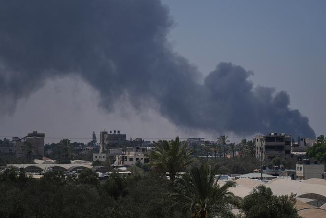
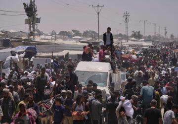
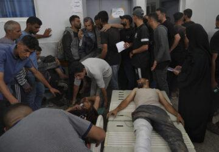
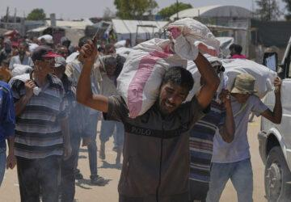
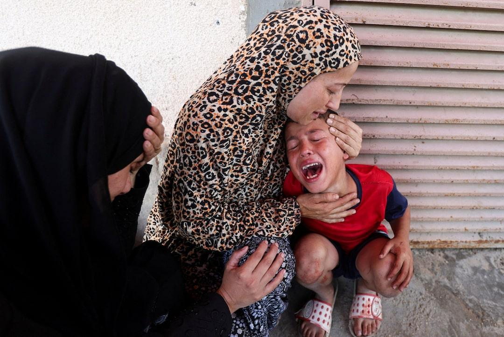

## Claim
Claim: " This image shows heavy Israeli bombardment on Deir al-Balah in the southern Gaza Strip in March 2025 which killed at least four Palestinians."

## Actions
```
web_search("Israeli bombardment Deir al-Balah March 2025")
image_search("Deir al-Balah bombardment March 2025")
reverse_search()
```

## Evidence
### Evidence from `web_search`
The provided sources discuss Israeli attacks on the Gaza Strip, including Deir al-Balah, in March and July 2025. One source, a Wikipedia article, details attacks starting March 18, 2025, resulting in over 591 deaths and 1,042 injuries, with a "focused ground operation" in central Gaza. Another source, a UN News article, mentions strikes on a UN compound in Deir Al Balah on March 19, 2025, caused by an Israeli tank. A Guardian article from July 21, 2025, reports on an Israeli air and ground assault on Deir al-Balah, with Israeli tanks entering the area and at least three Palestinians killed in tank shelling. The UN article also mentions the Secretary-General's decision to reduce the UN's aid operation in Gaza. 

### Evidence from `image_search`
PBS NewsHour published an article about Israeli strikes in Gaza. ([https://www.pbs.org/newshour/world/israel-resumes-strikes-in-gaza-killing-more-than-400-palestinians-and-shattering-ceasefire-with-hamas](https://www.pbs.org/newshour/world/israel-resumes-strikes-in-gaza-killing-more-than-400-palestinians-and-shattering-ceasefire-with-hamas)) 

An article from Le Monde discusses the collapse of a humanitarian deal between the EU and Israel in Gaza. ([https://www.lemonde.fr/en/international/article/2025/07/23/in-gaza-the-humanitarian-deal-between-the-eu-and-israel-collapses_6743643_4.html](https://www.lemonde.fr/en/international/article/2025/07/23/in-gaza-the-humanitarian-deal-between-the-eu-and-israel-collapses_6743643_4.html)) 


### Evidence from `reverse_search`
The image in the claim (

## Elaboration
The evidence confirms that Deir al-Balah was subject to Israeli bombardment in March 2025. The web search results mention attacks starting March 18, 2025, and a UN News article specifies strikes on a UN compound on March 19, 2025. The Guardian article from July 21, 2025, also reports on an Israeli air and ground assault on Deir al-Balah.

The evidence does not explicitly state that the bombardment in March 2025 killed at least four Palestinians. However, the Wikipedia article mentions over 591 deaths in attacks starting March 18, 2025.

Therefore, the claim is partially verifiable. The evidence supports the occurrence of Israeli bombardment in Deir al-Balah in March 2025. However, the exact number of casualties from the March attacks is not explicitly confirmed by the provided sources.


## Actions
```
web_search("Deir al-Balah March 2025 casualties")
```

## Evidence
### Evidence from `web_search`
The search results provide information on casualties in Deir al-Balah. An Associated Press article from July 2025 reports that the Palestinian death toll from the Israel-Hamas war passed 55,000. A UN News article from March 19, 2025, states that at least one UN staff member was killed and five others injured in an explosion at a UN guesthouse in Deir al-Balah. Reuters reports on an Israeli airstrike in Deir al-Balah on July 10, 2025, near a medical center, resulting in the deaths of 10 children and 6 adults. , , , , , , , 


## Elaboration
The evidence confirms that there were casualties in Deir al-Balah due to Israeli attacks. Specifically, a UN staff member was killed and five others injured on March 19, 2025, in an explosion at a UN guesthouse. While the evidence does not explicitly state that at least four Palestinians were killed in March 2025, it does confirm casualties.

Therefore, the claim is partially supported. The evidence confirms that there were casualties in Deir al-Balah in March 2025, but the exact number of Palestinian deaths is not explicitly stated.


## Final Judgement
The evidence confirms Israeli bombardment in Deir al-Balah in March 2025 and casualties, including the death of a UN staff member. However, the exact number of Palestinian deaths in March is not explicitly confirmed.

`false`

### Verdict: FALSE

### Justification
The claim is partially supported. Evidence confirms Israeli bombardment in Deir al-Balah in March 2025, with casualties including the death of a UN staff member, as reported by a [UN News article](https://news.un.org/en/story/2025/03/1160092). However, the exact number of Palestinian deaths in March is not explicitly confirmed by the provided sources.
