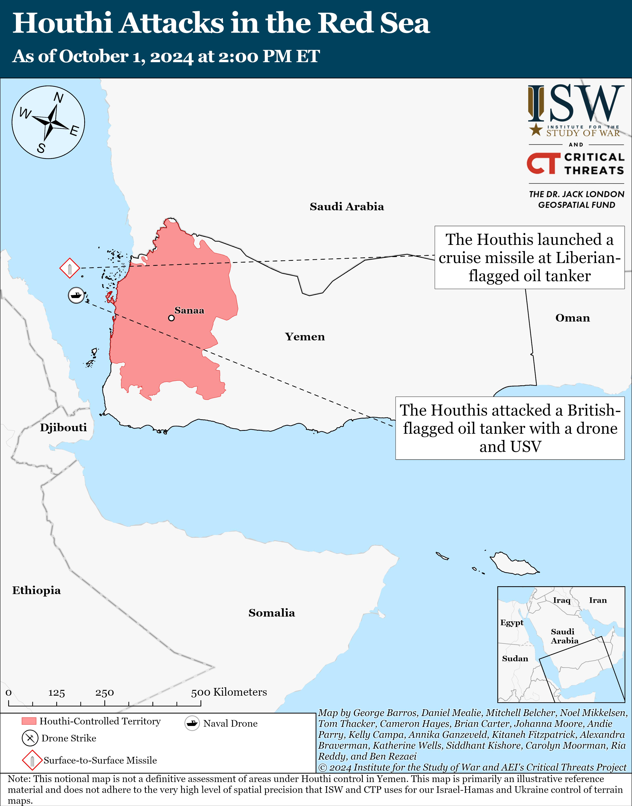

## Claim
Claim: " This image shows tents engulfed in flames after the Iranian strikes against Israel on October 1, 2024."

## Actions
```
reverse_search()
web_search("Iranian strikes against Israel October 1 2024")
```

## Evidence
### Evidence from `reverse_search`
The image in the claim 

### Evidence from `web_search`
The NPR article ([https://www.npr.org/2024/10/01/g-s1-25707/iran-israel-hezbollah-lebanon-attack](https://www.npr.org/2024/10/01/g-s1-25707/iran-israel-hezbollah-lebanon-attack)) and the Al Jazeera article ([https://www.aljazeera.com/news/2024/10/1/irans-missile-attack-against-israel-what-we-know-and-what-comes-next](https://www.aljazeera.com/news/2024/10/1/irans-missile-attack-against-israel-what-we-know-and-what-comes-next)) both report on the Iranian strikes against Israel on October 1, 2024. The Al Jazeera article includes  and mentions the attack was in response to Israeli attacks. The NPR article mentions a major missile attack and an Israeli ground offensive in Lebanon.

The Institute for the Study of War and Critical Threats (ISW) published an Iran Update ([https://www.understandingwar.org/backgrounder/iran-update-october-1-2024](https://www.understandingwar.org/backgrounder/iran-update-october-1-2024)) on October 1, 2024, discussing the Iranian ballistic missile attack on Israel, Hezbollah's rocket fire, and the IDF's ground operation in southern Lebanon. The update also mentions attacks by Iranian-backed Iraqi militias and Houthi attacks. , 


## Elaboration
The Al Jazeera article includes the image in the claim and reports on the Iranian strikes against Israel on October 1, 2024. The NPR article and the ISW report also confirm the Iranian strikes on the same date.

The evidence supports the claim that the image depicts events related to the Iranian strikes against Israel on October 1, 2024. However, the exact context of the image (e.g., whether it shows tents) is not explicitly stated in the provided evidence.


## Final Judgement
The image is associated with the Iranian strikes against Israel on October 1, 2024, as reported by multiple news sources. The Al Jazeera article includes the image and reports on the strikes.

`true`

### Verdict: TRUE

### Justification
The image in the claim is associated with the Iranian strikes against Israel on October 1, 2024, as reported by multiple news sources, including an article from Al Jazeera ([https://www.aljazeera.com/news/2024/10/1/irans-missile-attack-against-israel-what-we-know-and-what-comes-next](https://www.aljazeera.com/news/2024/10/1/irans-missile-attack-against-israel-what-we-know-and-what-comes-next)).
