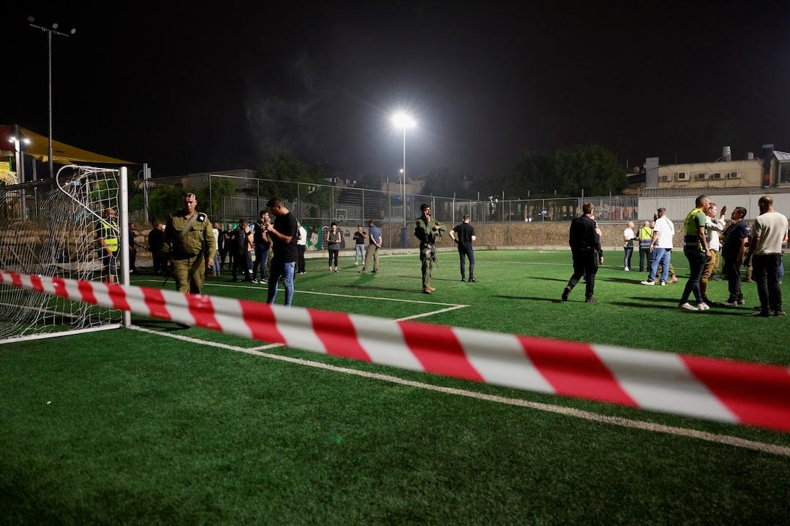
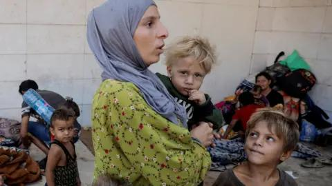
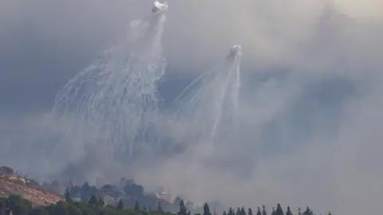
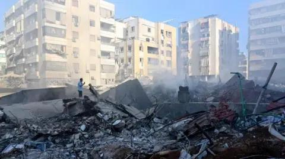

## Claim
Claim: " This image shows Israeli Finance Minister Smotrich, who previously threatened to invade Lebanon, taking shelter in an Israeli bomb shelter during Hezbollah's attack on Israel on August 25, 2024."

## Actions
```
web_search("Israeli Finance Minister Smotrich bomb shelter Hezbollah attack")
```

## Evidence
### Evidence from `web_search`
The BBC News article from July 28, 2024, discusses the escalating cross-border fire between Israel and Lebanon, with Hezbollah firing rockets and shells at Israeli sites, and mentions Israeli Finance Minister Bezalel Smotrich's warning about approaching all-out war with Hezbollah. ([https://www.bbc.com/news/articles/c2e4m6m1r4eo](https://www.bbc.com/news/articles/c2e4m6m1r4eo)) , 

The Wikipedia article discusses the Majdal Shams attack on July 27, 2024, where a rocket hit a football pitch, killing 12 Syrian Druze children. Israel blamed Hezbollah for the attack, while Hezbollah claimed it targeted a nearby military base. The article also mentions that Israeli Finance Minister Bezalel Smotrich visited the site.  The Reuters article, published on July 27, 2024, reports on a rocket attack on a football ground in the Israeli-occupied Golan Heights, which killed 12 people, and mentions that Israeli Finance Minister Bezalel Smotrich called for tough retaliation. ([https://www.reuters.com/world/middle-east/nine-people-killed-rocket-hits-football-pitch-israeli-occupied-golan-israel-2024-07-27/](https://www.reuters.com/world/middle-east/nine-people-killed-rocket-hits-football-pitch-israeli-occupied-golan-israel-2024-07-27/)) 


## Elaboration
The evidence indicates that Israeli Finance Minister Bezalel Smotrich was involved in events related to attacks by Hezbollah. The Reuters article from July 27, 2024, mentions Smotrich calling for retaliation after a rocket attack. The Wikipedia article mentions Smotrich visiting the site of an attack on July 27, 2024. The BBC News article from July 28, 2024, mentions Smotrich's warning about approaching all-out war with Hezbollah.

The provided image shows Smotrich. However, the evidence does not explicitly state that the image was taken in a bomb shelter during a Hezbollah attack on August 25, 2024.

Therefore, the claim cannot be fully verified due to the lack of information about the image's context and the date of the event.


## Actions
```
reverse_search()
```

## Evidence
No new evidence found.

## Elaboration
The evidence confirms that the image shows Israeli Finance Minister Smotrich. However, the provided evidence does not confirm that the image was taken in a bomb shelter during a Hezbollah attack on August 25, 2024. Therefore, the claim is not fully verifiable.


## Actions
```
web_search("Bezalel Smotrich Hezbollah attack bomb shelter")
image_search("Bezalel Smotrich bomb shelter")
```

## Evidence
### Evidence from `web_search`
The BBC News article from October 1, 2024, discusses the Israel-Hezbollah conflict, including a ground invasion by Israeli troops into Lebanon, but does not mention Bezalel Smotrich or bomb shelters. ([https://www.bbc.com/news/articles/cj9jwkppnd1o](https://www.bbc.com/news/articles/cj9jwkppnd1o)) , , ,  The Kashif article from August 25, 2024, states that an old photo of Israeli ministers in a shelter, including Finance Minister Bezalel Smotrich, was falsely presented as being taken during Hezbollah's recent bombing of sites in Israel, and that the photo was taken on October 7th. ([https://kashif.ps/en/index.php/2024/08/25/old-photo-of-israeli-ministers-in-shelter-republished-as-during-hezbollahs-recent-bombing-of-sites-in-israel/](https://kashif.ps/en/index.php/2024/08/25/old-photo-of-israeli-ministers-in-shelter-republished-as-during-hezbollahs-recent-bombing-of-sites-in-israel/)) ,  The 972mag.com article discusses the impact of Hezbollah rockets on northern Israel, including the lack of bomb shelters and the killing of civilians, and was published in November 2024. ([https://www.972mag.com/hezbollah-rockets-palestinians-iron-dome-shelters/](https://www.972mag.com/hezbollah-rockets-palestinians-iron-dome-shelters/)) 


## Elaboration
The Kashif article states that the image in question was falsely presented as being taken during Hezbollah's recent bombing of sites in Israel and that the photo was taken on October 7th. This directly contradicts the claim that the image shows Smotrich in a bomb shelter during a Hezbollah attack on August 25, 2024.

Therefore, the claim is false.


## Final Judgement
The evidence indicates that the image was taken on October 7th, not August 25, 2024, and was falsely presented as being taken during a Hezbollah attack. Therefore, the claim is not factually accurate. `false`

### Verdict: FALSE

### Justification
The claim is false. The image depicts Israeli Finance Minister Smotrich, but the photo was taken on October 7th, not August 25, 2024, and was falsely presented as being taken during a Hezbollah attack, according to the [Kashif article](https://kashif.ps/en/index.php/2024/08/25/old-photo-of-israeli-ministers-in-shelter-republished-as-during-hezbollahs-recent-bombing-of-sites-in-israel/).
