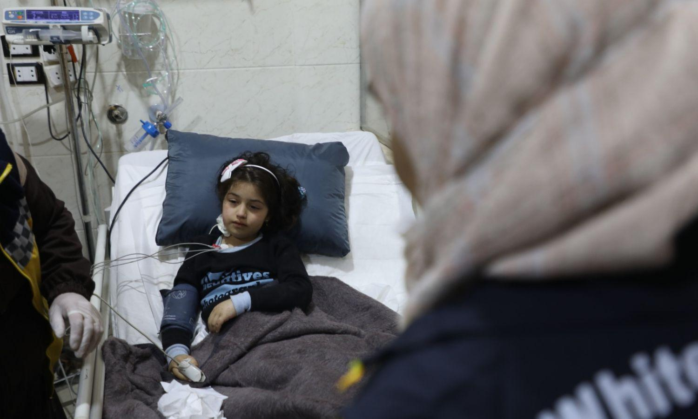
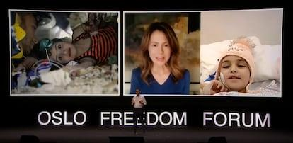

## Claim
Claim: " This image shows a palestinian child stuck under the rubble in Gaza after an Israeli airstrike in July 2024."

## Actions
```
reverse_search()
web_search("Palestinian child rubble Gaza Israeli airstrike July 2024")
```

## Evidence
### Evidence from `reverse_search`
The image () is of a Syrian child named Sham who was rescued from the rubble in Armanaz, Idlib, after an earthquake on February 6, 2023. The child was later transferred to a hospital in Abu Dhabi for treatment. The image was published in articles from Enab Baladi ([https://english.enabbaladi.net/archives/2023/03/shams-journey-from-under-the-rubble-to-abu-dhabis-burjeel-hospital/](https://english.enabbaladi.net/archives/2023/03/shams-journey-from-under-the-rubble-to-abu-dhabis-burjeel-hospital/)), UAE Times ([https://uaetimes.ae/shams-journey-from-under-the-rubble-to-abu-dhabis-burjeel-hospital/](https://uaetimes.ae/shams-journey-from-under-the-rubble-to-abu-dhabis-burjeel-hospital/)), and El País ([https://english.elpais.com/international/2023-07-20/the-manual-of-repression-shared-by-modern-tyrants.html](https://english.elpais.com/international/2023-07-20/the-manual-of-repression-shared-by-modern-tyrants.html)). The El País article also mentions a video call between the child and Asma al-Assad.

The Enab Baladi article includes additional images of the child (, , ). The El País article includes an image of Abdulrahman Almawwas speaking at the Oslo Freedom Forum, with the image of the child in the background ().


### Evidence from `web_search`
On July 27, 2024, CNN ([https://www.cnn.com/2024/07/27/middleeast/israel-gaza-deir-al-balah-school-intl](https://www.cnn.com/2024/07/27/middleeast/israel-gaza-deir-al-balah-school-intl)) and the Associated Press ([https://apnews.com/article/israel-hamas-war-gaza-palestinians-evacuation-27-july-2024-c95e8effebd9d4e4ba7e69bfbae61e04](https://apnews.com/article/israel-hamas-war-gaza-palestinians-evacuation-27-july-2024-c95e8effebd9d4e4ba7e69bfbae61e04)) reported on an Israeli airstrike on a school in Deir al-Balah, central Gaza, which resulted in at least 30 deaths. The AP article includes images of the aftermath, including a child inspecting the rubble <image:k>.

An Al Jazeera article from June 24, 2024 ([https://www.aljazeera.com/news/2024/6/24/over-20000-children-buried-trapped-detained-lost-amid-gaza-war-report](https://www.aljazeera.com/news/2024/6/24/over-20000-children-buried-trapped-detained-lost-amid-gaza-war-report)) reported that nearly 21,000 children are missing in Gaza <image:i>.


## Elaboration
The claim is demonstrably false. The image depicts a Syrian child, Sham, rescued from the rubble in Armanaz, Idlib, after an earthquake in February 2023, not a Palestinian child in Gaza after an Israeli airstrike in July 2024. The evidence from reverse image search confirms the image's origin and context. While there were Israeli airstrikes in Gaza in July 2024, as reported by CNN and AP, the image in question is unrelated to those events.


## Final Judgement
The image is of a Syrian child rescued after an earthquake in 2023, not a Palestinian child in Gaza after an Israeli airstrike in July 2024. The claim misrepresents the origin and context of the image. `false`

### Verdict: FALSE

### Justification
The image in the claim depicts a Syrian child, Sham, rescued from the rubble after an earthquake in February 2023, as confirmed by reverse image searches and articles from Enab Baladi ([https://english.enabbaladi.net/archives/2023/03/shams-journey-from-under-the-rubble-to-abu-dhabis-burjeel-hospital/](https://english.enabbaladi.net/archives/2023/03/shams-journey-from-under-the-rubble-to-abu-dhabis-burjeel-hospital/)), UAE Times, and El País. The claim incorrectly associates the image with a Palestinian child in Gaza after an Israeli airstrike in July 2024.
