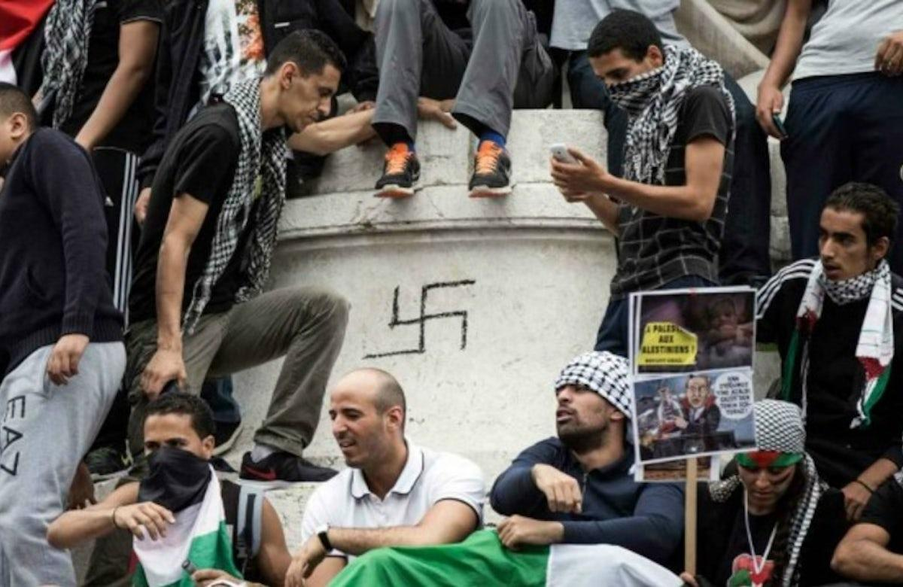

## Claim
Claim: " This image shows the 'French' Left who is rioting against Le Pen's victory in the first round of the French parliamentary elections in 2024."

## Actions
```
web_search("French Left protest Le Pen 2024")
image_search("protest Palestine swastika")
```

## Evidence
### Evidence from `web_search`
The Wikipedia article discusses the 2024 French protests against the National Rally, which began on June 9, 2024, in response to the National Rally party's victory in the 2024 European Parliament election. The protests took place across France, with demonstrations in cities like Paris, Toulouse, and Lyon. Protesters carried anti-racist and pro-Palestinian messages. The article mentions that on June 14, 2024, in Lyon, many protesters carried Palestinian flags.  The Guardian published an article on April 5, 2025, discussing rallies planned by both far-right and left-wing parties in France following Marine Le Pen's conviction. , 

The BBC News article, published on September 7, 2024, reports on protests in France against the appointment of Michel Barnier as the new prime minister. The demonstrations were organized by parties on the political left. , , 

The sources are: [Source](https://en.wikipedia.org/wiki/2024_French_protests_against_the_National_Rally), [Source](https://www.theguardian.com/world/2025/apr/05/france-braced-as-far-right-and-leftwing-parties-plan-rallies-in-wake-of-le-pen-decision), [Source](https://www.bbc.com/news/articles/c1l51y6p171o).


### Evidence from `image_search`
The Independent published an article about a protest in Times Square, which included an image of protesters holding Palestinian flags and a sign with a swastika (). The Ottawa Citizen reports on a police investigation after a swastika was spotted at a Gaza protest ().


## Elaboration
The evidence confirms that protests occurred in France in 2024 against the National Rally party, following their victory in the European Parliament election. The protests involved anti-racist and pro-Palestinian messages. The image search results show that swastikas have been present at pro-Palestinian protests.

The claim is partially supported by the evidence. The image could depict a protest against Le Pen's party, but the presence of a swastika raises concerns about the nature of the protest. The evidence does not confirm that the image is from a protest against Le Pen's victory in the first round of the French parliamentary elections.


## Actions
```
reverse_search()
```

## Evidence
### Evidence from `reverse_search`
The reverse image search found the image in articles discussing anti-Semitism and pro-Palestinian protests. The image, which shows a swastika, was taken during a pro-Palestinian demonstration in Paris on July 26, 2014, as reported by Vanity Fair ([https://www.vanityfair.com/news/2015/07/anti-semitism-france-hostage-hyper-cacher-kosher-market](https://www.vanityfair.com/news/2015/07/anti-semitism-france-hostage-hyper-cacher-kosher-market)). The World Jewish Congress ([https://www.worldjewishcongress.org/en/news/german-tv-agrees-to-air-anti-semitism-documentary-following-cries-of-censorship-6-1-2017](https://www.worldjewishcongress.org/en/news/german-tv-agrees-to-air-anti-semitism-documentary-following-cries-of-censorship-6-1-2017)) and The Jerusalem Post ([https://www.jpost.com/tags/adam-milstein](https://www.jpost.com/tags/adam-milstein)) also used the image. , <image:546154>, 


## Elaboration
The reverse image search reveals that the image is from a pro-Palestinian demonstration in Paris on July 26, 2014, not a protest against Le Pen's victory in 2024. The presence of a swastika in the image further indicates that the claim is inaccurate.

The claim is false.


## Final Judgement
The image is from a 2014 pro-Palestinian demonstration in Paris, not a 2024 protest against Le Pen's victory. The presence of a swastika in the image further indicates that the claim is inaccurate. `false`

### Verdict: FALSE

### Justification
The claim is false. The image depicts a pro-Palestinian demonstration in Paris on July 26, 2014, as reported by *Vanity Fair* ([https://www.vanityfair.com/news/2015/07/anti-semitism-france-hostage-hyper-cacher-kosher-market](https://www.vanityfair.com/news/2015/07/anti-semitism-france-hostage-hyper-cacher-kosher-market)), not a 2024 protest against Le Pen's victory.
