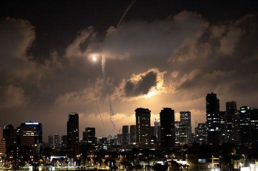

## Claim
Claim: "The assassination plot to kill Donald Trump in 2024 was orchestrated by two Jewish Americans. Israel wants war with Iran but wants American money to fund it and American servicemen to fight it."

## Actions
```
web_search("assassination plot Donald Trump 2024")
web_search("Israel Iran war American money")
```

## Evidence
### Evidence from `web_search`
The attempted assassination of Donald Trump on July 13, 2024, in Pennsylvania is discussed in a Wikipedia article, which mentions the perpetrator, Thomas Matthew Crooks, and the increased security due to intelligence suggesting Iran was plotting to assassinate him (<image:i>). NPR reports on a Justice Department disclosure of an Iranian murder-for-hire plot to kill Donald Trump, allegedly orchestrated by an Iranian government official, Farhad Shakeri, who was also tasked with planning the killings of two Jewish-Americans and Israeli tourists (, , ).

The BBC News reports that the US government charged an Afghan national in connection with the alleged Iranian plot to assassinate Donald Trump, and the indictment also alleges that the Iranian government sought to kill two Jewish American businesspeople living in New York City, and that Shakeri was asked to plan a mass shooting to target Israeli tourists in Sri Lanka ().

*   [https://en.wikipedia.org/wiki/Attempted\_assassination\_of\_Donald\_Trump\_in\_Pennsylvania](https://en.wikipedia.org/wiki/Attempted_assassination_of_Donald_Trump_in_Pennsylvania)
*   [https://www.npr.org/2024/11/08/nx-s1-5184549/iran-donald-trump-murder-for-hire-plot-justice-department](https://www.npr.org/2024/11/08/nx-s1-5184549/iran-donald-trump-murder-for-hire-plot-justice-department)
*   [https://www.bbc.com/news/articles/cx28x187rmko](https://www.bbc.com/news/articles/cx28x187rmko)


### Evidence from `web_search`
The search results discuss the economic impact of a potential Israel-Iran war. One article from TRT Global ([https://trt.global/world/article/334e2e1ae7a3](https://trt.global/world/article/334e2e1ae7a3)) focuses on a 12-day war in June 2025, mentioning costs for the US, Israel, and Iran, and a travel ban on Jewish citizens in Israel. The article includes images , .

Reuters ([https://www.reuters.com/markets/europe/israel-iran-conflict-highlights-dollars-tarnished-safe-haven-appeal-2025-06-16/](https://www.reuters.com/markets/europe/israel-iran-conflict-highlights-dollars-tarnished-safe-haven-appeal-2025-06-16/)) discusses the impact on the U.S. dollar. Wikipedia ([https://en.wikipedia.org/wiki/Economic_impact_of_the_Iran%E2%80%93Israel_war](https://en.wikipedia.org/wiki/Economic_impact_of_the_Iran%E2%80%93Israel_war)) covers the economic impact of the Iran–Israel war, including military spending, sanctions, and currency devaluation, and mentions conflicts in 2024 and 2025.


## Elaboration
The evidence indicates that an Iranian government official was allegedly involved in a plot to assassinate Donald Trump and target two Jewish Americans. However, the evidence does not support the claim that the assassination plot was orchestrated by Jewish Americans.

Regarding the second part of the claim, the evidence mentions an Iran-Israel war and its economic impact, including costs for the US. However, the evidence does not explicitly state that Israel wants American money to fund the war or American servicemen to fight it.

Therefore, the claim is partially inaccurate.


## Final Judgement
The evidence indicates that the claim is partially inaccurate. The first part of the claim, regarding the assassination plot, is false because the evidence suggests that the plot was orchestrated by an Iranian official, not Jewish Americans. The second part of the claim, about Israel's intentions, is not supported by the evidence.

`false`

### Verdict: FALSE

### Justification
The claim is partially inaccurate. Evidence suggests an Iranian government official orchestrated a plot to assassinate Donald Trump, not Jewish Americans, as stated in the claim. While the provided sources discuss the economic impact of an Iran-Israel war, they do not support the assertion that Israel desires American funding or servicemen for the conflict.
