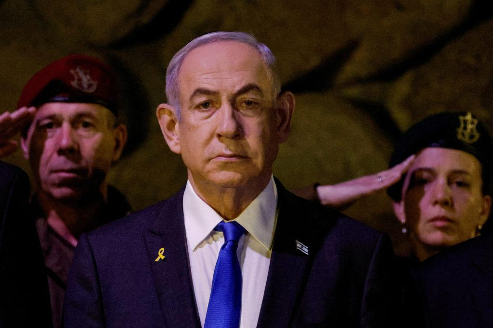

## Claim
Claim: "Gallant, a retired military general and a member of Prime Minister Benjamin Netanyahu’s war cabinet, was killed in the Iranian attack on Israel on October 1, 2024."

## Actions
```
web_search("Gallant killed Iranian attack October 1 2024")
web_search("Benjamin Netanyahu war cabinet members")
```

## Evidence
### Evidence from `web_search`
NPR published an article on November 5, 2024, stating that Benjamin Netanyahu fired Defense Minister Yoav Gallant and replaced him with Israel Katz. The article mentions an Iranian missile attack (, , , ). The Times of Israel published an article on October 23, 2024, stating that Defense Minister Yoav Gallant spoke to Israeli Air Force pilots and crews at the Hatzerim Airbase. The article mentions an Iranian attack on Israel on October 1, 2024, and an expected Israeli response ().

Yahoo News includes an interview with Yoav Gallant, former defense minister (). Gallant discussed the original plan of attack against Iran, which was scrapped prior to October 7. The article also mentions a funeral procession of Iranian military commanders killed in Israeli strikes on June 28, 2025 ().


### Evidence from `web_search`
On June 17, 2024, CNN ([https://www.cnn.com/2024/06/17/middleeast/netanyahu-disbands-israeli-war-cabinet-intl](https://www.cnn.com/2024/06/17/middleeast/netanyahu-disbands-israeli-war-cabinet-intl)) reported that Benjamin Netanyahu dissolved his war cabinet, which included Defense Minister Yoav Gallant. The BBC ([https://www.bbc.com/news/articles/ce99m0n99z0o](https://www.bbc.com/news/articles/ce99m0n99z0o)) also reported on June 17, 2024, that Netanyahu dissolved the war cabinet, and Gallant is expected to be in a "smaller consultation forum". PBS News ([https://www.pbs.org/newshour/world/netanyahu-has-dissolved-israels-war-cabinet-amid-growing-frustrations-with-war-in-gaza](https://www.pbs.org/newshour/world/netanyahu-has-dissolved-israels-war-cabinet-amid-growing-frustrations-with-war-in-gaza)) also reported on June 17, 2024, that Netanyahu dissolved Israel’s War Cabinet, which included Defense Minister Yoav Gallant. <image:k>, , , 


## Elaboration
The claim that Yoav Gallant was killed in the Iranian attack on October 1, 2024, is not supported by the evidence. The evidence indicates that Gallant was the Defense Minister and was later replaced by Israel Katz. Furthermore, an article from October 23, 2024, shows Gallant speaking to Air Force pilots, which contradicts the claim of his death on October 1, 2024. Also, the war cabinet was dissolved on June 17, 2024.


## Final Judgement
The evidence indicates that Yoav Gallant was not killed in the Iranian attack on October 1, 2024. He was the Defense Minister and was later replaced. Furthermore, he was seen speaking to Air Force pilots on October 23, 2024.

`false`

### Verdict: FALSE

### Justification
The claim is false. Evidence from multiple sources, including NPR and The Times of Israel, indicates that Yoav Gallant was the Defense Minister and was later replaced, and he was alive and active after the alleged date of his death. Additionally, Benjamin Netanyahu dissolved the war cabinet on June 17, 2024, which included Gallant.
