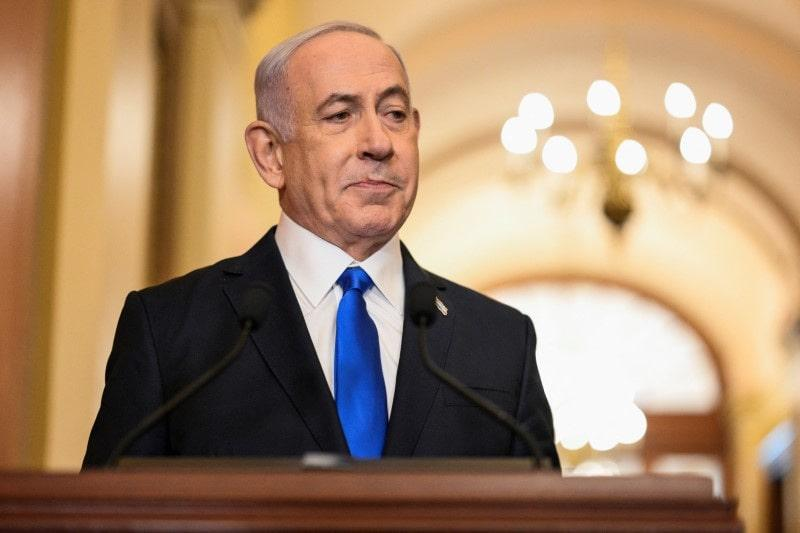

## Claim
Claim: "In a phone call with Benjamin Netanyahu on August 14, 2024, Donald Trump told the Israeli prime minister to stop a Gaza ceasefire deal because it would help Vice President Kamala Harris' 2024 presidential campaign."

## Actions
```
web_search("Donald Trump Benjamin Netanyahu phone call August 14 2024 Gaza ceasefire")
```

## Evidence
### Evidence from `web_search`
Reuters reports that Donald Trump and Benjamin Netanyahu spoke on August 14, 2024, discussing the Gaza ceasefire and hostage release deal (). The article mentions that one source told Axios that Trump's call was intended to encourage Netanyahu to take the deal. [Source](https://www.reuters.com/world/trump-netanyahu-speak-about-gaza-hostage-ceasefire-deal-axios-reports-2024-08-15/)

Newsweek published an article discussing allegations that Donald Trump called Benjamin Netanyahu on August 14 to discuss a ceasefire deal, which Trump and Netanyahu's office denied (, , ). [Source](https://www.newsweek.com/donald-trump-accused-crime-benjamin-netanyahu-call-ceasefire-hamas-1942248) NPR published an article on August 14, 2024, discussing the resumption of Gaza cease-fire talks (, ). [Source](https://www.npr.org/2024/08/14/g-s1-16958/gaza-ceasefire-talks-israel-hamas)


## Elaboration
The evidence confirms that Donald Trump and Benjamin Netanyahu spoke on August 14, 2024, and discussed the Gaza ceasefire. However, the evidence does not support the claim that Trump told Netanyahu to stop the deal because it would help Kamala Harris's campaign. In fact, one source told Axios that Trump's call was intended to encourage Netanyahu to take the deal. Newsweek reported that Trump and Netanyahu's office denied the allegations.

Therefore, the claim is not supported by the evidence.


## Final Judgement
The available evidence indicates that Donald Trump and Benjamin Netanyahu spoke on August 14, 2024, and discussed the Gaza ceasefire. However, there is no evidence to support the specific claim that Trump told Netanyahu to stop the deal to hurt Kamala Harris's campaign. In fact, one source suggests Trump encouraged the deal, and both Trump and Netanyahu's offices denied the allegations.

`false`

### Verdict: FALSE

### Justification
The claim that Donald Trump told Benjamin Netanyahu to stop a Gaza ceasefire deal to hurt Kamala Harris's campaign is not supported by the evidence. While a phone call between Trump and Netanyahu on August 14, 2024, did occur and involved discussions about the Gaza ceasefire, there is no evidence to support the specific claim. In fact, one source suggests Trump encouraged the deal, and both Trump and Netanyahu's offices denied the allegations, as reported by [Newsweek](https://www.newsweek.com/donald-trump-accused-crime-benjamin-netanyahu-call-ceasefire-hamas-1942248).
