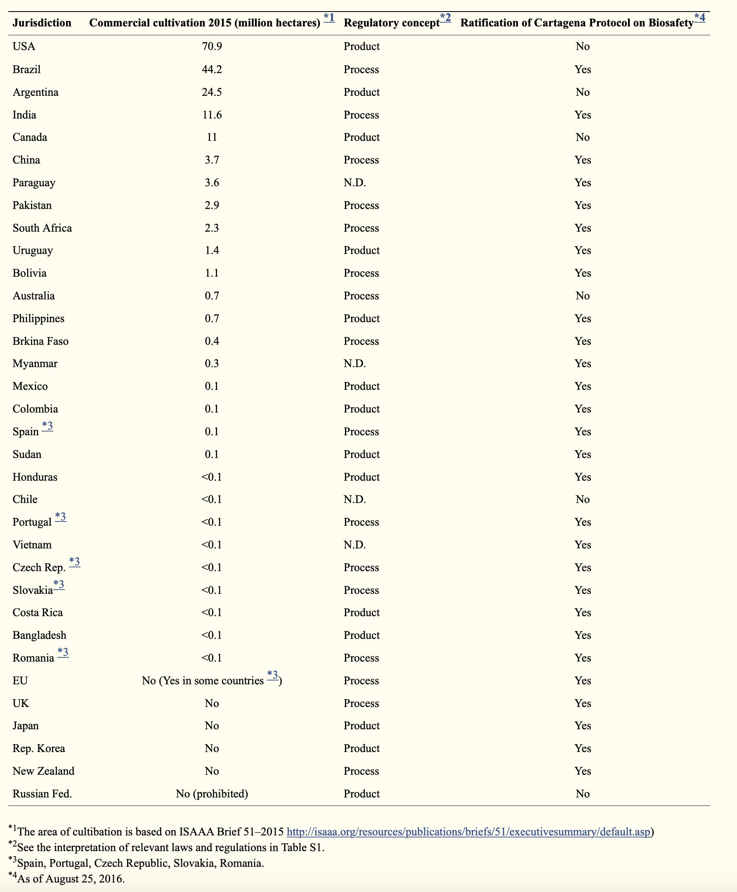

## Claim
Claim: "It is illegal to do a DNA test in Israel."

## Actions
```
web_search("DNA testing legality Israel")
web_search("Israel DNA testing regulations")
```

## Evidence
### Evidence from `web_search`
The search results discuss the use of DNA testing in Israel, particularly in the context of determining Jewishness for immigration under the Israeli Law of Return (<image:k>). One source, a publication from Harvard University, mentions the potential use of genetic tests for this purpose, published by Oxford University Press. Another source from nature.com discusses a bill proposing stringent restrictions on the use of genetic information in Israel, passed by the Israeli parliament's science committee.

The sources include: [https://ideas.repec.org/p/hrv/hksfac/29408321.html](https://ideas.repec.org/p/hrv/hksfac/29408321.html), [https://dash.harvard.edu/entities/publication/73120379-1b48-6bd4-e053-0100007fdf3b](https://dash.harvard.edu/entities/publication/73120379-1b48-6bd4-e053-0100007fdf3b), and [https://www.nature.com/articles/28247](https://www.nature.com/articles/28247).


## Elaboration
The evidence suggests that DNA testing is not illegal in Israel. Instead, it is used in specific contexts, such as determining Jewishness for immigration. Furthermore, there are discussions and legislative efforts to regulate the use of genetic information, indicating that DNA testing is permissible but subject to potential restrictions.

The provided sources do not explicitly state that DNA testing is illegal. Instead, they highlight its use and the ongoing debate regarding its regulation.

To definitively verify the claim, information about specific laws prohibiting DNA testing in Israel is missing.


## Actions
```
web_search("Israel law DNA testing prohibition")
```

## Evidence
### Evidence from `web_search`
The search results indicate that DNA testing is not illegal in Israel. One source from crispr-gene-editing-regs-tracker.geneticliteracyproject.org states that germline gene editing is prohibited, but the Minister of Health may give permission for germline gene editing experiments, upon the recommendation of an advisory committee. The "Prohibition of Genetic Intervention" Law, passed in 1999 and amended in 2016, bans germline gene editing unless authorized. (, ) Another source from The Times of Israel mentions the use of DNA tests by the Chief Rabbinate to determine Jewishness, and a 2000 law grants authority for genetic testing to both civil family courts and religious authorities with consent. ()

Additionally, welcome-israel.com states that DNA testing is not illegal in Israel, but it is not generally accepted as the sole method for proving Jewish ancestry or for repatriation under the Law of Return. (<image:k>)


## Elaboration
The evidence confirms that DNA testing is not illegal in Israel. The "Prohibition of Genetic Intervention" Law focuses on germline gene editing, not DNA testing in general. Furthermore, DNA testing is used in specific contexts, such as determining Jewishness, and is authorized by law.


## Final Judgement
The fact-check reveals that DNA testing is not illegal in Israel. While there are regulations and discussions about the use of genetic information, and specific laws regarding germline gene editing, the evidence does not support the claim that DNA testing is illegal.

`false`

### Verdict: FALSE

### Justification
DNA testing is not illegal in Israel. Evidence indicates that DNA testing is used in specific contexts, such as determining Jewishness, and is authorized by law, although there are regulations and discussions about the use of genetic information, and specific laws regarding germline gene editing. Sources include [crispr-gene-editing-regs-tracker.geneticliteracyproject.org](https://crispr-gene-editing-regs-tracker.geneticliteracyproject.org) and [The Times of Israel](https://www.timesofisrael.com/).
