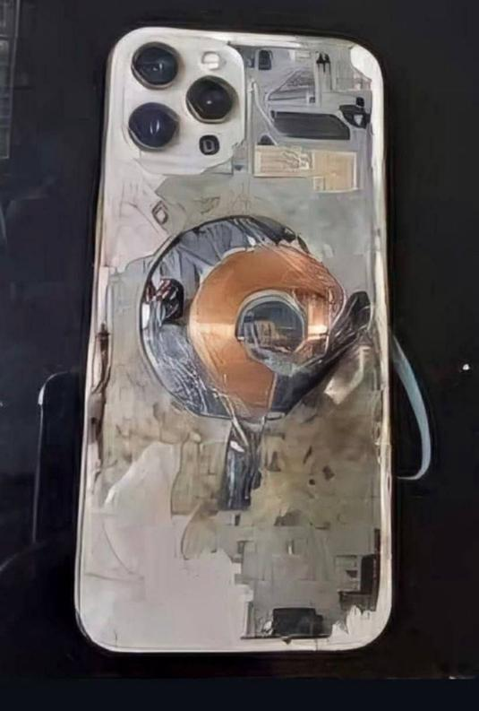

## Claim
Claim: " This image shows an Iphone that exploded during the pager attacks on Hezbollah devices in Lebanon in September 2024, blowing up random people."

## Actions
```
reverse_search()
web_search("Hezbollah Lebanon September 2024")
```

## Evidence
### Evidence from `reverse_search`
The image of the exploded iPhone () is featured in multiple articles discussing explosions in Lebanon. One article from DW.com ([https://www.dw.com/en/fact-check-no-iphones-solar-panels-laptops-exploded-in-lebanon/a-70281061](https://www.dw.com/en/fact-check-no-iphones-solar-panels-laptops-exploded-in-lebanon/a-70281061)) states that the image is old and not related to the recent attacks, dating back to March 2021. Another article from ITC.ua ([https://itc.ua/en/news/not-just-pagers-iphones-laptops-electronic-locks-and-other-devices-exploded-in-lebanon-today/](https://itc.ua/en/news/not-just-pagers-iphones-laptops-electronic-locks-and-other-devices-exploded-in-lebanon-today/)) mentions the image in the context of explosions targeting Hezbollah members, with 14 deaths and at least 500 injuries. The China Academy ([https://thechinaacademy.org/israels-pager-attack-has-cooked-western-led-globalization/](https://thechinaacademy.org/israels-pager-attack-has-cooked-western-led-globalization/)) also uses the image, linking it to a "pager attack" and a trust crisis among Chinese consumers, with 12 deaths and 3000 injuries reported.


### Evidence from `web_search`
The Wikipedia article ([https://en.wikipedia.org/wiki/September_2024_Israeli_attacks_against_Lebanon](https://en.wikipedia.org/wiki/September_2024_Israeli_attacks_against_Lebanon)) discusses the September 2024 Israeli attacks against Lebanon, including airstrikes and a pager attack. The CNN article ([https://www.cnn.com/2024/09/24/middleeast/israel-strikes-lebanon-hezbollah-explainer-intl-hnk](https://www.cnn.com/2024/09/24/middleeast/israel-strikes-lebanon-hezbollah-explainer-intl-hnk)) discusses the Israeli airstrikes on Lebanon and Hezbollah. The BBC article ([https://www.bbc.com/news/articles/c9vp7dg3ml1o](https://www.bbc.com/news/articles/c9vp7dg3ml1o)) discusses the ceasefire between Israel and Hezbollah in Lebanon, mentioning the escalation of conflict in late September 2024. 

## Elaboration
The claim that the image shows an iPhone that exploded during pager attacks on Hezbollah devices in Lebanon in September 2024 is partially supported by the evidence. The image is linked to explosions in Lebanon and the "pager attack" targeting Hezbollah. However, the image is old, dating back to March 2021, according to DW.com. The evidence also mentions the September 2024 Israeli attacks against Lebanon, including airstrikes and a pager attack.

The evidence suggests that there were attacks in Lebanon in September 2024, including a pager attack. However, the image is not from that period.

The claim is therefore **partially false**.


## Final Judgement
The image of the exploded iPhone is linked to explosions in Lebanon and a "pager attack" targeting Hezbollah. However, the image is old, dating back to March 2021, and not related to the September 2024 attacks. The evidence confirms the attacks in September 2024, but the image is not from that period.

`false`

### Verdict: FALSE

### Justification
The image of the exploded iPhone (