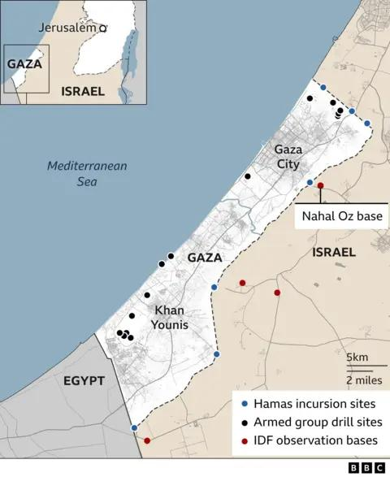
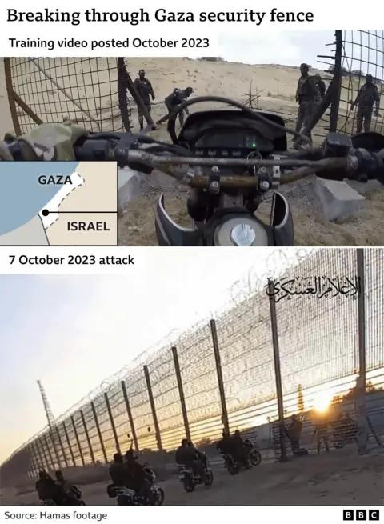
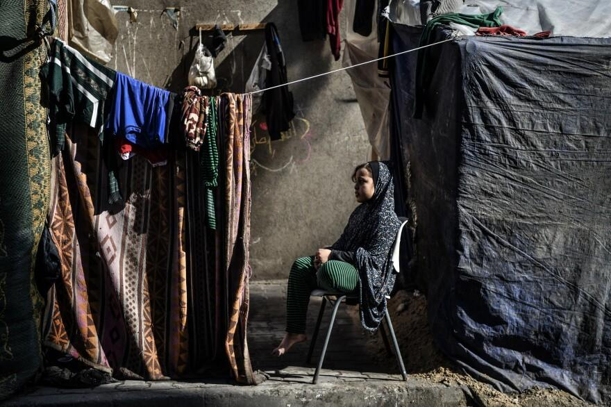
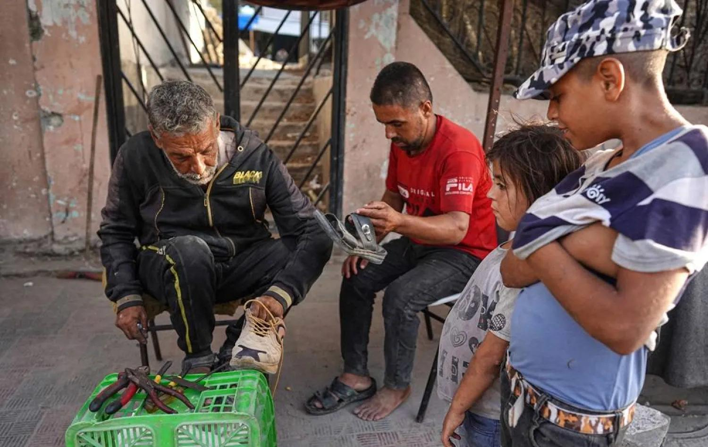
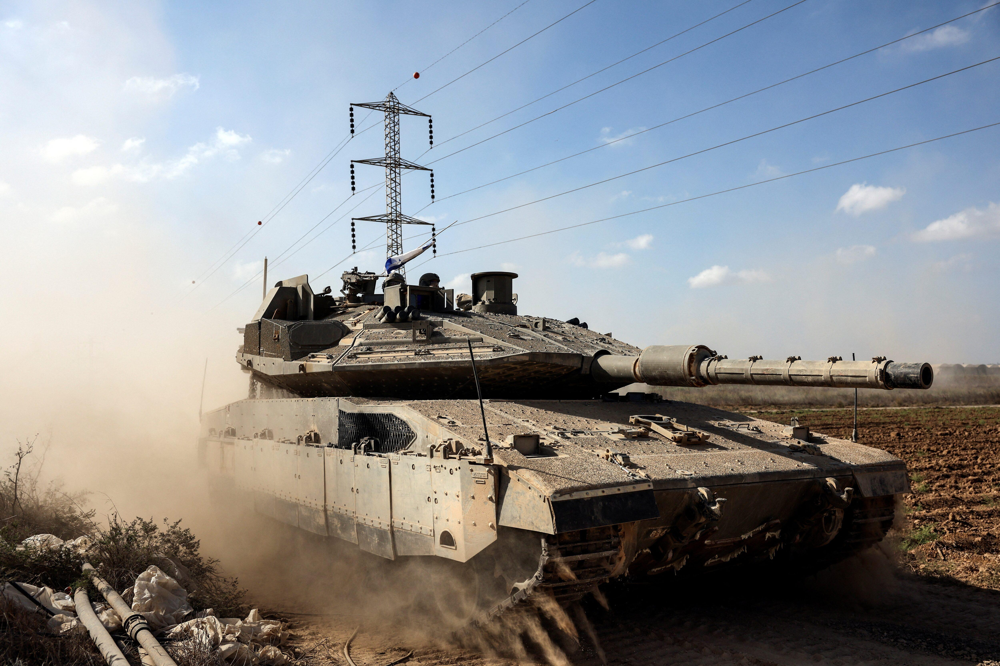

## Claim
Claim: " This image shows a Palestinian woman using an Israeli tank to dry clothes in Gaza in July 2024."

## Actions
```
reverse_search()
```

## Evidence
No new evidence found.

## Elaboration
Insufficient information to verify the claim. The reverse image search did not yield any results.


## Actions
```
web_search("Palestinian woman Israeli tank dry clothes Gaza")
image_search("Israeli tank Palestinian woman clothesline")
```

## Evidence
### Evidence from `web_search`
Reuters ([https://www.reuters.com/world/middle-east/israeli-soldiers-play-with-gaza-womens-underwear-online-posts-2024-03-28/](https://www.reuters.com/world/middle-east/israeli-soldiers-play-with-gaza-womens-underwear-online-posts-2024-03-28/)) and Al Jazeera ([https://www.aljazeera.com/opinions/2024/4/12/weaponising-underwear-genocide-with-a-semi-pornographic-twist](https://www.aljazeera.com/opinions/2024/4/12/weaponising-underwear-genocide-with-a-semi-pornographic-twist)) both report on Israeli soldiers posting photos and videos with lingerie found in Palestinian homes in Gaza. The Al Jazeera article also mentions the killing of nearly 34,000 Palestinians in Gaza since October 7. The BBC ([https://www.bbc.com/news/world-middle-east-67958260](https://www.bbc.com/news/world-middle-east-67958260)) discusses the role of female soldiers guarding the Gaza border, including images of the border fence, IDF observation bases, and training videos (, , , , , ).

The image of the tank () is not mentioned in any of the provided sources.


### Evidence from `image_search`
Swissinfo.ch published an article with an image of Israeli soldiers on a tank (). The New York Times published an article about Israeli tanks and women soldiers (). VPM.org shows a photograph of a girl sitting outside with clothes hanging on a clothesline ().

The provided sources do not contain information about a Palestinian woman using an Israeli tank to dry clothes in Gaza.


## Elaboration
The claim cannot be verified. While the search results show images of Israeli tanks and women soldiers, and also images of clotheslines, none of the evidence supports the specific scenario described in the claim. The evidence does not mention a Palestinian woman using an Israeli tank to dry clothes in Gaza.


## Actions
```
web_search("tank drying clothes Gaza conflict")
image_search("tank clothesline Gaza")
```

## Evidence
### Evidence from `web_search`
Al Jazeera ([https://www.aljazeera.com/news/2024/11/25/flooding-in-gaza-compounds-hardship-of-people-displaced-by-israeli-attacks](https://www.aljazeera.com/news/2024/11/25/flooding-in-gaza-compounds-hardship-of-people-displaced-by-israeli-attacks)) reports on flooding in Gaza, which has damaged tents and left people without dry clothes (). Asharq Al-Awsat ([https://english.aawsat.com/features/5051777-besieged-gazans-share-shoes-wear-same-clothes-months](https://english.aawsat.com/features/5051777-besieged-gazans-share-shoes-wear-same-clothes-months)) discusses the difficulties Gazans face in obtaining clothing due to the ongoing conflict, including an image of Palestinians waiting for a cobbler to repair their shoes (). The New Yorker ([https://www.newyorker.com/magazine/2023/11/06/israel-gaza-war-hamas](https://www.newyorker.com/magazine/2023/11/06/israel-gaza-war-hamas)) discusses the Israeli-Gaza conflict, mentioning tanks and the impact of the conflict on civilians in Gaza.


### Evidence from `image_search`
From [Source](https://www.reuters.com/world/white-house-israels-call-move-gaza-civilians-is-tall-order-2023-10-13/): 
Content: Reuters published an article with an image of an Israeli tank. 


## Elaboration
The claim remains unverified. The new evidence provides additional context about the conflict in Gaza, including the impact on civilians and their access to clothing. However, none of the evidence supports the specific scenario of a Palestinian woman using an Israeli tank to dry clothes.


## Final Judgement
The claim cannot be verified. While the search results provide context about the conflict in Gaza, including the impact on civilians and their access to clothing, none of the evidence supports the specific scenario described in the claim. The image search did not yield any results that match the claim. `false`

### Verdict: FALSE

### Justification
The claim is unverified. Despite searches about the conflict in Gaza and related topics like tanks and clothing, no evidence supports the specific scenario of a Palestinian woman using an Israeli tank to dry clothes. The image search did not yield any results that match the claim.
