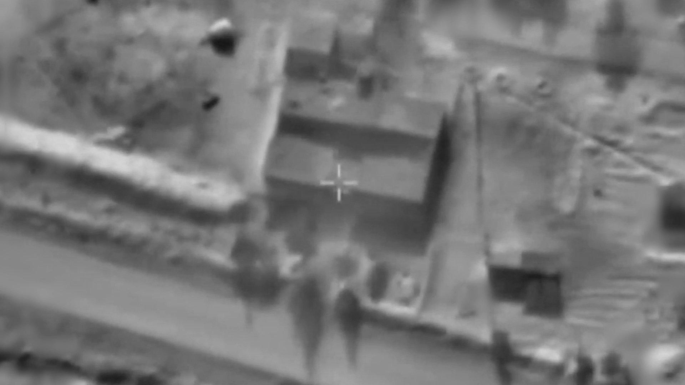
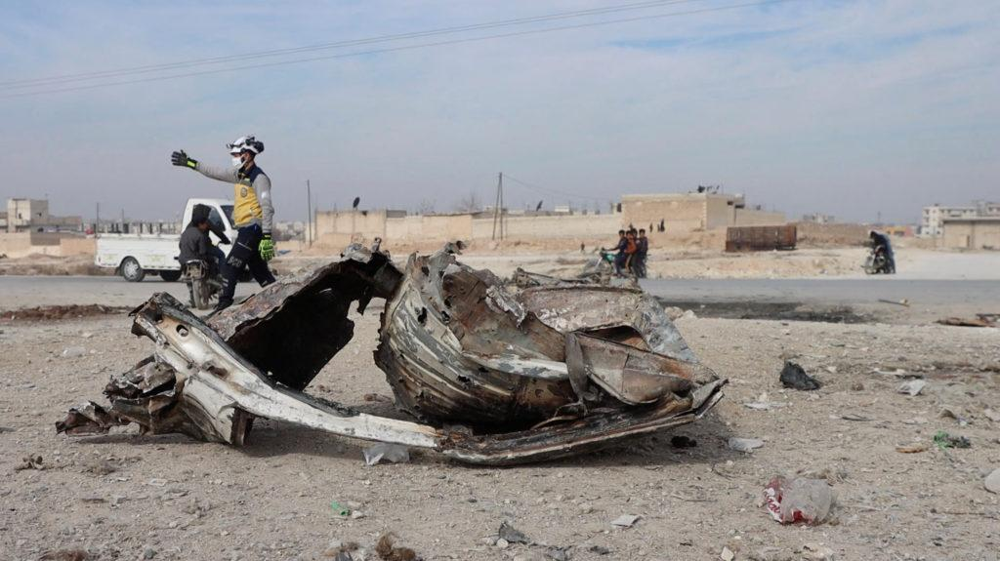

## Claim
Claim: " This image shows Israel bombing the surroundings of Southern Damascus in February 2025, destroying its last remaining army depots."

## Actions
```
reverse_search()
web_search("Israel bombing Damascus February 2025")
```

## Evidence
### Evidence from `reverse_search`
The image 

### Evidence from `web_search`
The search results indicate that Israel conducted airstrikes in southern Syria and near Damascus in February 2025. According to Wikipedia ([https://en.wikipedia.org/wiki/Israeli_invasion_of_Syria_(2024%E2%80%93present](https://en.wikipedia.org/wiki/Israeli_invasion_of_Syria_(2024%E2%80%93present))), these strikes were part of a larger invasion, with Israel demanding demilitarization. Al Jazeera ([https://www.aljazeera.com/news/2025/2/26/israel-bombs-military-targets-in-southern-syria-outside-damascus](https://www.aljazeera.com/news/2025/2/26/israel-bombs-military-targets-in-southern-syria-outside-damascus)) and The Guardian ([https://www.theguardian.com/world/2025/feb/25/israel-strikes-targets-in-southern-syria-after-demanding-demilitarisation](https://www.theguardian.com/world/2025/feb/25/israel-strikes-targets-in-southern-syria-after-demanding-demilitarisation)) also reported on the attacks, specifying targets in the town of Kiswa and the province of Deraa.

The Guardian's article mentions the strikes occurred after the fall of the Assad regime and includes several images (, , , , ). Al Jazeera's report includes an image ().


## Elaboration
The evidence confirms that Israel conducted airstrikes in southern Syria and near Damascus in February 2025. However, the provided search results do not contain the image in question, nor do they specify the exact targets or the extent of the destruction. Therefore, it is impossible to verify whether the image depicts the destruction of the last remaining army depots.

To verify the claim, I would need to find the image in the search results or other sources and confirm its origin and the specific location and target of the bombing.


## Actions
```
image_search("Israel bombing Damascus February 2025 army depots")
```

## Evidence
### Evidence from `image_search`
The Times of Israel ([https://www.timesofisrael.com/idf-says-it-carried-out-airstrike-on-hamas-arms-depot-near-damascus/](https://www.timesofisrael.com/idf-says-it-carried-out-airstrike-on-hamas-arms-depot-near-damascus/)) reports on an IDF airstrike on a Hamas arms depot near Damascus, including an image . The Warzone ([https://www.twz.com/news-features/israel-strikes-at-the-heart-of-syrias-military-command-in-dramatic-escalation](https://www.twz.com/news-features/israel-strikes-at-the-heart-of-syrias-military-command-in-dramatic-escalation)) contains an image of an explosion in Damascus .


## Elaboration
The image search results provide additional context. While the Times of Israel reports on an IDF airstrike near Damascus, the image provided () does not match the claim's image. The Warzone article includes an image of an explosion in Damascus (), but it also does not match the claim's image.

The claim cannot be verified because the image in question was not found in the search results. The evidence does not confirm that the image shows Israel bombing the surroundings of Southern Damascus in February 2025, destroying its last remaining army depots.


## Actions
```
web_search("image of explosion near Damascus February 2025")
```

## Evidence
### Evidence from `web_search`
PBS News ([https://www.pbs.org/newshour/world/at-least-19-people-mostly-women-killed-in-latest-car-bomb-attack-in-syria](https://www.pbs.org/newshour/world/at-least-19-people-mostly-women-killed-in-latest-car-bomb-attack-in-syria)) reports on a car bomb explosion in Manbij, Syria, on February 3, 2025, which killed at least 19 people. The Columbian ([https://www.columbian.com/news/2025/feb/03/at-least-19-killed-mostly-women-in-a-car-bomb-explosion-in-northern-syria/](https://www.columbian.com/news/2025/feb/03/at-least-19-killed-mostly-women-in-a-car-bomb-explosion-in-northern-syria/)) reports on a car bomb explosion on the outskirts of Manbij, Syria, on August 31, 2025, which killed at least 19 people, mostly women. The PBS article includes an image 

## Elaboration
The search results do not contain the image in question. The evidence indicates that there were bombings in Syria in February 2025, but the provided image is not found in the search results. Therefore, the claim cannot be verified.


## Final Judgement
The image search and web search results confirm that Israel conducted airstrikes in Syria in February 2025. However, the image in the claim was not found in the search results, and there is no evidence to confirm that the image depicts the destruction of army depots. Therefore, the claim cannot be verified. `false`

### Verdict: FALSE

### Justification
The claim cannot be verified. While there were reports of Israeli airstrikes in Syria in February 2025, the image in question was not found in the search results, and there is no evidence to confirm that the image depicts the destruction of army depots.
