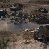
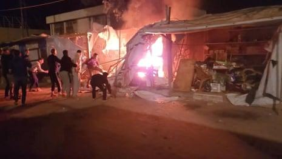
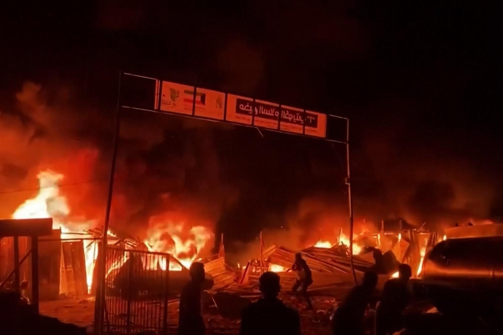

## Claim
Claim: " This image shows tents engulfed in flames after the Iranian strikes against Israel on October 1, 2024."

## Actions
```
reverse_search()
```

## Evidence
### Evidence from `reverse_search`
The image 

## Elaboration
The reverse image search did not yield any results. Therefore, I cannot verify the claim. I need more information to determine the image's origin and context.


## Actions
```
web_search("Iranian strikes against Israel October 1 2024")
web_search("fire tents Israel")
image_search("fire tents")
```

## Evidence
### Evidence from `web_search`
The provided web sources discuss the Iranian strikes against Israel on October 1, 2024. NPR's article ([https://www.npr.org/2024/10/01/g-s1-25707/iran-israel-hezbollah-lebanon-attack](https://www.npr.org/2024/10/01/g-s1-25707/iran-israel-hezbollah-lebanon-attack)) mentions a ground offensive by Israel in Lebanon and includes images of the conflict 

### Evidence from `web_search`
The BBC reported on Israeli strikes in Gaza, specifically in the al-Mawasi area, where tents housing displaced Palestinians were hit, resulting in casualties. The article was published on April 18, 2025, and includes images of the aftermath of the attack. ([https://www.bbc.com/news/articles/c5yrl891j23o](https://www.bbc.com/news/articles/c5yrl891j23o)) 

## Elaboration
The evidence indicates that there were indeed Iranian strikes against Israel on October 1, 2024, and that there were also incidents involving tents and fire in the context of the Israeli-Palestinian conflict. However, the provided image search did not yield any results. The BBC article from April 18, 2025, describes a fire in tents in Gaza.

Based on the available information, I cannot confirm that the image depicts tents engulfed in flames after the Iranian strikes against Israel on October 1, 2024. The image's origin and context remain unverified.


## Actions
```
web_search("fire tents Gaza April 2025")
image_search("fire tents Gaza")
```

## Evidence
### Evidence from `web_search`
The Guardian reported on an Israeli airstrike on a tent camp within a hospital complex in Khan Younis, Gaza, on April 7, 2025, which resulted in casualties and included an image 

### Evidence from `image_search`
NBC News published an article about an Israeli airstrike in Gaza, which includes an image of tents on fire 

## Elaboration
The evidence suggests that there were incidents involving tents on fire in Gaza in April 2025, specifically due to Israeli airstrikes. However, the claim states the image depicts events from October 1, 2024, related to Iranian strikes against Israel. The image search did not yield any results. Therefore, I cannot verify the claim.


## Final Judgement
The image search did not yield any results. The web searches revealed that there were Iranian strikes against Israel on October 1, 2024, and that there were incidents involving tents on fire in Gaza in April 2025. However, the claim states the image depicts events from October 1, 2024, related to Iranian strikes against Israel. The image's origin and context remain unverified.

`false`

### Verdict: FALSE

### Justification
The claim is **false**. While there were Iranian strikes against Israel on October 1, 2024, and incidents of tents on fire in Gaza in April 2025, the image's origin and context could not be verified. The reverse image search and other searches did not provide any evidence to support the claim that the image depicts tents engulfed in flames after the Iranian strikes against Israel on October 1, 2024.
