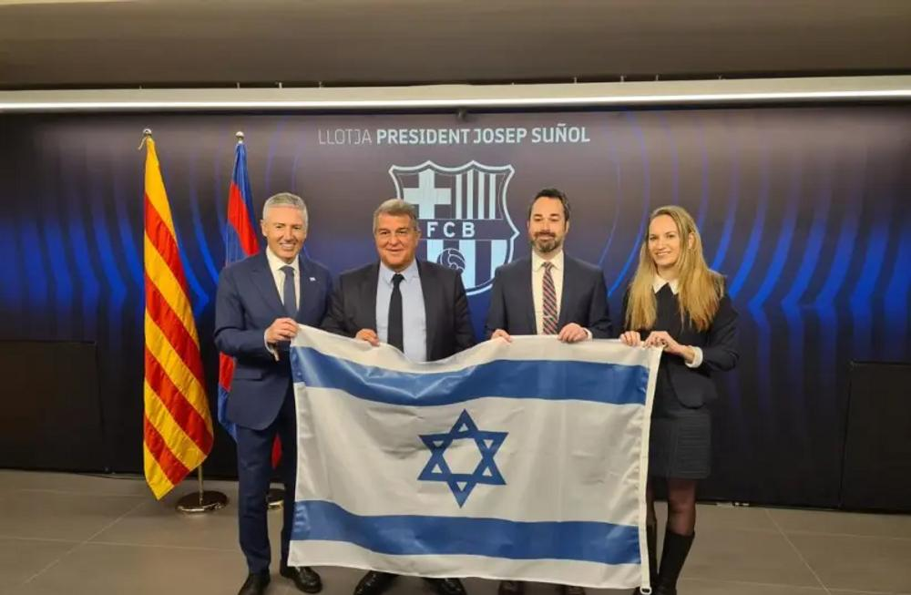
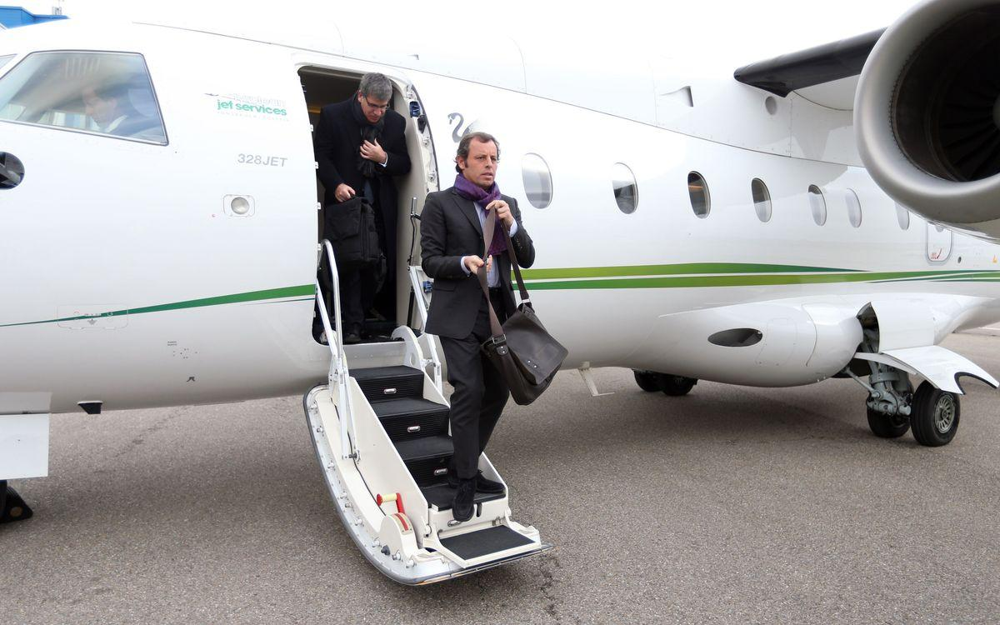
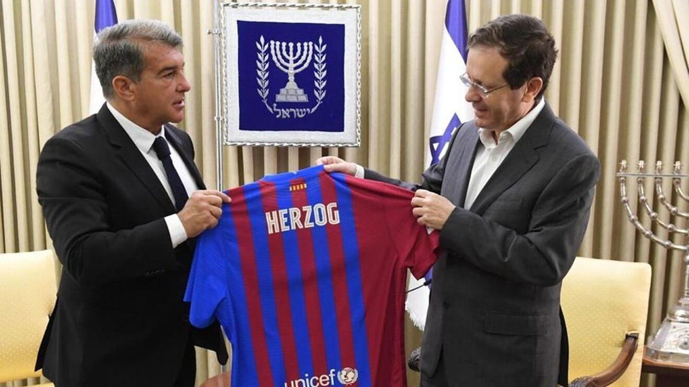

## Claim
Claim: " This image shows the President of FC Barcelona with Israel Embassy Representatives in September 2024 during the ongoing Gaza war."

## Actions
```
web_search("FC Barcelona Israel Embassy meeting September 2024")
image_search("FC Barcelona President Israel flag")
```

## Evidence
### Evidence from `web_search`
FC Barcelona has not cut ties with Israel, according to a Yahoo News article, which also mentions the Barcelona City Council suspending ties with the Israeli government in November 2023. The article also mentions a TikTok video claiming the opposite. [] Another article from The Business Standard discusses the cancellation of a friendly match between FC Barcelona and Beitar Jerusalem FC in 2021. []

A CBS News article mentions the revocation of Palestinian President Mahmoud Abbas's visa by U.S. Secretary of State Marco Rubio in September 2024, weeks before a U.N. meeting.


### Evidence from `image_search`
The image shows the President of FC Barcelona with Israel Embassy Representatives holding an Israeli flag (). FC Barcelona's president, Joan Laporta, met with Isaac Herzog, the President of Israel ().

Sources: [https://www.i24news.tv/en/news/israel/diplomacy/1676623454-barcelona-soccer-team-sends-message-of-support-for-israel](https://www.i24news.tv/en/news/israel/diplomacy/1676623454-barcelona-soccer-team-sends-message-of-support-for-israel) and [https://www.fcbarcelona.com/en/club/news/2192444/joan-laporta-meets-with-isaac-herzog-president-of-israel](https://www.fcbarcelona.com/en/club/news/2192444/joan-laporta-meets-with-isaac-herzog-president-of-israel).


## Elaboration
The image search confirms that the President of FC Barcelona has met with Israeli representatives and held an Israeli flag. The provided evidence does not explicitly state that the meeting occurred in September 2024 or during the Gaza war. However, the CBS News article mentions events in September 2024, and the Yahoo News article mentions the ongoing conflict.

The evidence suggests that FC Barcelona has maintained ties with Israel, despite some political actions. The claim's assertion about the meeting's timing and context requires further verification.

To fully verify the claim, I need to confirm the exact date of the meeting depicted in the image and whether the Gaza war was ongoing at that time.


## Actions
```
web_search("FC Barcelona Israel meeting date")
```

## Evidence
### Evidence from `web_search`
The website fcbarcelona.fr discusses a trip to Israel and Palestine by President Sandro Rosell and vice president Javier Faus on February 18, 2011, where they met with Israeli and Palestinian Presidents. [] [] The FC Barcelona website mentions a "Peace Tour" visit to Palestine on August 3, 2013. [] An article from The New Arab, published on May 30, 2024, reports that Barcelona's city council voted to cut ties with the Israeli government, citing the ongoing Gaza war. []


## Elaboration
The evidence does not provide the exact date of the meeting depicted in the image. However, the evidence confirms that FC Barcelona has engaged with Israeli representatives. The New Arab article from May 30, 2024, mentions the ongoing Gaza war. Therefore, the claim's assertion about the meeting's timing and context remains unverified.


## Actions
```
web_search("FC Barcelona Joan Laporta Isaac Herzog meeting date")
```

## Evidence
### Evidence from `web_search`
The President of FC Barcelona, Joan Laporta, met with Isaac Herzog, the President of Israel, in Jerusalem on July 18, 2021, as reported by Marca.com. [] Jewishwebsite.com mentions Laporta's participation in a tree-planting ceremony in Israel on July 20, 2021, and also mentions the meeting with Herzog. []


## Elaboration
The meeting depicted in the image occurred on July 18, 2021, as confirmed by Marca.com. The evidence does not support the claim that the meeting happened in September 2024. The Gaza war was ongoing in May 2024, but not in July 2021.

**Verdict: The claim is false.**


## Final Judgement
The image shows a meeting between FC Barcelona's president and Israeli representatives. The meeting took place on July 18, 2021, not in September 2024 as the claim states. The Gaza war was not ongoing at the time of the meeting.

`false`

### Verdict: FALSE

### Justification
The claim is false. The image depicts a meeting between FC Barcelona's president and Israeli representatives that occurred on July 18, 2021, as reported by Marca.com, not in September 2024. The Gaza war was not ongoing at the time of the meeting.
