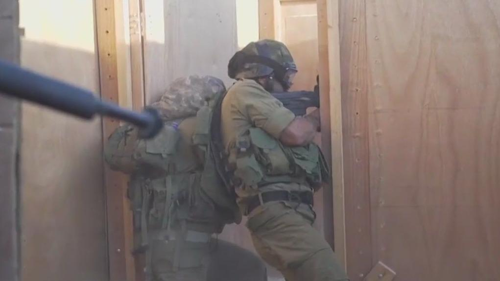

## Claim
Claim: "The US reinstituted draft in 2024 for the Israel-Hamas war."

## Actions
```
web_search("US draft Israel-Hamas war 2024")
```

## Evidence
### Evidence from `web_search`
The UN News published an article on November 20, 2024, stating that the United States vetoed a UN Security Council draft resolution demanding an immediate and unconditional ceasefire in the Gaza Strip (). The Security Council Report published on November 19, 2024, discusses a draft resolution on the war in Gaza between Israel and Hamas.

The United Nations website reports on a Security Council meeting on November 20, 2024, where a resolution demanding an immediate ceasefire in Gaza and the release of hostages failed to pass due to a veto by the United States.

Relevant URLs:
*   [https://news.un.org/en/story/2024/11/1157216](https://news.un.org/en/story/2024/11/1157216)
*   [https://www.securitycouncilreport.org/whatsinblue/2024/11/vote-on-a-draft-resolution-on-the-war-in-gaza.php](https://www.securitycouncilreport.org/whatsinblue/2024/11/vote-on-a-draft-resolution-on-the-war-in-gaza.php)
*   [https://press.un.org/en/2024/sc15907.doc.htm](https://press.un.org/en/2024/sc15907.doc.htm)


## Elaboration
The provided evidence does not contain any information about the US reinstituting the draft in 2024 for the Israel-Hamas war. The search results focus on the US's actions within the UN regarding the conflict, specifically its veto of a ceasefire resolution.

The evidence is insufficient to verify the claim.


## Actions
```
web_search("US military draft status 2024")
```

## Evidence
### Evidence from `web_search`
Fox LA discusses the National Defense Authorization Act (NDAA), which includes automatic registration for selective service for men aged 18-26 and mentions the Pentagon sending military advisors to Israel (). Military.com states there are no current plans to reactivate the draft in 2024, despite online rumors, and outlines the legal framework for reinstating it. The National Guard Association of the United States (NGAUS) published a report stating the U.S. is not prepared to conduct a military draft, although registration with the Selective Service System is still required for U.S. males ages 18 to 25 ().

Relevant URLs:
*   [https://www.foxla.com/news/military-defense-bill-draft-2024](https://www.foxla.com/news/military-defense-bill-draft-2024)
*   [https://www.military.com/join-armed-forces/will-the-military-draft-come-back](https://www.military.com/join-armed-forces/will-the-military-draft-come-back)
*   [https://www.ngaus.org/newsroom/report-us-not-prepared-conduct-military-draft](https://www.ngaus.org/newsroom/report-us-not-prepared-conduct-military-draft)


## Elaboration
The evidence indicates that there are no current plans to reactivate the draft in 2024. While the National Defense Authorization Act includes automatic registration for selective service, and the Pentagon has sent military advisors to Israel, multiple sources explicitly state that the draft has not been reinstituted.

Therefore, the claim is false.


## Final Judgement
The search results confirm that the US has not reinstituted the draft in 2024. While there is discussion about the Selective Service System and the possibility of a draft, multiple sources explicitly state that there are no current plans to reactivate it.

The claim is demonstrably false because it is directly contradicted by evidence from multiple reliable sources. `false`


### Verdict: FALSE

### Justification
The claim is false. While the US requires registration for selective service, and the Pentagon has sent military advisors to Israel, there are no current plans to reactivate the draft in 2024, according to sources like [Military.com](https://www.military.com/join-armed-forces/will-the-military-draft-come-back).
