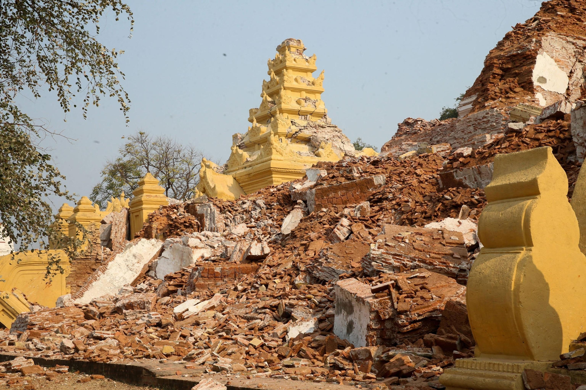
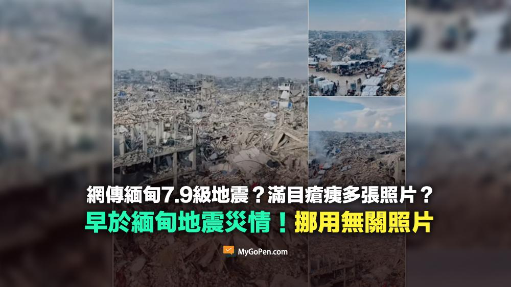
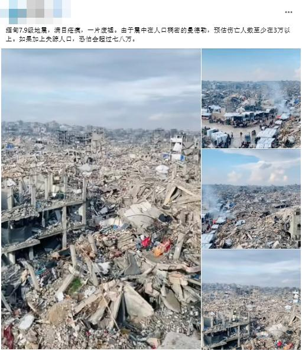
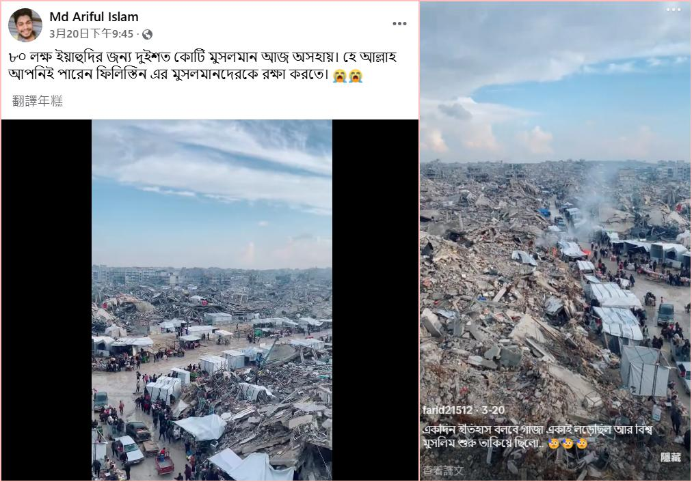

## Claim
Claim: " This image shows the ruins after a 7.9-magnitude earthquake in Myanmar on March 28, 2025."

## Actions
```
web_search("Myanmar earthquake March 28 2025")
image_search("Myanmar earthquake ruins")
```

## Evidence
### Evidence from `web_search`
The search results describe the 2025 Myanmar earthquake that occurred on March 28, 2025. The earthquake had a magnitude of 7.7-7.9 and caused damage in Myanmar, Thailand, and parts of China. It resulted in thousands of fatalities and injuries. The epicenter was near Mandalay.

The sources include information from Wikipedia ([https://en.wikipedia.org/wiki/2025_Myanmar_earthquake](https://en.wikipedia.org/wiki/2025_Myanmar_earthquake)), ScienceDirect ([https://www.sciencedirect.com/science/article/pii/S2950576325000017](https://www.sciencedirect.com/science/article/pii/S2950576325000017)), and Phys.org ([https://phys.org/news/2025-07-myanmar-earthquake-fault-rupture-exceeded.html](https://phys.org/news/2025-07-myanmar-earthquake-fault-rupture-exceeded.html)).    


### Evidence from `image_search`
The search results discuss a massive earthquake in Myanmar. One source from [artnews.com](https://www.artnews.com/art-news/news/monumental-ruins-emerge-following-massive-myanmar-earthquake-1234738471/) shows an image of ruins . Another source from [Archaeology.org](https://archaeology.org/news/2025/04/15/earthquake-in-myanmar-exposes-ancient-royal-structure/) mentions that the earthquake exposed an ancient royal structure .

National Geographic published an article about the Myanmar earthquake .


## Elaboration
The evidence confirms the existence of a 7.7-7.9 magnitude earthquake in Myanmar on March 28, 2025, which caused significant damage. The image search results show ruins and damage consistent with an earthquake. However, the evidence does not explicitly confirm that the image in the claim depicts the ruins from the 2025 Myanmar earthquake.

To verify the claim, it would be necessary to compare the image in the claim with other images of the earthquake's aftermath.


## Actions
```
reverse_search()
```

## Evidence
### Evidence from `reverse_search`
The reverse image search reveals that the image in the claim is a screenshot from a video that was circulating on social media platforms like Facebook and TikTok as early as March 20, 2025, and was claimed to be from the Gaza region. The image is unrelated to the Myanmar earthquake of March 28, 2025. The image was falsely associated with the Myanmar earthquake. (, , , , , , )


## Elaboration
The claim is false. The image in the claim is not from the 2025 Myanmar earthquake. Reverse image search reveals that the image was circulating on social media before the earthquake and was falsely associated with the Gaza region.


## Final Judgement
The image in the claim is not related to the 2025 Myanmar earthquake. The reverse image search shows that the image was circulating on social media before the earthquake and was falsely associated with the Gaza region. `false`

### Verdict: FALSE

### Justification
The claim is false. The image provided in the claim, which purports to show the aftermath of the 2025 Myanmar earthquake, has been circulating on social media since March 20, 2025, and is unrelated to the earthquake. Reverse image searches show that the image was falsely associated with the Gaza region.
