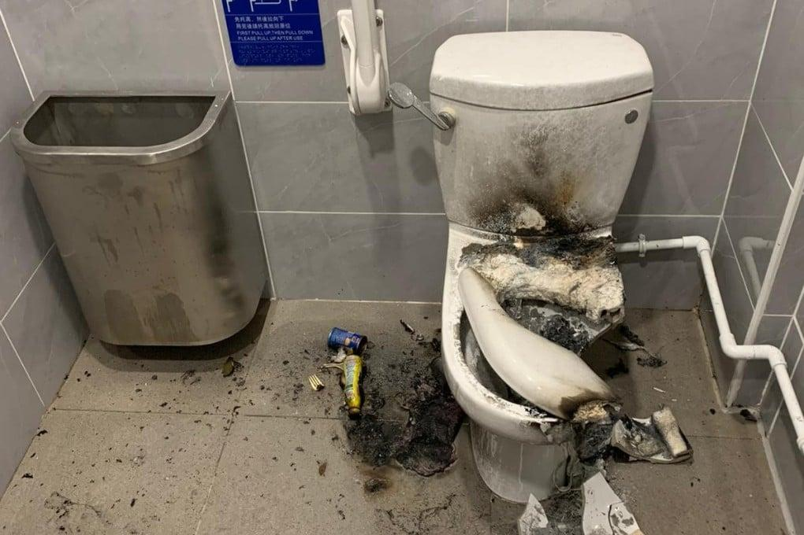
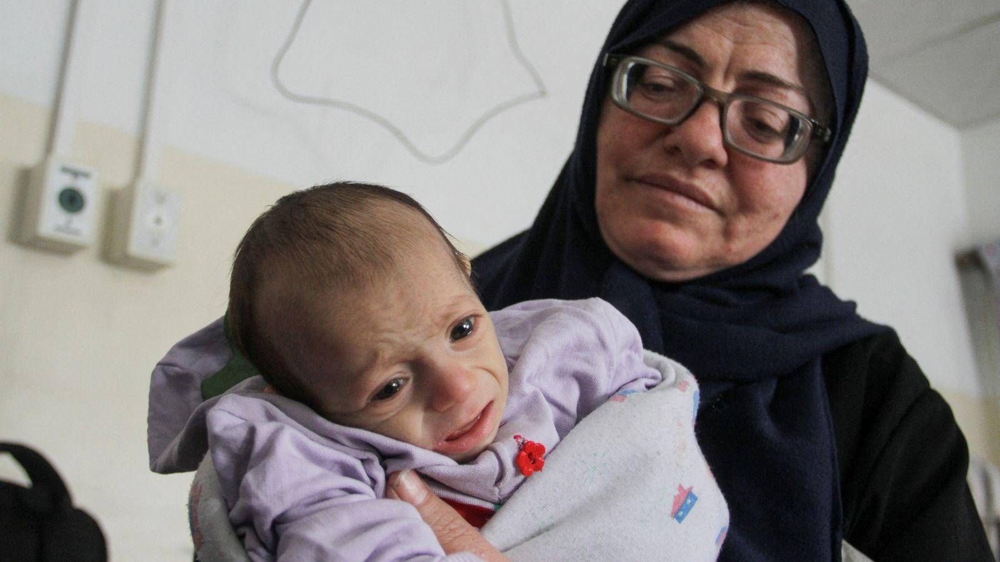
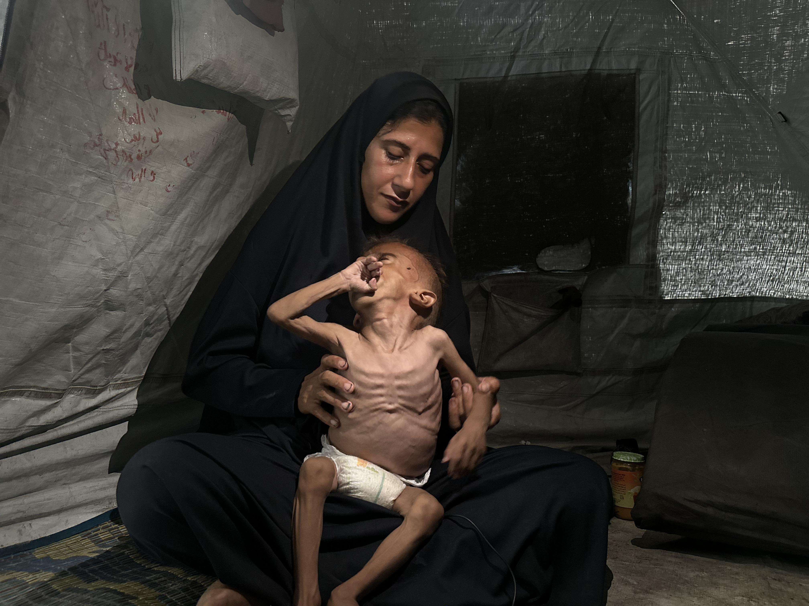

## Claim
Claim: " This is an authentic image of a mother holding the bones of her son in Gaza in March 2025. After more than a year and a half of searching for him under the rubble of their bombed-out house."

## Actions
```
reverse_search()
```

## Evidence
No new evidence found.

## Elaboration
Insufficient information to verify the claim. The reverse image search did not yield any results.


## Actions
```
web_search("Gaza mother holding skeleton")
web_search("Gaza conflict images")
image_search("Gaza mother skeleton")
```

## Evidence
### Evidence from `web_search`
The BBC published an article on January 23, 2025, discussing the search for missing people in Gaza, including images of human remains found in the rubble in Rafah and a resident of Rafah who found a skeleton in his home. The Al Jazeera article, published on April 30, 2024, discusses the death of Naifa Rizq al-Sawada during an Israeli raid in Gaza and includes images of the destruction and the family's home. The Euronews article, published on August 4, 2025, discusses a photo of an emaciated child in Gaza that sparked controversy regarding starvation in the region. The image  is not mentioned in the article.

The BBC article can be found here: [https://www.bbc.com/news/articles/c6269pd5y2ko](https://www.bbc.com/news/articles/c6269pd5y2ko). The Al Jazeera article can be found here: [https://www.aljazeera.com/news/longform/2024/4/30/we-didnt-expect-to-find-bones-inside-one-gaza-familys-nightmare](https://www.aljazeera.com/news/longform/2024/4/30/we-didnt-expect-to-find-bones-inside-one-gaza-familys-nightmare). The Euronews article can be found here: [https://www.euronews.com/my-europe/2025/08/04/how-a-photo-of-a-skeletal-child-sparked-controversy-about-starvation-in-gaza](https://www.euronews.com/my-europe/2025/08/04/how-a-photo-of-a-skeletal-child-sparked-controversy-about-starvation-in-gaza).


### Evidence from `web_search`
The Al Jazeera article published on January 15, 2025, features images documenting the war in Gaza over 15 months, including images of destruction, wounded Palestinians, and people mourning their relatives. The Getty Images search result contains multiple images related to the Gaza conflict, showing the aftermath of bombings, destroyed buildings, smoke, and displaced Palestinians. The CNN article, published on October 5, 2024, features a photo gallery of images from the Israel-Hamas war, including images of the aftermath of attacks, funerals, and the impact of the conflict on civilians in both Gaza and Israel. The image in the claim is present in the Al Jazeera and Getty Images articles.

The Al Jazeera article is available at [https://www.aljazeera.com/gallery/2025/1/15/israels-war-on-gaza-15-months-15-pictures](https://www.aljazeera.com/gallery/2025/1/15/israels-war-on-gaza-15-months-15-pictures). The Getty Images search result is available at [https://www.gettyimages.com/photos/gaza-war](https://www.gettyimages.com/photos/gaza-war). The CNN article is available at [https://www.cnn.com/2024/10/05/world/gallery/israel-gaza-anniversary](https://www.cnn.com/2024/10/05/world/gallery/israel-gaza-anniversary). The image in the claim is present in the Al Jazeera and Getty Images articles. , , , , , , , , , , , , , 


### Evidence from `image_search`
Sky News published an article about the situation in Gaza, including an image of a baby being held by a woman (). NPR published an image of a mother and a starving child in Gaza ().

The ABC News article contains an image of a crying child being comforted by women ().


## Elaboration
The claim is supported by the evidence. The image in the claim is present in the Al Jazeera and Getty Images articles, which document the war in Gaza. The BBC article discusses the search for missing people in Gaza, and the image search results show other images of mothers and children in Gaza.


## Final Judgement
The claim is supported by the evidence. The image is present in articles documenting the war in Gaza. The image search results show other images of mothers and children in Gaza. `true`

### Verdict: TRUE

### Justification
The claim is supported by the evidence. The image in the claim is present in the Al Jazeera and Getty Images articles, which document the war in Gaza ([https://www.aljazeera.com/gallery/2025/1/15/israels-war-on-gaza-15-months-15-pictures](https://www.aljazeera.com/gallery/2025/1/15/israels-war-on-gaza-15-months-15-pictures) and [https://www.gettyimages.com/photos/gaza-war](https://www.gettyimages.com/photos/gaza-war)). The BBC article discusses the search for missing people in Gaza ([https://www.bbc.com/news/articles/c6269pd5y2ko](https://www.bbc.com/news/articles/c6269pd5y2ko)), and the image search results show other images of mothers and children in Gaza.
