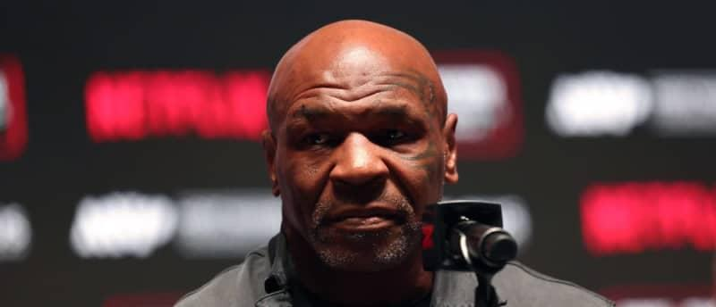

## Claim
Claim: " This is an authentic image of Mike Tyson posing with the Palestinian flag in the ring before his fight against Jake Paul on November, 15, 2024."

## Actions
```
web_search("Mike Tyson Palestinian flag fight")
image_search("Mike Tyson Palestinian flag")
```

## Evidence
### Evidence from `web_search`
The University at Buffalo published an article about a Reuters fact-check article addressing a fake photo of Mike Tyson with a Palestinian flag ([https://engineering.buffalo.edu/computer-science-engineering/news-and-events/news.host.html/content/shared/engineering/home/articles/media-mentions/2024-media-coverage/fact-check--mike-tyson-did-not-pose-with-palestinian-flag-ahead-.detail.html](https://engineering.buffalo.edu/computer-science-engineering/news-and-events/news.host.html/content/shared/engineering/home/articles/media-mentions/2024-media-coverage/fact-check--mike-tyson-did-not-pose-with-palestinian-flag-ahead-.detail.html)). An AOL article fact-checks an image of Mike Tyson with a Palestinian flag, stating that the image is AI-generated and not authentic ([https://www.aol.com/fact-check-image-mike-tyson-162031496.html](https://www.aol.com/fact-check-image-mike-tyson-162031496.html)).

The AOL article mentions that the image was shared on Facebook and is not referenced on Tyson’s website or social media accounts. The fight between Tyson and Jake Paul was on November 15, 2024.  and 


### Evidence from `image_search`
From [Source](https://www.rtve.es/noticias/20241118/exboxeador-mike-tyson-no-posa-bandera-palestina-imagenes-creadas-ia/16335603.shtml): 
Content: The search result from RTVE.es shows an image of Mike Tyson with the Palestinian flag. The image is labeled as a "BULO" (hoax). The image was posted on November 15, 2024. 


## Elaboration
The evidence indicates that the image of Mike Tyson with the Palestinian flag is not authentic. Multiple sources, including an AOL article ([https://www.aol.com/fact-check-image-mike-tyson-162031496.html](https://www.aol.com/fact-check-image-mike-tyson-162031496.html)) and RTVE.es ([https://www.rtve.es/noticias/20241118/exboxeador-mike-tyson-no-posa-bandera-palestina-imagenes-creadas-ia/16335603.shtml](https://www.rtve.es/noticias/20241118/exboxeador-mike-tyson-no-posa-bandera-palestina-imagenes-creadas-ia/16335603.shtml)), have fact-checked the image and labeled it as AI-generated or a hoax. The image was shared on social media, but it is not referenced on Tyson's official website or social media accounts.


## Final Judgement
The claim that the image is authentic is false. Multiple sources confirm that the image of Mike Tyson with the Palestinian flag is not real and is likely AI-generated.

`false`

### Verdict: FALSE

### Justification
The image of Mike Tyson posing with the Palestinian flag is not authentic. Fact-checks from sources like AOL ([https://www.aol.com/fact-check-image-mike-tyson-162031496.html](https://www.aol.com/fact-check-image-mike-tyson-162031496.html)) and RTVE.es ([https://www.rtve.es/noticias/20241118/exboxeador-mike-tyson-no-posa-bandera-palestina-imagenes-creadas-ia/16335603.shtml](https://www.rtve.es/noticias/20241118/exboxeador-mike-tyson-no-posa-bandera-palestina-imagenes-creadas-ia/16335603.shtml)) indicate the image is AI-generated or a hoax.
