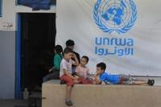
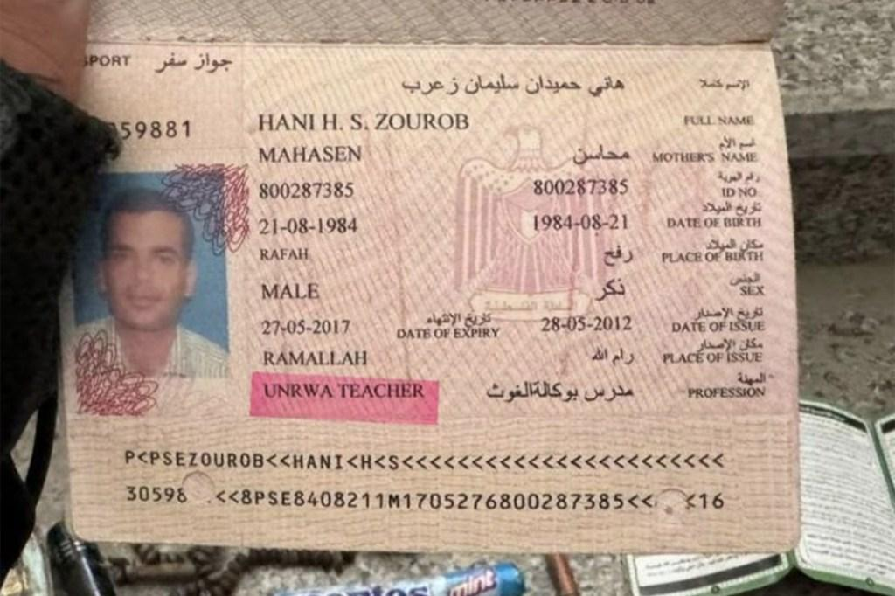
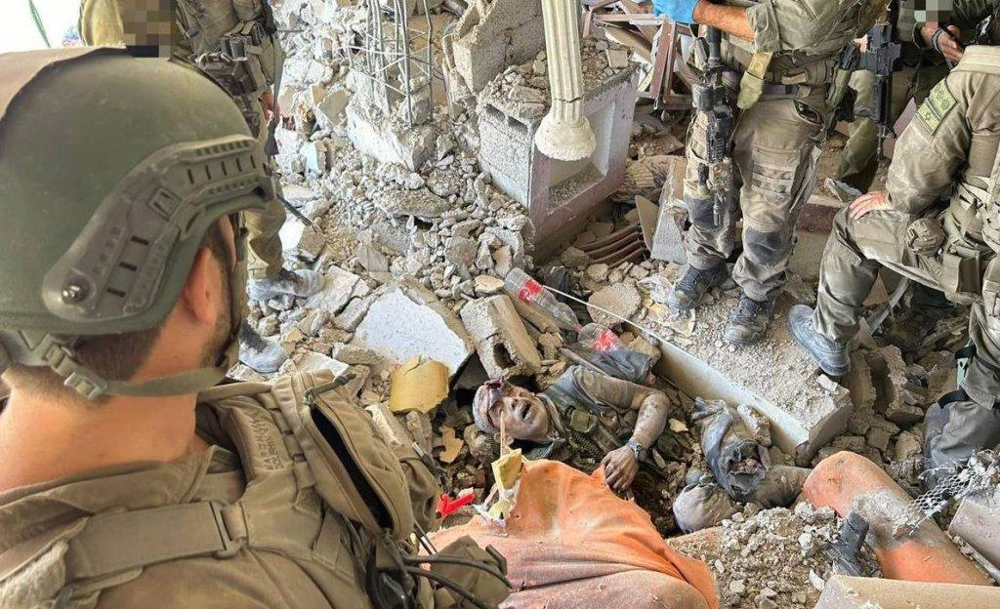
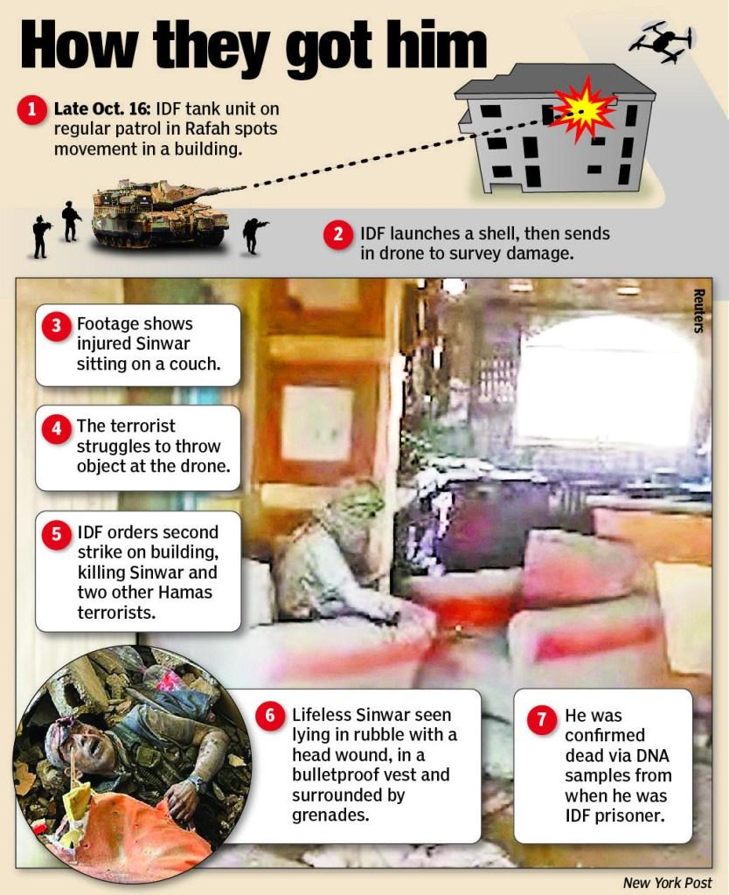

## Claim
Claim: " This image shows a screenshot of the X profile of UNRWA which has placed a black band over its profile photo in mourning for the death of Yahya Sinwar, Hamas leader in the Gaza Strip, in October 2024."

## Actions
```
web_search("UNRWA profile Yahya Sinwar")
```

## Evidence
### Evidence from `web_search`
The DW article ([https://www.dw.com/en/fact-check-black-ribbon-on-unrwa-logo-does-not-show-mourning-for-sinwar/a-70532996](https://www.dw.com/en/fact-check-black-ribbon-on-unrwa-logo-does-not-show-mourning-for-sinwar/a-70532996)) fact-checks the claim that UNRWA is mourning the death of Yahya Sinwar, stating that the black ribbon was added to the UNRWA profile picture on X before Sinwar's death, specifically by October 22, 2023, and on Facebook on October 11, 2023. The Canadian Press News ([https://www.thecanadianpressnews.ca/fact_checking/black-band-on-unrwas-social-media-profiles-appeared-before-yahya-sinwars-death/article_33032eb2-f64b-55c6-8a57-3289e6a014cf.html](https://www.thecanadianpressnews.ca/fact_checking/black-band-on-unrwas-social-media-profiles-appeared-before-yahya-sinwars-death/article_33032eb2-f64b-55c6-8a57-3289e6a014cf.html)) also fact-checked the claim and found that the black band was present before Sinwar's death.

The New York Post ([https://nypost.com/2024/10/17/us-news/unrwa-teachers-passport-found-on-hamas-leader-sinwars-slain-body-after-israeli-forces-killed-him-photos-show/](https://nypost.com/2024/10/17/us-news/unrwa-teachers-passport-found-on-hamas-leader-sinwars-slain-body-after-israeli-forces-killed-him-photos-show/)) reports that an apparent passport belonging to a UNRWA teacher was found on the body of Hamas leader Yahya Sinwar after he was killed by Israeli forces.        


## Elaboration
The claim is inaccurate. The evidence indicates that the black band on the UNRWA profile picture predates the death of Yahya Sinwar. The DW article ([https://www.dw.com/en/fact-check-black-ribbon-on-unrwa-logo-does-not-show-mourning-for-sinwar/a-70532996](https://www.dw.com/en/fact-check-black-ribbon-on-unrwa-logo-does-not-show-mourning-for-sinwar/a-70532996)) and The Canadian Press News ([https://www.thecanadianpressnews.ca/fact_checking/black-band-on-unrwas-social-media-profiles-appeared-before-yahya-sinwars-death/article_33032eb2-f64b-55c6-8a57-3289e6a014cf.html](https://www.thecanadianpressnews.ca/fact_checking/black-band-on-unrwas-social-media-profiles-appeared-before-yahya-sinwars-death/article_33032eb2-f64b-55c6-8a57-3289e6a014cf.html)) both confirm this.


## Final Judgement
The claim is false because the black band on the UNRWA profile picture was present before the death of Yahya Sinwar. `false`

### Verdict: FALSE

### Justification
The claim that UNRWA placed a black band on its profile picture to mourn the death of Yahya Sinwar is false. Fact-checks by DW ([https://www.dw.com/en/fact-check-black-ribbon-on-unrwa-logo-does-not-show-mourning-for-sinwar/a-70532996](https://www.dw.com/en/fact-check-black-ribbon-on-unrwa-logo-does-not-show-mourning-for-sinwar/a-70532996)) and The Canadian Press News ([https://www.thecanadianpressnews.ca/fact_checking/black-band-on-unrwas-social-media-profiles-appeared-before-yahya-sinwars-death/article_33032eb2-f64b-55c6-8a57-3289e6a014cf.html](https://www.thecanadianpressnews.ca/fact_checking/black-band-on-unrwas-social-media-profiles-appeared-before-yahya-sinwars-death/article_33032eb2-f64b-55c6-8a57-3289e6a014cf.html)) show that the black band was added before Sinwar's death.
