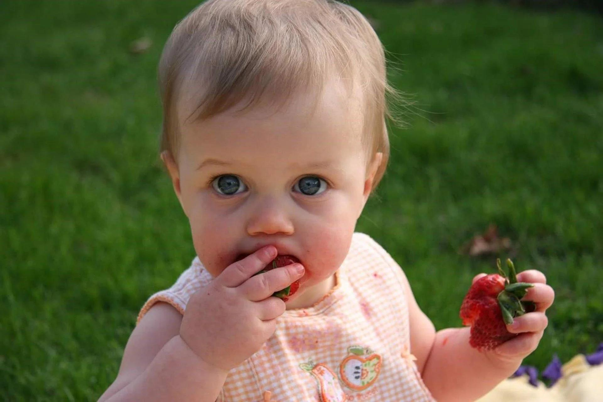

## Claim
Claim: " This image shows the youngest victim of the Hezbollah rocket that murdered 12 children playing soccer in Israel on July 27, 2024."

## Actions
```
reverse_search()
web_search("Hezbollah rocket Israel July 27 2024")
```

## Evidence
### Evidence from `reverse_search`
The image in the claim, 

### Evidence from `web_search`
The search results include a Wikipedia article about the timeline of the Israel–Hezbollah conflict from July 27, 2024, to September 16, 2024, which mentions a Hezbollah rocket striking a soccer field in Majdal Shams on July 27, 2024, killing 12 children. The image 

## Elaboration
The evidence suggests that a Hezbollah rocket did strike a soccer field in Israel on July 27, 2024, killing 12 children. However, the image provided does not appear in the search results.

Therefore, the claim cannot be verified. More information is needed to confirm if the image is related to the event.


## Actions
```
image_search("Malak baby strawberry")
web_search("Hezbollah rocket Majdal Shams July 27 2024")
```

## Evidence
### Evidence from `image_search`
From [Source](https://www.malinamalkani.com/blog/what-you-need-to-know-about-strawberries-and-baby-led-weaning): 
Content: The search result from malinamalkani.com shows a baby eating a strawberry. 


### Evidence from `web_search`
The Wikipedia article ([https://en.wikipedia.org/wiki/Majdal_Shams_attack](https://en.wikipedia.org/wiki/Majdal_Shams_attack)) discusses the Majdal Shams attack on July 27, 2024, where a rocket hit a soccer field, killing 12 Syrian Druze children. Israel blamed Hezbollah, while Hezbollah denied responsibility. NPR ([https://www.npr.org/2024/07/27/nx-s1-5054339/rocket-attack-on-israeli-controlled-golan-heights-kills-10-rescue-official-says](https://www.npr.org/2024/07/27/nx-s1-5054339/rocket-attack-on-israeli-controlled-golan-heights-kills-10-rescue-official-says)) also reports on the attack, stating that at least 10 people were killed. 

## Elaboration
The image search reveals a baby eating a strawberry, which is unrelated to the claim. The web search confirms the rocket attack on Majdal Shams on July 27, 2024, but the image is not associated with the event.

Therefore, the claim is not supported by the evidence.


## Final Judgement
The image search shows a baby eating a strawberry, and the web search confirms the rocket attack on July 27, 2024, but the image is not associated with the event. The claim is not supported by the evidence.

`false`

### Verdict: FALSE

### Justification
The claim is false. While a rocket attack did occur on July 27, 2024, in Majdal Shams, killing children, the image provided is unrelated to the event. The image search results show a baby eating a strawberry, and the web search confirms the attack, but the image is not associated with the event.
