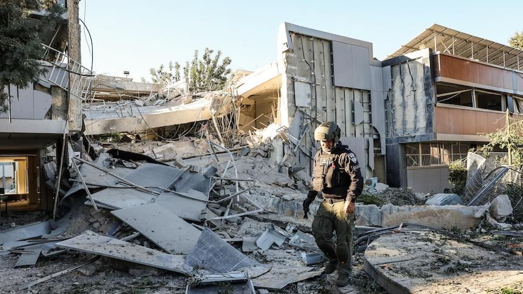
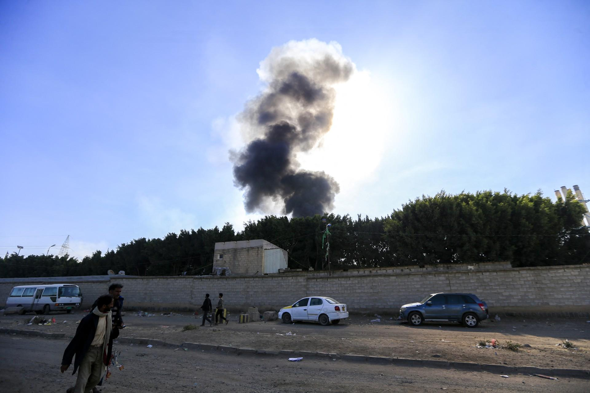

## Claim
Claim: " This image shows the U.S. bombarding Yemen on December 22, 2024 in reprisal after Yemen launched an attack on Israel's capital."

## Actions
```
web_search("U.S. bombing Yemen December 22 2024")
image_search("U.S. bombing Yemen December 22 2024")
```

## Evidence
### Evidence from `web_search`
On December 22, 2024, the U.S. launched airstrikes against Houthi targets in Yemen in response to Houthi attacks on U.S. navy warships and merchant vessels, as reported by The Guardian ([https://www.theguardian.com/world/2024/dec/22/us-launches-airstrikes-against-houthi-targets-in-yemen](https://www.theguardian.com/world/2024/dec/22/us-launches-airstrikes-against-houthi-targets-in-yemen)). The article also mentions that Israel launched strikes against Yemen. Al Jazeera reported on December 21, 2024, that the U.S. conducted airstrikes against Houthi targets in Yemen's capital, Sanaa ([https://www.aljazeera.com/news/2024/12/21/us-says-conducted-strikes-against-houthi-targets-in-yemens-capital](https://www.aljazeera.com/news/2024/12/21/us-says-conducted-strikes-against-houthi-targets-in-yemens-capital)). The Wikipedia article "US–UK airstrikes on Yemen" discusses military operations by the United States and the United Kingdom against the Houthi movement in Yemen, starting on January 12, 2024 ([https://en.wikipedia.org/wiki/US%E2%80%93UK_airstrikes_on_Yemen](https://en.wikipedia.org/wiki/US%E2%80%93UK_airstrikes_on_Yemen)).

The Wikipedia article also mentions the 2024 Houthi drone attack on Israel, and the 2024 Tel Aviv drone attack. The article also mentions the 2024 Israeli attacks on Yemen. The article also mentions the 2025 U.S.–Houthi ceasefire. The article also mentions the 2025 Houthi attack on Tel Aviv airport. The article also mentions the May 2025 Israeli attacks on Yemen. The Al Jazeera article includes an image of smoke rising from the site of strikes in Sanaa, Yemen, on October 4, 2024 ().


### Evidence from `image_search`
On December 22, 2024, Al Jazeera published an article about the U.S. military, including an image of a U.S. Navy jet (). ABC News reported that the U.S. launched air strikes against Houthi targets in Yemen on the same date ().

Turkiyetoday.com also reported on U.S. airstrikes in Yemen's capital Sanaa, showing an image of smoke in the sky ().

*   [https://www.aljazeera.com/news/2024/12/22/us-army-says-two-navy-pilots-shot-down-over-red-sea-in-friendly-fire](https://www.aljazeera.com/news/2024/12/22/us-army-says-two-navy-pilots-shot-down-over-red-sea-in-friendly-fire)
*   [https://www.turkiyetoday.com/region/us-confirms-airstrikes-in-yemen-capital-sanaa-targeting-houthi-missile-facilities-95871](https://www.turkiyetoday.com/region/us-confirms-airstrikes-in-yemen-capital-sanaa-targeting-houthi-missile-facilities-95871)
*   [https://www.abc.net.au/news/2024-12-22/us-air-strikes-hit-houthi-targets-in-yemen/104755402](https://www.abc.net.au/news/2024-12-22/us-air-strikes-hit-houthi-targets-in-yemen/104755402)


## Elaboration
The evidence confirms that the U.S. launched airstrikes against Houthi targets in Yemen on December 22, 2024. However, the provided evidence does not mention that the U.S. strikes were in reprisal for a Houthi attack on Israel's capital. The evidence mentions that Israel also launched strikes against Yemen.

The image search results show images related to the U.S. airstrikes in Yemen on December 22, 2024.

Therefore, the claim is partially supported, as the U.S. did bomb Yemen on the specified date. However, the reason for the bombing, as stated in the claim, is not supported by the evidence.


## Final Judgement
The evidence confirms that the U.S. launched airstrikes against Houthi targets in Yemen on December 22, 2024. However, the claim that the strikes were in reprisal for a Houthi attack on Israel's capital is not supported by the evidence.

The claim is partially accurate, as the U.S. did bomb Yemen on the specified date. However, the reason for the bombing, as stated in the claim, is not supported by the evidence. Therefore, the claim is `false`.

### Verdict: FALSE

### Justification
The claim is partially accurate. The U.S. did launch airstrikes against Houthi targets in Yemen on December 22, 2024, as reported by sources like The Guardian ([https://www.theguardian.com/world/2024/dec/22/us-launches-airstrikes-against-houthi-targets-in-yemen](https://www.theguardian.com/world/2024/dec/22/us-launches-airstrikes-against-houthi-targets-in-yemen)) and Al Jazeera ([https://www.aljazeera.com/news/2024/12/21/us-says-conducted-strikes-against-houthi-targets-in-yemens-capital](https://www.aljazeera.com/news/2024/12/21/us-says-conducted-strikes-against-houthi-targets-in-yemens-capital)). However, the claim that the strikes were in reprisal for a Houthi attack on Israel's capital is not supported by the evidence.
