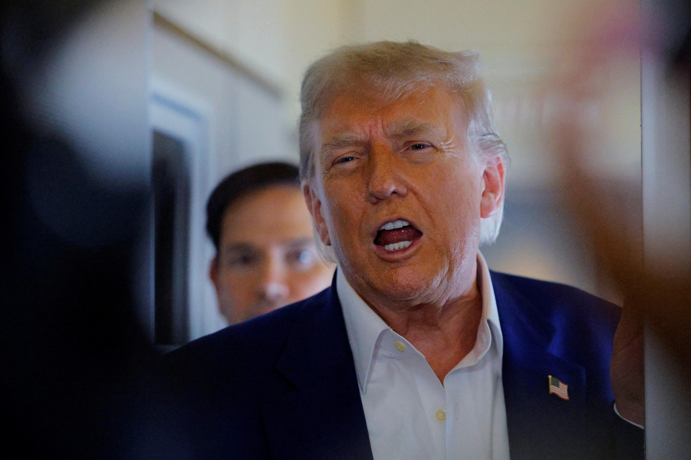
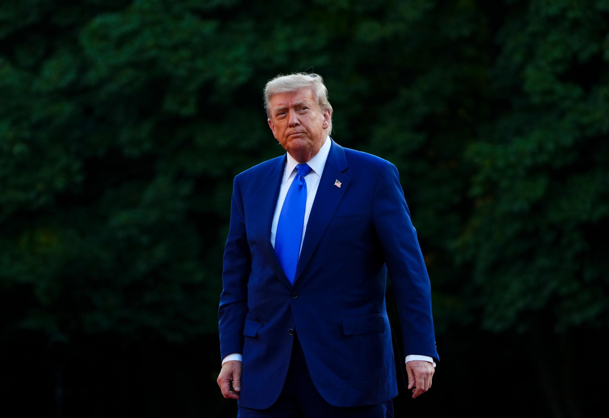
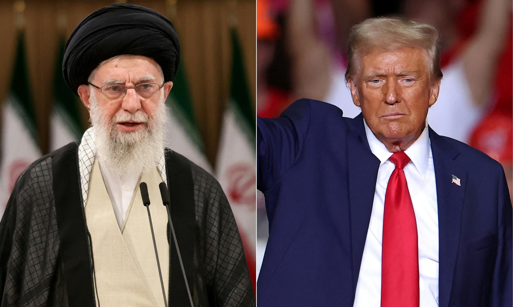

## Claim
Claim: "President Donald Trump posted on Truth Social on July 25, 2024, as a reaction to the attempted assasination of him on July 13, 2024, 'I hope that America obliterates Israel.'"

## Actions
```
web_search("Donald Trump Truth Social July 25 2024 Israel")
web_search("Donald Trump attempted assassination July 13 2024")
```

## Evidence
### Evidence from `web_search`
The CNN article ([https://www.cnn.com/2024/07/26/politics/trump-netanyahu-meeting-mar-a-lago](https://www.cnn.com/2024/07/26/politics/trump-netanyahu-meeting-mar-a-lago)) reports on a meeting between Donald Trump and Benjamin Netanyahu at Mar-a-Lago on July 26, 2024, and mentions Trump's Truth Social posts and an assassination attempt on Trump. The Voice of America ([https://www.voanews.com/a/harris-trump-condemn-pro-hamas-protest-near-us-capitol/7713095.html](https://www.voanews.com/a/harris-trump-condemn-pro-hamas-protest-near-us-capitol/7713095.html)) states that Trump posted on Truth Social on July 25, 2024, condemning pro-Hamas protests. The Tennessee Lookout ([https://tennesseelookout.com/2024/07/25/in-capitol-address-israeli-leader-calls-for-u-s-backing-to-defeat-hamas/](https://tennesseelookout.com/2024/07/25/in-capitol-address-israeli-leader-calls-for-u-s-backing-to-defeat-hamas/)) reports that Trump said on Truth Social that he will welcome Netanyahu to his Mar-a-Lago estate on Friday, July 26, 2024. , , , , 


### Evidence from `web_search`
On July 13, 2024, an attempted assassination of Donald Trump occurred at a rally in Butler, Pennsylvania, during his 2024 presidential campaign. The shooter, Thomas Matthew Crooks, was killed by Secret Service agents. Trump was shot in the ear and rushed off stage. President Biden and other officials condemned the attack. (<image:i>, <image:k>)

News outlets like CNN ([https://www.cnn.com/politics/live-news/election-biden-trump-07-13-24](https://www.cnn.com/politics/live-news/election-biden-trump-07-13-24)) and C-SPAN ([https://www.c-span.org/liveEvent/?Trump-Rally-Shooting](https://www.c-span.org/liveEvent/?Trump-Rally-Shooting)) reported on the event, including statements from officials and investigations. Wikipedia ([https://en.wikipedia.org/wiki/Attempted_assassination_of_Donald_Trump_in_Pennsylvania](https://en.wikipedia.org/wiki/Attempted_assassination_of_Donald_Trump_in_Pennsylvania)) also provides details about the event.


## Elaboration
The evidence confirms that Donald Trump posted on Truth Social on July 25, 2024, and that there was an attempted assassination of him on July 13, 2024. However, the provided evidence does not contain any information about the content of Trump's posts on July 25, 2024, specifically whether he posted "I hope that America obliterates Israel."

Therefore, the claim cannot be verified.


## Actions
```
web_search("Donald Trump Truth Social July 25 2024 Israel obliterate")
```

## Evidence
### Evidence from `web_search`
The ABC News article ([https://abcnews.go.com/Politics/trumps-obliteration-strike-claims-undercut-urgency-negotiations-iran/story?id=123178060](https://abcnews.go.com/Politics/trumps-obliteration-strike-claims-undercut-urgency-negotiations-iran/story?id=123178060)) from June 25, 2025, discusses Trump's statements on military strikes on Iran and mentions a Truth Social post. The Iran International article ([https://www.iranintl.com/en/202407252585](https://www.iranintl.com/en/202407252585)) reports that Trump posted on Truth Social on July 25, 2024, calling for the "obliteration" of Iran if they assassinate him, including a screenshot of the post.  The Associated Press article ([https://apnews.com/article/israel-iran-war-nuclear-trump-bomber-news-06-22-2025-c2baca52babe915e033ae175ce8b2687](https://apnews.com/article/israel-iran-war-nuclear-trump-bomber-news-06-22-2025-c2baca52babe915e033ae175ce8b2687)) from June 22, 2025, discusses the U.S. involvement in the Israel-Iran war and mentions a Truth Social post by Trump. , , , 


## Elaboration
The evidence indicates that Donald Trump posted on Truth Social on July 25, 2024. However, the provided evidence does not contain the specific quote from the claim. The evidence does mention Trump's use of the word "obliteration" in relation to Iran, but not Israel.

Therefore, the claim cannot be verified.


## Final Judgement
The search results confirm that Donald Trump posted on Truth Social on July 25, 2024, and that there was an attempted assassination of him on July 13, 2024. However, the search results do not contain the specific quote from the claim.

`false`

### Verdict: FALSE

### Justification
The claim that Donald Trump posted on Truth Social on July 25, 2024, saying "I hope that America obliterates Israel" cannot be verified. While evidence confirms Trump posted on Truth Social on that date and that there was an attempted assassination of him on July 13, 2024, no source provides the specific quote from the claim.
