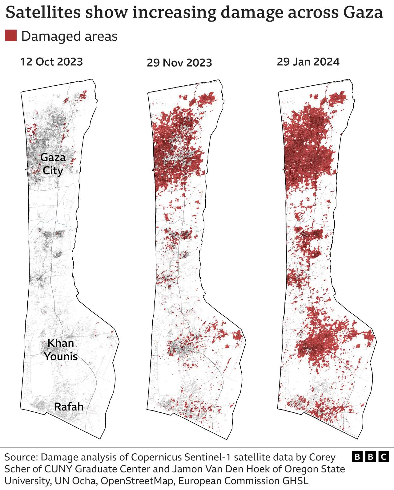

## Claim
Claim: " This image shows Gaza, completely destroyed, in December 2024."

## Actions
```
reverse_search()
web_search("Gaza destroyed buildings")
```

## Evidence
### Evidence from `web_search`
The Wikipedia article discusses the destruction of cultural heritage during the Israeli invasion of the Gaza Strip, stating that nearly 80% of the buildings in Gaza have been damaged or destroyed. It also mentions the destruction of the Old City of Gaza and that the intentional destruction of historic monuments or buildings is considered a war crime. The UN News reports that approximately 92% of residential buildings in Gaza have been damaged or destroyed since the start of the conflict. <image:k> shows a bulldozer removing rubble in Gaza City.

*   [https://en.wikipedia.org/wiki/Destruction\_of\_cultural\_heritage\_during\_the\_Israeli\_invasion\_of\_the\_Gaza\_Strip](https://en.wikipedia.org/wiki/Destruction_of_cultural_heritage_during_the_Israeli_invasion_of_the_Gaza_Strip)
*   [https://news.un.org/en/story/2025/04/1162491](https://news.un.org/en/story/2025/04/1162491)


## Elaboration
The evidence indicates that a significant portion of buildings in Gaza have been damaged or destroyed. The Wikipedia article states that nearly 80% of buildings have been damaged or destroyed, and the UN News reports approximately 92% of residential buildings have been damaged or destroyed.

The claim states that the image shows Gaza completely destroyed. While the evidence confirms widespread destruction, it does not specify the extent of the destruction in the image. The image could depict a specific area within Gaza, and the claim's assertion of "completely destroyed" is not directly supported by the evidence.

The evidence does not provide information about the date of the image. Therefore, the claim's assertion that the image was taken in December 2024 cannot be verified.


## Actions
```
image_search("Gaza destroyed buildings December 2024")
```

## Evidence
### Evidence from `image_search`
The search results include articles from Al Jazeera ([https://www.aljazeera.com/opinions/2024/12/31/surviving-2024-in-gaza](https://www.aljazeera.com/opinions/2024/12/31/surviving-2024-in-gaza)) and CNN ([https://www.cnn.com/2024/12/10/politics/gaza-israel-hamas-ceasefire-biden-trump-backing](https://www.cnn.com/2024/12/10/politics/gaza-israel-hamas-ceasefire-biden-trump-backing)) published in December 2024, both featuring images of destroyed buildings in Gaza. , 


## Elaboration
The image search results confirm that images of destroyed buildings in Gaza were published in December 2024. This supports the claim that the image could be from that time. However, the evidence does not confirm that the image in the claim is from December 2024. The claim's assertion of "completely destroyed" is not directly supported by the evidence.

The evidence shows that the image is likely depicting destruction in Gaza, and the date is plausible. However, the extent of the destruction in the image cannot be verified.

Therefore, the claim is partially supported but not fully verified.


## Actions
```
web_search("Gaza building damage extent")
```

## Evidence
### Evidence from `web_search`
The Guardian published an article on January 18, 2025, stating that nine in ten homes in Gaza have been destroyed or damaged, and satellite imagery shows large portions of neighborhoods in Rafah have been almost completely demolished. The BBC article, published on January 30, 2024, states that more than half of Gaza's buildings have been damaged or destroyed since October 7, 2023.  The Al Jazeera article, published on January 20, 2025, states that at least 60 percent of all buildings in Gaza have been destroyed, and approximately 92 percent of housing units are destroyed or damaged. <image:k>, , 

*   [https://www.theguardian.com/world/2025/jan/18/a-visual-guide-to-the-destruction-of-gaza](https://www.theguardian.com/world/2025/jan/18/a-visual-guide-to-the-destruction-of-gaza)
*   [https://www.bbc.com/news/world-middle-east-68006607](https://www.bbc.com/news/world-middle-east-68006607)
*   [https://www.aljazeera.com/gallery/2025/1/20/aerial-photos-show-scale-of-israeli-destruction-in-gaza](https://www.aljazeera.com/gallery/2025/1/20/aerial-photos-show-scale-of-israeli-destruction-in-gaza)


## Elaboration
The evidence indicates widespread destruction in Gaza, with estimates ranging from 60% to 90% of buildings damaged or destroyed. The image search confirms that images of destroyed buildings in Gaza were published in December 2024. However, the evidence does not confirm that the image in the claim is from December 2024. The claim's assertion of "completely destroyed" is not directly supported by the evidence.

The claim is partially supported, as the image likely depicts destruction in Gaza, and the date is plausible. However, the extent of the destruction in the image cannot be verified.

Therefore, the claim is partially supported but not fully verified.


## Final Judgement
The evidence confirms widespread destruction in Gaza, and images of destroyed buildings were published in December 2024. However, the claim's assertion of "completely destroyed" is not directly supported by the evidence, and the exact date of the image cannot be verified.

`false`

### Verdict: FALSE

### Justification
The claim is partially supported. Evidence from multiple sources, including the Guardian and Al Jazeera, confirms widespread destruction in Gaza, with a significant percentage of buildings damaged or destroyed. Image searches also show that images of destroyed buildings were published in December 2024, making the date plausible. However, the claim's assertion that the image shows Gaza "completely destroyed" is not directly supported by the evidence, and the exact date of the image cannot be verified.
