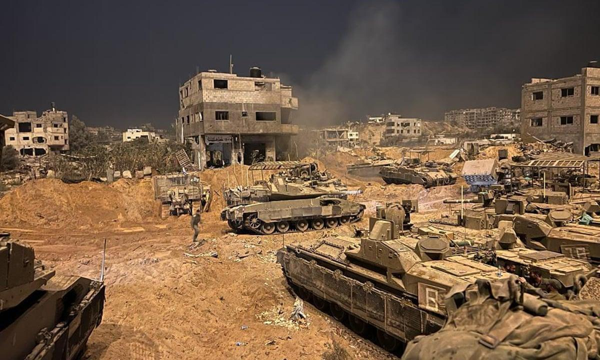
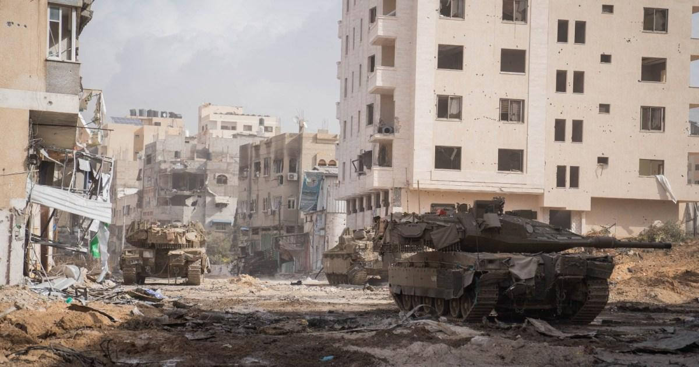

## Claim
Claim: " This image shows an Israeli tank unit near Jabalia camp in northern Gaza that was successfully ambushed by Hamas fighters, destroying multiple vehicles and injuring or killing their crews in October 2024."

## Actions
```
web_search("Israeli tank Jabalia camp Hamas ambush October 2024")
image_search("Israeli tank destroyed Gaza")
```

## Evidence
### Evidence from `web_search`
Al Jazeera ([https://www.aljazeera.com/news/2024/10/6/israel-launches-ground-offensive-on-jabalia-again-killing-17](https://www.aljazeera.com/news/2024/10/6/israel-launches-ground-offensive-on-jabalia-again-killing-17)) reported on an Israeli ground offensive on Jabalia refugee camp in northern Gaza in October 2024, mentioning tank deployment and casualties. The Guardian ([https://www.theguardian.com/global-development/2024/dec/18/jabaliya-refugee-camp-gaza-destruction-idf](https://www.theguardian.com/global-development/2024/dec/18/jabaliya-refugee-camp-gaza-destruction-idf)) discussed the destruction of the Jabaliya refugee camp by Israeli forces, including satellite images and videos.

The Wikipedia article ([https://en.wikipedia.org/wiki/Siege_of_North_Gaza](https://en.wikipedia.org/wiki/Siege_of_North_Gaza)) discusses the Siege of North Gaza, which included fighting in Jabalia, and mentions an ambush on October 10, where Hamas destroyed an IDF mechanized infantry company. The articles mention the deployment of tanks and the destruction of vehicles in the Jabalia camp. , , , , , , 


### Evidence from `image_search`
The Guardian published an article on November 4, 2023, about the Israeli military operations in Gaza, including an image of Israeli tanks in Gaza (). Al Jazeera published an article on November 21, 2023, about Israeli army tanks in Gaza City ().

Anadolu Agency reported that Hamas's armed wing said it destroyed an Israeli tank and two bulldozers in Gaza.


## Elaboration
The evidence confirms that Israeli tanks were deployed in Gaza, including in the Jabalia camp, and that there were clashes between Israeli forces and Hamas fighters in October 2024. The Wikipedia article mentions an ambush on October 10, where Hamas destroyed an IDF mechanized infantry company. The image search results show images of Israeli tanks in Gaza.

The claim states that the image shows an Israeli tank destroyed in an ambush by Hamas fighters. The evidence supports the presence of Israeli tanks in Gaza and fighting in Jabalia, including an ambush. However, the evidence does not explicitly confirm that the tank in the image was destroyed in an ambush by Hamas fighters.

Therefore, the claim is partially supported, but further information is needed to confirm the specific circumstances of the tank's destruction in the image.


## Actions
```
reverse_search()
```

## Evidence
### Evidence from `reverse_search`
The reverse image search found the image () on 9jaflaver.com, which reported on the Hamas attack on Israel on October 7, 2023, and Nairaland.com, which also reported on the Hamas attacks on Israel on October 7, 2023. The image was also found on dawahilallah.com, which published an article on August 14, 2025, discussing the destruction of two Israeli tanks by Al-Qassam Brigades in Khan Yunis. The articles from 9jaflaver.com and Nairaland.com include images of the conflict, while the article from dawahilallah.com discusses the destruction of tanks.


## Elaboration
The reverse image search results indicate that the image of the burning tank has been associated with the Hamas attack on Israel on October 7, 2023, and with the destruction of Israeli tanks by Al-Qassam Brigades in Khan Yunis. The claim mentions an ambush in October 2024, which is not supported by the evidence.

The claim is therefore **inaccurate** because the image is associated with events in 2023, not 2024.


## Final Judgement
The evidence indicates that the image of the burning tank is associated with events in 2023, specifically the Hamas attack on Israel in October 2023. The claim mentions an ambush in October 2024, which is not supported by the evidence. Therefore, the claim is inaccurate. `false`

### Verdict: FALSE

### Justification
The claim is inaccurate. While the image depicts a burning tank, reverse image searches link it to the Hamas attack on Israel in October 2023, not an ambush in October 2024 as stated in the claim. The image was found on websites like [9jaflaver.com](https://www.9jaflaver.com/) and [Nairaland.com](https://www.nairaland.com/), which reported on the October 7, 2023, attacks.
