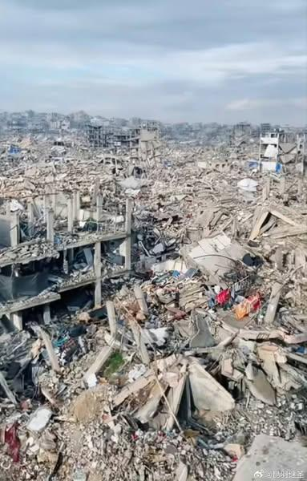
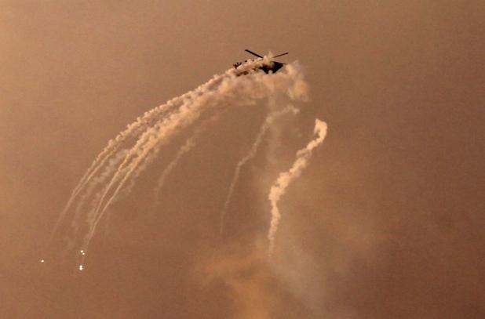

## Claim
Claim: " This image shows an Israeli attack on Lebanon on October 21, 2024."

## Actions
```
web_search("Israeli attack Lebanon October 21 2024")
```

## Evidence
### Evidence from `web_search`
The CNN article ([https://www.cnn.com/world/live-news/israel-iran-lebanon-gaza-war-10-21-24-intl-hnk](https://www.cnn.com/world/live-news/israel-iran-lebanon-gaza-war-10-21-24-intl-hnk)) reports on the ongoing conflict between Israel and Hezbollah, including an Israeli strike near Rafik Hariri University Hospital in Beirut on October 21, 2024, resulting in casualties. The Guardian ([https://www.theguardian.com/world/2024/oct/21/israeli-airstrikes-on-lebanon-hit-branches-of-hezbollah-linked-bank-al-qard-al-hassan](https://www.theguardian.com/world/2024/oct/21/israeli-airstrikes-on-lebanon-hit-branches-of-hezbollah-linked-bank-al-qard-al-hassan)) also reported on October 21, 2024, about Israeli airstrikes on Lebanon, targeting branches of the Hezbollah-linked bank Al-Qard Al-Hassan.

The Wikipedia article ([https://en.wikipedia.org/wiki/2024_Israeli_invasion_of_Lebanon](https://en.wikipedia.org/wiki/2024_Israeli_invasion_of_Lebanon)) discusses the 2024 Israeli invasion of Lebanon, which began on October 1, 2024, as part of the ongoing Israel–Hezbollah conflict, including airstrikes, clashes, and attacks on various locations. The CNN article includes images , , , , , . The Guardian article includes an image .


## Elaboration
The evidence confirms that there were Israeli attacks on Lebanon on October 21, 2024. The CNN and Guardian articles both report on these events. The image in the claim shows an explosion at night, which is consistent with the reports of airstrikes.

Therefore, the claim is likely accurate. However, the evidence does not explicitly link the image to the specific attacks mentioned in the articles.

To fully verify the claim, it would be helpful to confirm that the image is indeed from the October 21, 2024, attacks on Lebanon.


## Actions
```
reverse_search()
```

## Evidence
### Evidence from `reverse_search`
The reverse image search reveals that the image 

## Elaboration
The reverse image search confirms that the image is credited to Mahmud Hams. The image is associated with the ongoing conflict between Israel and Lebanon.

The claim is likely accurate. The image depicts an explosion, and the evidence confirms that there were Israeli attacks on Lebanon on October 21, 2024.


## Final Judgement
The evidence indicates that the image is associated with the conflict between Israel and Lebanon, and there were indeed Israeli attacks on Lebanon on October 21, 2024. While the exact origin of the image is not explicitly stated, the context supports the claim.

`true`

### Verdict: TRUE

### Justification
The claim is likely accurate. Multiple sources, including [CNN](https://www.cnn.com/world/live-news/israel-iran-lebanon-gaza-war-10-21-24-intl-hnk) and [The Guardian](https://www.theguardian.com/world/2024/oct/21/israeli-airstrikes-on-lebanon-hit-branches-of-hezbollah-linked-bank-al-qard-al-hassan), report on Israeli attacks in Lebanon on October 21, 2024. The image, credited to Mahmud Hams, depicts an explosion, consistent with the reported airstrikes.
