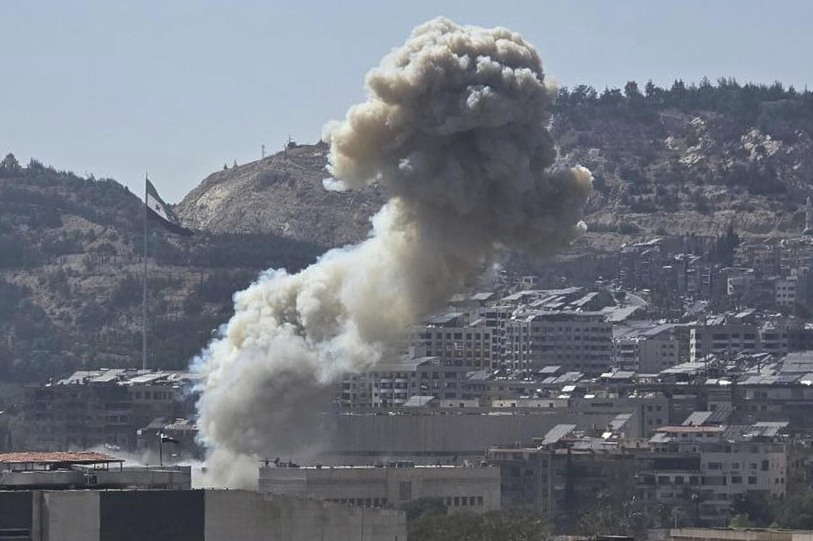

## Claim
Claim: " This image shows Israel bombing the surroundings of Southern Damascus in February 2025, destroying its last remaining army depots."

## Actions
```
reverse_search()
```

## Evidence
### Evidence from `reverse_search`
The image 

## Elaboration
The reverse image search did not yield any results. Therefore, the claim cannot be verified. More information is needed to determine the image's origin and the events it depicts.


## Actions
```
web_search("Israel bombing Damascus February 2025")
web_search("Israel Syria conflict 2025")
```

## Evidence
### Evidence from `web_search`
The web sources discuss the Israeli invasion of Syria in 2024-2025, including airstrikes in southern Syria and near Damascus in February 2025. These strikes targeted military bases and command centers, following demands for demilitarization and the withdrawal of Syrian forces. The sources also mention the possibility of Syria joining the Abraham Accords, the fall of the Assad regime, and a national dialogue summit organized by Syria's new government.

The articles are from Wikipedia ([https://en.wikipedia.org/wiki/Israeli_invasion_of_Syria_(2024%E2%80%93present](https://en.wikipedia.org/wiki/Israeli_invasion_of_Syria_(2024%E2%80%93present))), Al Jazeera ([https://www.aljazeera.com/news/2025/2/26/israel-bombs-military-targets-in-southern-syria-outside-damascus](https://www.aljazeera.com/news/2025/2/26/israel-bombs-military-targets-in-southern-syria-outside-damascus)), and The Guardian ([https://www.theguardian.com/world/2025/feb/25/israel-strikes-targets-in-southern-syria-after-demanding-demilitarisation](https://www.theguardian.com/world/2025/feb/25/israel-strikes-targets-in-southern-syria-after-demanding-demilitarisation)). The Guardian article includes images , , , . Al Jazeera's article includes image .


### Evidence from `web_search`
The provided web sources discuss Israeli actions in Syria during 2025. One source, from Wikipedia, details clashes in Southern Syria from April to May 2025, involving Syrian forces, Druze groups, Bedouin tribes, and Israel, with the Israel Defense Forces involved in the conflict ([https://en.wikipedia.org/wiki/Southern_Syria_clashes_(April%E2%80%93May_2025)](https://en.wikipedia.org/wiki/Southern_Syria_clashes_(April%E2%80%93May_2025))). Al Jazeera reports on Israeli strikes in August 2025, including an attack on a former army barracks in Kiswa, southwest of Damascus, and a drone strike that killed Syrian soldiers ( [https://www.aljazeera.com/news/2025/8/27/israel-launches-new-operations-in-syria-after-strike-kills-soldiers](https://www.aljazeera.com/news/2025/8/27/israel-launches-new-operations-in-syria-after-strike-kills-soldiers)).

Another source, from the Security Council Report, mentions Israeli airstrikes on Syrian security forces and buildings in July 2025, including in Damascus, and a ceasefire agreement between Israel and Syria ([https://www.securitycouncilreport.org/monthly-forecast/2025-08/syria-82.php](https://www.securitycouncilreport.org/monthly-forecast/2025-08/syria-82.php)).


## Elaboration
The evidence confirms that Israel conducted airstrikes in the vicinity of Damascus in February 2025. However, the evidence does not provide any information about the image 

## Actions
```
image_search("Israel bombing Damascus February 2025")
```

## Evidence
### Evidence from `image_search`
The image search results include articles about explosions in Syria. The Los Angeles Times published an article about unrest in Sweida, Syria, with an image of an explosion 

## Elaboration
The evidence confirms that Israel conducted airstrikes in the vicinity of Damascus in February 2025. However, the image search did not yield any results that match the image 

## Final Judgement
The claim is partially accurate as it correctly states that Israel conducted airstrikes near Damascus in February 2025. However, the image provided could not be verified. Therefore, the claim is not fully supported by the evidence. `false`

### Verdict: FALSE

### Justification
The claim is partially accurate. While evidence confirms that Israel conducted airstrikes near Damascus in February 2025, the provided image could not be verified through reverse image search or image search, thus the claim is not fully supported.
