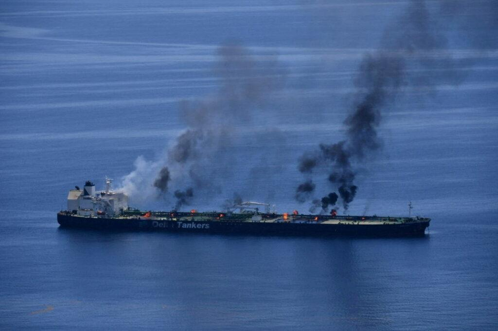

## Claim
Claim: "The Huthi rebels announced the final cessation of their military operations in international waters after Trump won the 2024 US presidential election."

## Actions
```
web_search("Huthi rebels military operations international waters Trump 2024")
```

## Evidence
### Evidence from `web_search`
The Atlantic Council published an article on March 18, 2025, discussing the US approach toward the Houthis, mentioning that Trump ordered airstrikes against Yemen’s Houthi rebels in response to attacks on Red Sea shipping and that Russia has aided Houthi operations. (, , ) [Source](https://www.atlanticcouncil.org/blogs/new-atlanticist/trump-should-not-forget-the-russian-hand-behind-the-houthis/)

An ABC News article, published on July 8, 2025, reports that the Houthi rebels attacked ships in the Red Sea, killing mariners, which were the first attacks since late 2024, when Trump's administration targeted the rebels in airstrikes. The Houthis pledged to stop attacking ships. [Source](https://abcnews.go.com/International/wireStory/yemens-houthi-rebels-attack-ship-red-sea-killing-123559774) A Wikipedia article discusses the Red Sea crisis, including the timeline, attacks, military operations, and diplomacy, including the 2025 U.S.–Houthi ceasefire. [Source](https://en.wikipedia.org/wiki/Red_Sea_crisis)


## Elaboration
The evidence suggests that the Houthis attacked ships in the Red Sea, and the attacks were ongoing in 2025. The ABC News article states that the attacks were the first since late 2024, when Trump's administration targeted the rebels in airstrikes, and the Houthis pledged to stop attacking ships. However, the Atlantic Council article mentions that Trump ordered airstrikes against the Houthis.

Based on the provided evidence, it is not possible to verify the claim that the Houthis announced the final cessation of their military operations in international waters after Trump won the 2024 US presidential election. The evidence indicates that attacks occurred after the election, and the situation is more complex than a simple cessation of operations.


## Final Judgement
The evidence indicates that the Houthis were involved in attacks in international waters after the 2024 US presidential election. While there was a pledge to stop attacking ships, the situation is more complex than a final cessation of military operations.

`false`

### Verdict: FALSE

### Justification
The claim is false. Evidence from the Atlantic Council ([Source](https://www.atlanticcouncil.org/blogs/new-atlanticist/trump-should-not-forget-the-russian-hand-behind-the-houthis/)) and ABC News ([Source](https://abcnews.go.com/International/wireStory/yemens-houthi-rebels-attack-ship-red-sea-killing-123559774)) indicates that Houthi attacks in international waters continued after the 2024 US presidential election, and the situation involved airstrikes and a pledge to stop attacks, not a final cessation of military operations.
