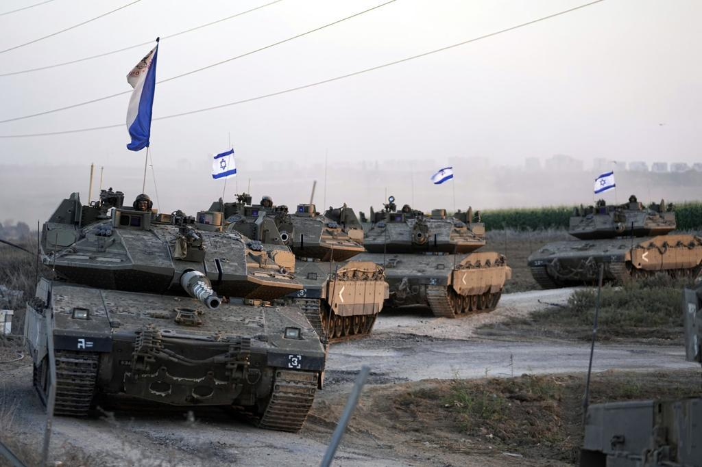

## Claim
Claim: " This image shows the Israeli army reaching Damascus in Syria in December 2024."

## Actions
```
web_search("Israeli army Damascus Syria")
image_search("Israeli tanks Damascus")
```

## Evidence
### Evidence from `web_search`
The provided web sources discuss Israeli airstrikes in Damascus, Syria. Al Jazeera ([https://www.aljazeera.com/news/2025/7/16/israel-bombards-syrias-damascus-as-us-says-steps-agreed-to-end-violence](https://www.aljazeera.com/news/2025/7/16/israel-bombards-syrias-damascus-as-us-says-steps-agreed-to-end-violence)) reports on strikes near the presidential palace and military headquarters, with Israel citing protection of the Druze minority as a reason. CNN ([https://www.cnn.com/2025/07/16/middleeast/damascus-syria-airstrikes-intl](https://www.cnn.com/2025/07/16/middleeast/damascus-syria-airstrikes-intl)) mentions the withdrawal of Syrian troops and US involvement.

The BBC ([https://www.bbc.com/news/articles/cp90l77187zo](https://www.bbc.com/news/articles/cp90l77187zo)) also reports on the strikes, linking them to fighting in Suweida and quoting Israeli Prime Minister Benjamin Netanyahu. The BBC article includes a map of Syria  and an image of Syrian security forces . The CNN article includes images , .


### Evidence from `image_search`
The Times of Israel published an image of an Israeli tank ([https://www.timesofisrael.com/liveblog_entry/report-israeli-tanks-reach-point-25km-from-damascus/](https://www.timesofisrael.com/liveblog_entry/report-israeli-tanks-reach-point-25km-from-damascus/)) . NDTV fact-checked a claim that Israeli tanks were near Damascus and marked the image as "FALSE" . The image was posted on December 10, 2024.

Al Jazeera published an article on December 8, 2024, about Israel seizing a buffer zone in Syria's Golan Heights, which included an image of an Israeli tank ([https://www.aljazeera.com/news/2024/12/8/israel-seizes-buffer-zone-in-syrias-golan-heights-after-al-assad-falls](https://www.aljazeera.com/news/2024/12/8/israel-seizes-buffer-zone-in-syrias-golan-heights-after-al-assad-falls)) .


## Elaboration
The claim is demonstrably false. The image search results include a fact-check from NDTV that labels the image as "FALSE" and indicates it was posted on December 10, 2024. The evidence also shows that while there were reports of Israeli tanks near Damascus, the image in the claim does not depict the Israeli army reaching Damascus.


## Final Judgement
The claim is demonstrably false. The image has been fact-checked and debunked by NDTV. The image was posted on December 10, 2024, and the fact-check indicates that the image does not depict the Israeli army reaching Damascus. `false`

### Verdict: FALSE

### Justification
The claim is false. While there were reports of Israeli military activity near Damascus, the image in the claim has been fact-checked and debunked by NDTV as not depicting the Israeli army reaching Damascus, with the image being posted on December 10, 2024 ([https://www.timesofisrael.com/liveblog_entry/report-israeli-tanks-reach-point-25km-from-damascus/](https://www.timesofisrael.com/liveblog_entry/report-israeli-tanks-reach-point-25km-from-damascus/)).
