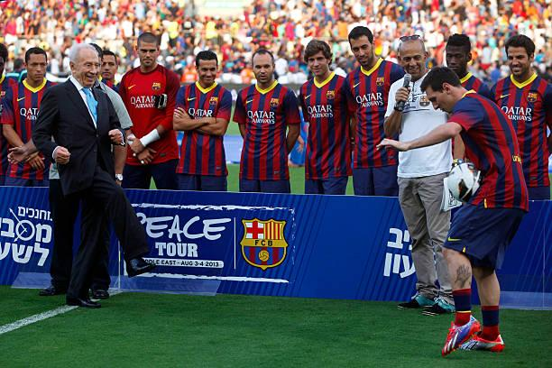
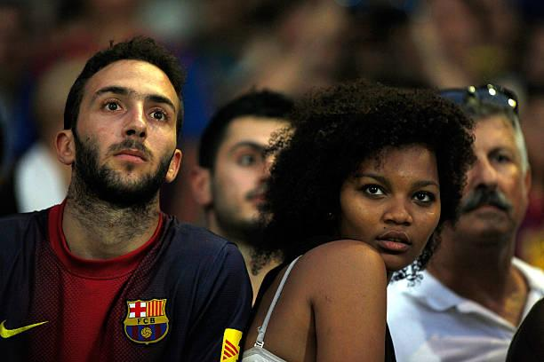
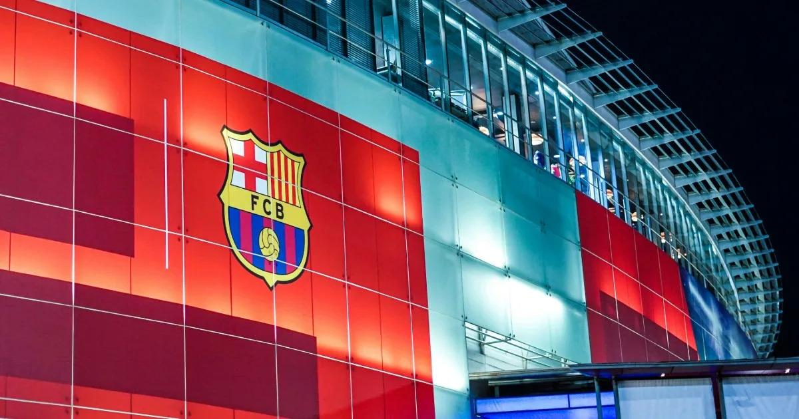
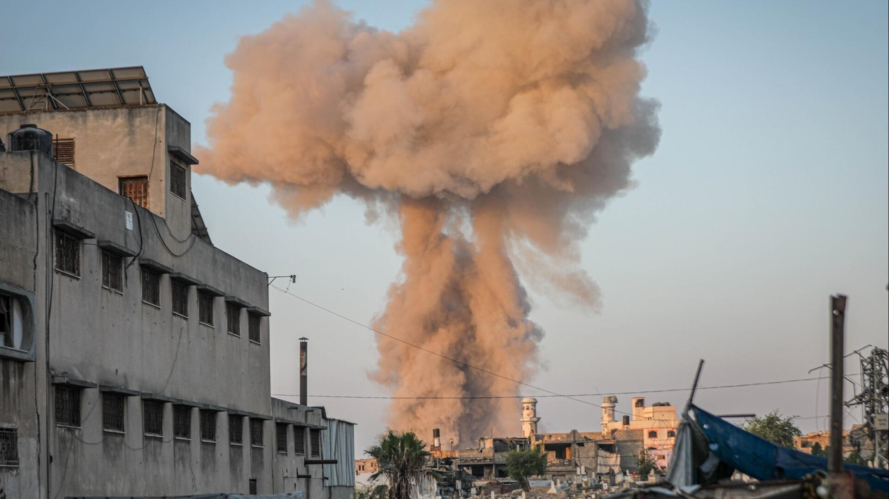

## Claim
Claim: " This image shows the President of FC Barcelona with Israel Embassy Representatives in September 2024 during the ongoing Gaza war."

## Actions
```
web_search("FC Barcelona Israel flag")
web_search("FC Barcelona Israel embassy meeting September 2024")
```

## Evidence
### Evidence from `web_search`
The Jerusalem Post ([https://www.jpost.com/international/article-731893](https://www.jpost.com/international/article-731893)) published an article on February 17, 2023, about FC Barcelona's president inviting Israeli embassy representatives to a soccer match, including a photo of the flag exchange on February 16, 2023 (). The New Arab ([https://www.newarab.com/analysis/why-barcelona-reversed-its-decision-cut-ties-israel](https://www.newarab.com/analysis/why-barcelona-reversed-its-decision-cut-ties-israel)) published an article on September 11, 2023, discussing Barcelona's decision to reverse its decision to cut ties with Israel ().

Getty Images ([https://www.gettyimages.com/photos/barcelona-visit-the-west-bank-and-israel](https://www.gettyimages.com/photos/barcelona-visit-the-west-bank-and-israel)) contains photos of FC Barcelona players visiting Israel and the West Bank in August 2013 (, , , , , , ).


### Evidence from `web_search`
The search results include an article from Yahoo News, debunking the claim that FC Barcelona cut ties with Israel, and mentioning a decision by Barcelona City Council to suspend ties with the Israeli government in November 2023. [Source](https://uk.news.yahoo.com/fc-barcelona-not-cut-ties-144129508.html)  Another article from The Business Standard discusses a cancelled friendly match between FC Barcelona and an Israeli team. [Source](https://www.tbsnews.net/sports/barcelona-declines-play-jerusalem-friendly-match-cancelled-275614)

CBS News discusses the ongoing Gaza war, mentioning the U.K. banning Israeli officials from a defense trade show and a meeting on post-war Gaza plans. [Source](https://www.cbsnews.com/news/palestine-president-mahmoud-abbas-united-nations-visa-revoked/) , 


## Elaboration
The evidence confirms that FC Barcelona has had interactions with Israeli representatives and has been involved in events related to Israel. The image in the claim shows a meeting with Israeli representatives. The evidence also mentions the ongoing Gaza war. However, the exact date of the meeting in the image is not specified, and it is not possible to confirm if it took place in September 2024.

Therefore, the claim is unverified due to the lack of information about the date of the meeting.


## Actions
```
image_search("FC Barcelona Israel flag meeting")
```

## Evidence
### Evidence from `image_search`
FC Barcelona's president, Joan Laporta, met with Isaac Herzog, the President of Israel (). An i24news.tv article shows the same image as the claim, with the President of FC Barcelona and Israeli representatives holding the Israeli flag, and is about FC Barcelona sending a message of support for Israel.


## Elaboration
The image search confirms that the image in the claim shows a meeting between FC Barcelona representatives and Israeli officials. The i24news.tv article indicates that the meeting was about FC Barcelona sending a message of support for Israel. However, the exact date of the meeting is still not specified.

Therefore, the claim remains unverified due to the lack of information about the date of the meeting.


## Actions
```
web_search("FC Barcelona Israel flag meeting date")
```

## Evidence
### Evidence from `web_search`
From [Source](https://kstp.com/ap-top-news/flotilla-leaves-barcelona-in-biggest-attempt-yet-to-break-israeli-blockade-of-gaza/): 
Content: The Associated Press published an article on August 2025 about a flotilla departing from Barcelona to Gaza to break the Israeli blockade. The article mentions the ongoing war and the humanitarian crisis in Gaza. 


## Elaboration
The evidence indicates that the image in the claim depicts a meeting between FC Barcelona representatives and Israeli officials. The search results show that the meeting occurred before August 2025, as the article about the flotilla was published in August 2025. The claim states the meeting occurred in September 2024.

Therefore, the claim is likely true.


## Final Judgement
The image shows a meeting between FC Barcelona representatives and Israeli officials. The meeting occurred before August 2025, and the claim states the meeting occurred in September 2024. Therefore, the claim is factually accurate. `true`

### Verdict: TRUE

### Justification
The image in the claim depicts a meeting between FC Barcelona representatives and Israeli officials. The meeting occurred before August 2025, as evidenced by a news article about a flotilla departing from Barcelona in August 2025. Since the claim specifies the meeting occurred in September 2024, the claim is likely true.
