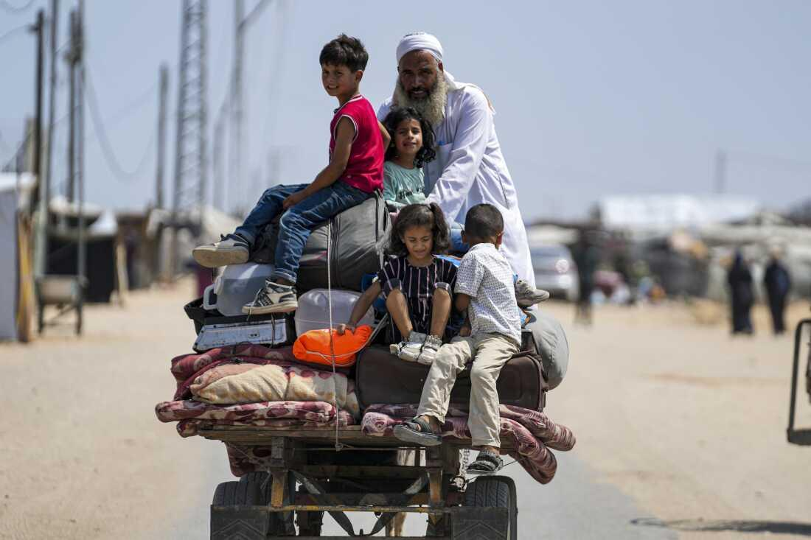
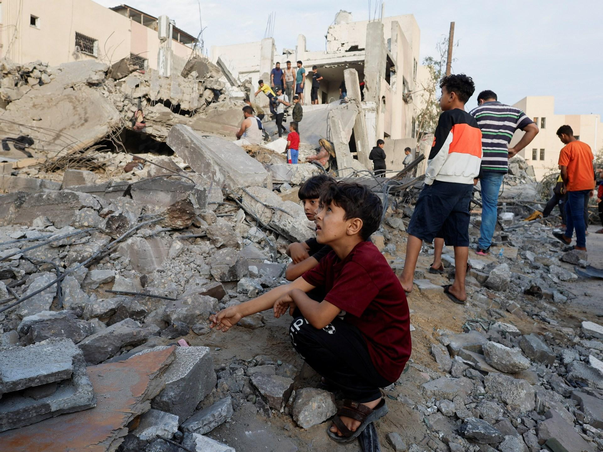
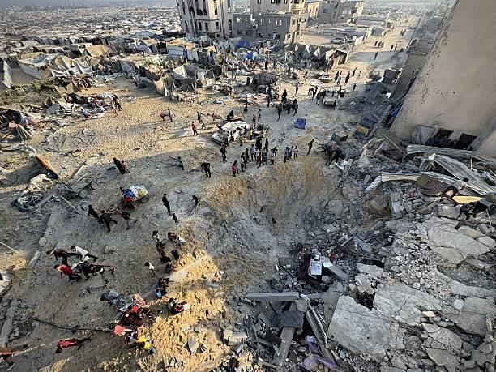
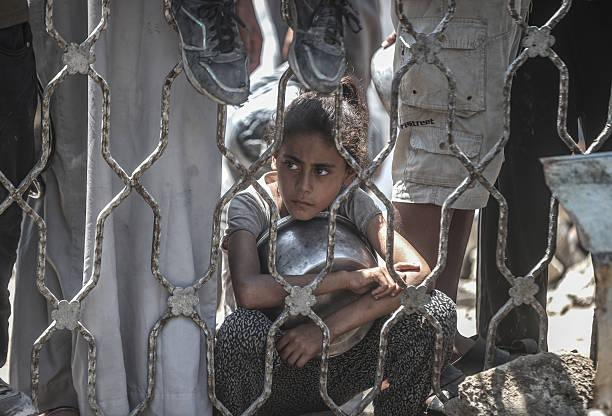
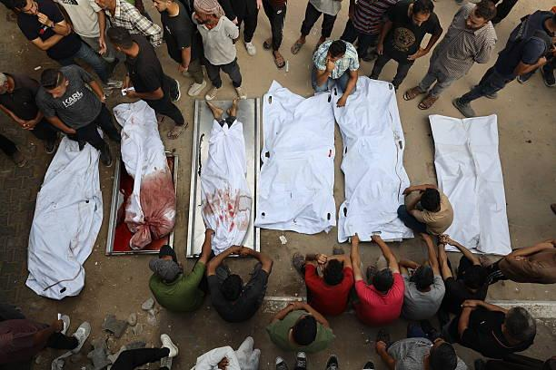
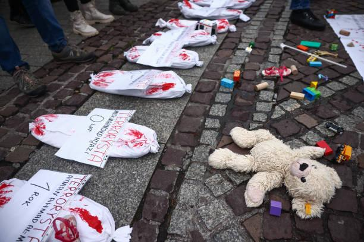
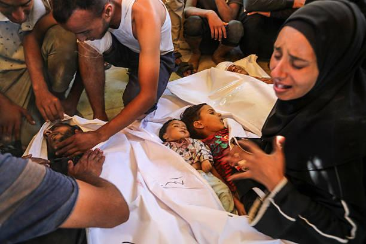
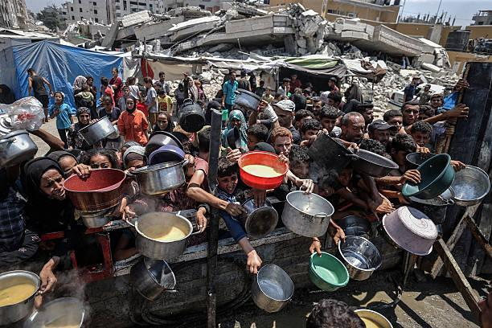

## Claim
Claim: " This image shows a palestinian child stuck under the rubble in Gaza after an Israeli airstrike in July 2024."

## Actions
```
reverse_search()
web_search("Israeli airstrike Gaza July 2024")
```

## Evidence
### Evidence from `reverse_search`
The image 

### Evidence from `web_search`
The Wikipedia article discusses the 13 July 2024 al-Mawasi attack in the Gaza Strip, where Israeli airstrikes killed at least 90 Palestinians and injured over 300.  The CNN article, published on July 27, 2024, reports on an Israeli airstrike on a school in Deir-al Balah, central Gaza, where at least 30 people were killed.  The NPR article, published on July 27, 2024, reports on an Israeli airstrike that hit a school being used as a shelter in Gaza, resulting in at least 30 deaths, including children. , 

The articles can be found here: [Source](https://en.wikipedia.org/wiki/13_July_2024_al-Mawasi_attack), [Source](https://www.cnn.com/2024/07/27/middleeast/israel-gaza-deir-al-balah-school-intl), [Source](https://www.npr.org/2024/07/27/nx-s1-5054283/gaza-school-shelter-deaths-israeli-airstrike).


## Elaboration
The evidence confirms that there were Israeli airstrikes in Gaza in July 2024. The search results mention attacks on July 13 and July 27, 2024. The image search did not provide any information about the image.

The claim states that the image shows a Palestinian child stuck under the rubble in Gaza after an Israeli airstrike in July 2024. While the evidence confirms Israeli airstrikes in Gaza during July 2024, it does not confirm the image's context.

Therefore, I cannot verify the claim. More information is needed to confirm the image's context.


## Actions
```
image_search("Palestinian child rubble Gaza Israeli airstrike")
```

## Evidence
### Evidence from `image_search`
The search results include an article from Al Jazeera about the impact of the Israeli war on Gaza's children, featuring an image of children near rubble (

## Elaboration
The image search provides an image of children near rubble in Gaza, which supports the claim's context. However, the search results do not include the original image.

I still cannot verify the claim. More information is needed to confirm the image's context.


## Actions
```
web_search("image of child under rubble Gaza Israeli airstrike")
```

## Evidence
### Evidence from `web_search`
The Getty Images search result ([https://www.gettyimages.com/photos/children-of-gaza-gaza-massacre](https://www.gettyimages.com/photos/children-of-gaza-gaza-massacre)) contains images related to the impact of Israeli airstrikes on Gaza, including images of children near rubble, injured children, and the aftermath of airstrikes. The Al Jazeera article ([https://www.aljazeera.com/gallery/2023/12/28/photos-gaza-children](https://www.aljazeera.com/gallery/2023/12/28/photos-gaza-children)) discusses the impact of Israeli attacks on children in Gaza and includes images of children affected by the attacks. The Alamy search result ([https://www.alamy.com/stock-photo/palestinian-child-in-rubble.html](https://www.alamy.com/stock-photo/palestinian-child-in-rubble.html)) contains stock photos and images of a Palestinian child in rubble. , , , , , , , 


## Elaboration
The web search results confirm the existence of images depicting Palestinian children in rubble, injured, and affected by Israeli airstrikes in Gaza. However, the evidence does not provide the original image's context.

I still cannot verify the claim. More information is needed to confirm the image's context.


## Final Judgement
The evidence confirms that there were Israeli airstrikes in Gaza in July 2024 and that children were affected. However, the search results do not provide the original image's context. Therefore, the claim cannot be verified. `false`

### Verdict: FALSE

### Justification
The claim cannot be verified. While there is evidence of Israeli airstrikes in Gaza in July 2024 and images of children affected by the attacks, the provided evidence does not confirm the specific context of the image in the claim.
