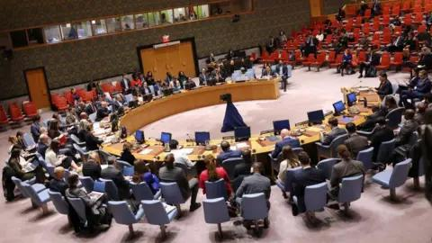

## Claim
Claim: "The US reinstituted draft in 2024 for the Israel-Hamas war."

## Actions
```
web_search("US draft Israel-Hamas war 2024")
```

## Evidence
### Evidence from `web_search`
The UN News reported on November 20, 2024, that the United States vetoed a UN Security Council draft resolution calling for an immediate ceasefire in Gaza (). The Security Council Report, published on November 19, 2024, discussed a draft resolution on the war in Gaza, mentioning the US's potential veto.

The United Nations website also reported on a Security Council meeting on November 20, 2024, where a resolution demanding an immediate ceasefire in Gaza and the release of hostages failed due to a US veto. The resolution was supported by 14 Council members.

*   [Source](https://news.un.org/en/story/2024/11/1157216)
*   [Source](https://www.securitycouncilreport.org/whatsinblue/2024/11/vote-on-a-draft-resolution-on-the-war-in-gaza.php)
*   [Source](https://press.un.org/en/2024/sc15907.doc.htm)


## Elaboration
The provided evidence does not contain any information about the US reinstituting the draft in 2024 for the Israel-Hamas war. The evidence focuses on the US's actions within the UN Security Council regarding the war in Gaza, specifically its veto of resolutions calling for a ceasefire.

Therefore, the claim cannot be verified based on the available evidence.


## Actions
```
web_search("US military draft 2024")
```

## Evidence
### Evidence from `web_search`
The Wikipedia article discusses conscription in the United States, including its history and mentions a 2024 meeting memo that suggested modifications to the Selective Service Act, including registration by women and self-reporting of critical skills. [https://en.wikipedia.org/wiki/Conscription\_in\_the\_United\_States](https://en.wikipedia.org/wiki/Conscription_in_the_United_States) , 

An article from War on the Rocks, published on August 8, 2024, discusses the possibility of a draft in the US, mentioning that conscription is being discussed among US allies and adversaries. [https://warontherocks.com/2024/08/preparing-for-the-possibility-of-a-draft-without-panic/](https://warontherocks.com/2024/08/preparing-for-the-possibility-of-a-draft-without-panic/) 


## Elaboration
The evidence indicates that there were discussions and considerations regarding the draft in the US in 2024. The Wikipedia article mentions modifications to the Selective Service Act, and the War on the Rocks article discusses the possibility of a draft. However, neither source confirms that the draft was reinstituted for the Israel-Hamas war.

Therefore, the claim remains unverified.


## Actions
```
web_search("US draft Israel-Hamas war")
```

## Evidence
### Evidence from `web_search`
The UN News reported in June 2025 that the US vetoed a UN Security Council resolution demanding a permanent ceasefire in Gaza (). PBS NewsHour reported in May 2025 about a U.S. draft proposal for a 60-day cease-fire in Gaza (, ). The BBC News reported in November 2024 that the US vetoed a UN Security Council draft resolution calling for an immediate ceasefire in Gaza ().

*   [Source](https://news.un.org/en/story/2025/06/1164056)
*   [Source](https://www.pbs.org/newshour/show/how-israel-is-responding-to-latest-u-s-proposals-to-pause-war-in-gaza)
*   [Source](https://www.bbc.com/news/articles/cjr4p9rg8zlo)


## Elaboration
The evidence does not support the claim. The search results focus on the US's diplomatic actions regarding the Israel-Hamas war, such as vetoing UN resolutions and proposing ceasefires. There is no mention of the US reinstituting the draft.


## Final Judgement
The fact-check reveals that while there were discussions about potential modifications to the Selective Service Act and the possibility of a draft in the US in 2024, there is no evidence to support the claim that the US reinstituted the draft for the Israel-Hamas war. The provided sources focus on the US's diplomatic actions and discussions about conscription, but do not confirm the claim.

`false`


### Verdict: FALSE

### Justification
The fact-check found no evidence to support the claim that the US reinstituted the draft in 2024 for the Israel-Hamas war. While there were discussions about conscription and modifications to the Selective Service Act, the search results primarily focused on the US's diplomatic actions, such as vetoing UN resolutions and proposing ceasefires, without mentioning the draft being reinstituted. Therefore, the claim is false.
