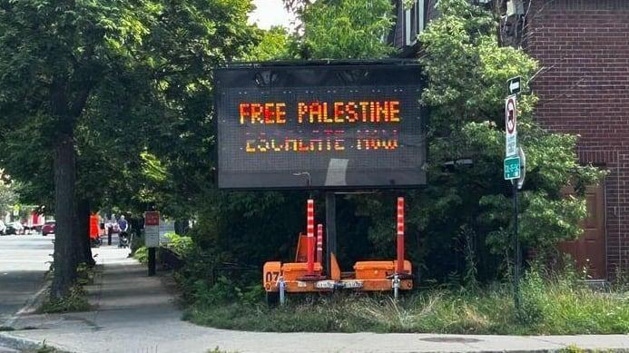
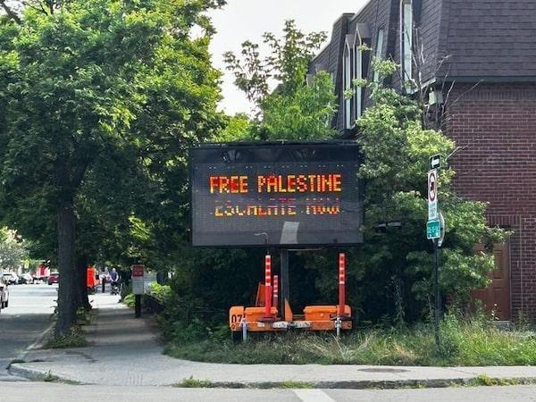

## Claim
Claim: " This image shows a traffic sign in Montreal in July 2024 which displays a 'Free Palestine. Escalate now' message and was authorized by Montreal's Mayor Valérie Plante."

## Actions
```
reverse_search()
geolocate()
web_search("Montreal Mayor Valérie Plante Free Palestine sign")
```

## Evidence
### Evidence from `reverse_search`
The image () of the traffic sign displaying "Free Palestine. Escalate now" was found in multiple news articles. According to a CTV News article published on July 24, 2024, electronic traffic signs in Montreal were hacked to display pro-Palestinian slogans. The CBC News article, published on July 25, 2024, also reported the same incident, with the City of Montreal calling it an act of vandalism. The Globe and Mail also reported the incident on July 24, 2024.

The articles can be found here: [https://www.ctvnews.ca/montreal/article/montreal-electronic-traffic-signs-hacked-to-display-pro-palestinian-political-slogans/](https://www.ctvnews.ca/montreal/article/montreal-electronic-traffic-signs-hacked-to-display-pro-palestinian-political-slogans/), [https://www.cbc.ca/news/canada/montreal/montreal-traffic-signs-pro-palestinian-slogans-1.7274809](https://www.cbc.ca/news/canada/montreal/montreal-traffic-signs-pro-palestinian-slogans-1.7274809), and [https://www.theglobeandmail.com/canada/article-montreal-traffic-signs-apparently-hacked-to-display-pro-palestinian/](https://www.theglobeandmail.com/canada/article-montreal-traffic-signs-apparently-hacked-to-display-pro-palestinian/). The image was also found in the articles (, ).


### Evidence from `geolocate`
The most likely countries where the image was taken are: {'Palestine': 0.85, 'Canada': 0.07, 'Germany': 0.02, 'Austria': 0.01, 'Israel': 0.01, 'Poland': 0.01, 'Slovenia': 0.01, 'South Korea': 0.01, 'Albania': 0.0, 'Andorra': 0.0}

### Evidence from `web_search`
The Suburban ([https://www.thesuburban.com/news/city_news/plante-served-over-pro-palestinian-electronic-signs/article_e0143fdc-d532-5ecf-9a66-095ad0ee8ab9.html](https://www.thesuburban.com/news/city_news/plante-served-over-pro-palestinian-electronic-signs/article_e0143fdc-d532-5ecf-9a66-095ad0ee8ab9.html)) reported on a legal action against Montreal Mayor Valérie Plante regarding pro-Palestinian electronic signs, including one with the message "Free Palestine. Escalate now" (

## Elaboration
The image shows a traffic sign in Montreal displaying "Free Palestine. Escalate now." The reverse image search confirms the image's presence in news articles. These articles state that the signs were hacked and the City of Montreal considered it an act of vandalism. The Suburban reported on legal action against Montreal Mayor Valérie Plante regarding the signs.

The claim that the sign was authorized by Montreal's Mayor Valérie Plante is not supported by the evidence. The evidence suggests the signs were hacked and the city considered it vandalism.


## Final Judgement
The image is of a traffic sign in Montreal displaying "Free Palestine. Escalate now." The evidence indicates that the signs were hacked and the city considered it vandalism. The claim that the sign was authorized by Montreal's Mayor Valérie Plante is demonstrably false.

`false`

### Verdict: FALSE

### Justification
The image depicts a traffic sign in Montreal displaying "Free Palestine. Escalate now." However, the sign was the result of a hack, and the City of Montreal considered it an act of vandalism, as reported by [CTV News](https://www.ctvnews.ca/montreal/article/montreal-electronic-traffic-signs-hacked-to-display-pro-palestinian-political-slogans/), [CBC News](https://www.cbc.ca/news/canada/montreal/montreal-traffic-signs-pro-palestinian-slogans-1.7274809), and [The Globe and Mail](https://www.theglobeandmail.com/canada/article-montreal-traffic-signs-apparently-hacked-to-display-pro-palestinian/). Therefore, the claim that the sign was authorized by Montreal's Mayor Valérie Plante is false.
