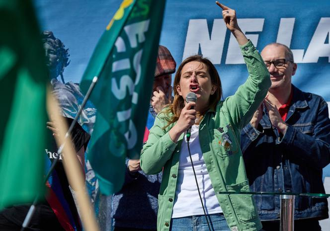

## Claim
Claim: " This image shows the 'French' Left who is rioting against Le Pen's victory in the first round of the French parliamentary elections in 2024."

## Actions
```
reverse_search()
web_search("French Left protest Le Pen 2024")
```

## Evidence
### Evidence from `reverse_search`
The image  was found in multiple sources. One source is a Vanity Fair article from July 2015, discussing antisemitism in France and mentioning a 2014 pro-Palestinian demonstration in Paris where a swastika was painted on a statue. Another source is a World Jewish Congress article from June 19, 2017, about a German TV documentary on European anti-Semitism, which includes a similar image . The Jerusalem Post published an article by Adam Milstein on July 27, 2023, discussing antisemitism in Europe, and the image  is present in the article. The image depicts a pro-Palestinian demonstration in Paris.

The sources are:
*   [https://www.vanityfair.com/news/2015/07/anti-semitism-france-hostage-hyper-cacher-kosher-market](https://www.vanityfair.com/news/2015/07/anti-semitism-france-hostage-hyper-cacher-kosher-market)
*   [https://www.worldjewishcongress.org/en/news/german-tv-agrees-to-air-anti-semitism-documentary-following-cries-of-censorship-6-1-2017](https://www.worldjewishcongress.org/en/news/german-tv-agrees-to-air-anti-semitism-documentary-following-cries-of-censorship-6-1-2017)
*   [https://www.jpost.com/tags/adam-milstein](https://www.jpost.com/tags/adam-milstein)


### Evidence from `web_search`
The provided web sources discuss protests and rallies related to French politics. One article from Le Monde ([https://www.lemonde.fr/en/france/article/2025/04/06/french-left-protests-against-far-right-but-remains-divided_6739901_7.html](https://www.lemonde.fr/en/france/article/2025/04/06/french-left-protests-against-far-right-but-remains-divided_6739901_7.html)) covers a left-wing counter-demonstration in Paris on April 6, 2025, following Marine Le Pen's conviction, with participation from La France Insoumise (LFI) and the Greens ().

Another source, a Wikipedia article ([https://en.wikipedia.org/wiki/2024_French_protests_against_the_National_Rally](https://en.wikipedia.org/wiki/2024_French_protests_against_the_National_Rally)), details the 2024 French protests against the National Rally, which began on June 9, 2024, in response to the party's victory in the European Parliament election and the subsequent call for legislative elections. The protests involved various political organizations and took place in multiple cities, including a gathering on June 30, 2024, at Place de la République in Paris (). The Guardian ([https://www.theguardian.com/world/2025/apr/05/france-braced-as-far-right-and-leftwing-parties-plan-rallies-in-wake-of-le-pen-decision](https://www.theguardian.com/world/2025/apr/05/france-braced-as-far-right-and-leftwing-parties-plan-rallies-in-wake-of-le-pen-decision)) reported on rallies planned by both far-right and left-wing parties in France following Marine Le Pen's conviction for embezzlement (, ).


## Elaboration
The image 

## Final Judgement
The image in question has been identified in multiple sources as depicting a pro-Palestinian demonstration in Paris, with the swastika painted on a statue. While there were protests in France in 2024 and 2025, the image's context is not related to the French parliamentary elections or Le Pen's victory.

`false`

### Verdict: FALSE

### Justification
The image depicts a pro-Palestinian demonstration in Paris, as evidenced by sources like a [Vanity Fair article](https://www.vanityfair.com/news/2015/07/anti-semitism-france-hostage-hyper-cacher-kosher-market) and a [World Jewish Congress article](https://www.worldjewishcongress.org/en/news/german-tv-agrees-to-air-anti-semitism-documentary-following-cries-of-censorship-6-1-2017). The image is not related to the French parliamentary elections or Le Pen's victory.
