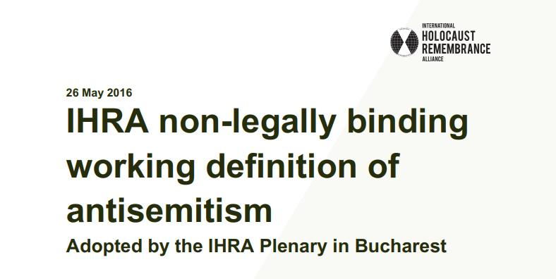

## Claim
Claim: "The World Jewish Congress (WJC) has amended the International Holocaust Remembrance Alliance (IHRA) working definition of antisemitism in March 2025 to include: 'Conflating the assassination of JFK to jews/israel'."

## Actions
```
web_search("World Jewish Congress IHRA antisemitism definition")
web_search("IHRA working definition of antisemitism March 2025")
```

## Evidence
### Evidence from `web_search`
The IHRA definition of antisemitism was adopted on May 26, 2016, and has been adopted by several countries and institutions. The definition includes examples of antisemitism, such as targeting the state of Israel. The World Jewish Congress website provides the IHRA Working Definition of Antisemitism, but it does not mention the assassination of JFK. <image:k>, , , , 

The provided sources are: [https://en.wikipedia.org/wiki/IHRA_definition_of_antisemitism](https://en.wikipedia.org/wiki/IHRA_definition_of_antisemitism), [https://www.worldjewishcongress.org/en/working-definition-of-antisemitism](https://www.worldjewishcongress.org/en/working-definition-of-antisemitism), and [https://holocaustremembrance.com/resources/working-definition-antisemitism](https://holocaustremembrance.com/resources/working-definition-antisemitism).


### Evidence from `web_search`
The search results discuss the IHRA Working Definition of Antisemitism, adopted in May 2016. One source, published on August 26, 2025, from [urj.org](https://urj.org/blog/five-definitions-antisemitism), mentions that the definition is a "working definition" which "connote[s] the possibility for change." The article also mentions the Nexus Document and the Jerusalem Declaration on Antisemitism, which were written in response to the IHRA definition.

Another article from [palquest.org](https://www.palquest.org/en/highlight/38757/ihra-working-definition-antisemitism) discusses the IHRA Working Definition of Antisemitism and its examples, noting that by March 2025, the definition had been endorsed by 44 UN member states. Neither source mentions the World Jewish Congress or any amendment to the definition in March 2025.


## Elaboration
The evidence indicates that the IHRA definition was adopted in May 2016 and has been endorsed by numerous entities. The World Jewish Congress provides the IHRA definition on its website, but the provided evidence does not mention any amendment to the definition in March 2025, nor does it mention the assassination of JFK. The evidence also suggests that the definition is a "working definition" and can be changed.

The search results do not provide any information about the World Jewish Congress amending the IHRA definition to include the assassination of JFK. Therefore, the claim cannot be verified with the available evidence.

To verify the claim, information about any amendments made by the World Jewish Congress to the IHRA definition, specifically in March 2025, would be needed.


## Actions
```
web_search("World Jewish Congress IHRA definition JFK")
```

## Evidence
### Evidence from `web_search`
From [Source](https://www.aol.com/news/fact-check-world-jewish-congress-151433542.html): 
Content: The AOL News fact-check, published on March 27, 2025, debunks the claim that the World Jewish Congress amended the IHRA definition of antisemitism to include the assassination of JFK.  The article states that the World Jewish Congress did not make such an amendment and that Reuters debunked the claim on March 26.


## Elaboration
The AOL News fact-check, published on March 27, 2025, debunks the claim that the World Jewish Congress amended the IHRA definition of antisemitism to include the assassination of JFK. The article states that the World Jewish Congress did not make such an amendment, and Reuters debunked the claim on March 26.

Therefore, the claim is false.


## Final Judgement
The World Jewish Congress did not amend the IHRA definition of antisemitism in March 2025 to include conflating the assassination of JFK to Jews/Israel. This has been debunked by multiple sources.

`false`

### Verdict: FALSE

### Justification
The claim is false. A fact-check by AOL News, published on March 27, 2025, and Reuters, debunked the claim that the World Jewish Congress amended the IHRA definition of antisemitism to include the assassination of JFK.
