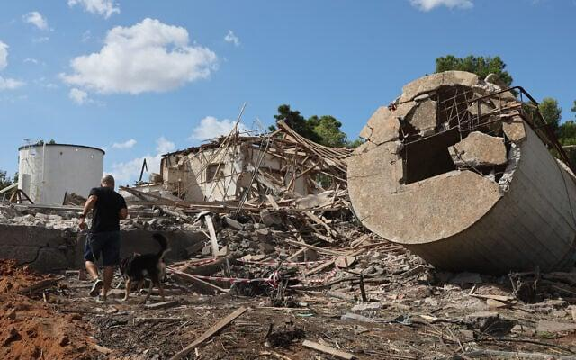

## Claim
Claim: "Gallant, a retired military general and a member of Prime Minister Benjamin Netanyahu’s war cabinet, was killed in the Iranian attack on Israel on October 1, 2024."

## Actions
```
web_search("Gallant killed October 1 2024")
```

## Evidence
### Evidence from `web_search`
The Times of Israel ([https://www.timesofisrael.com/after-iranian-missiles-hit-base-gallant-says-attack-didnt-even-scratch-air-force/](https://www.timesofisrael.com/after-iranian-missiles-hit-base-gallant-says-attack-didnt-even-scratch-air-force/)) published an article about an Iranian missile attack on Israel on October 1, 2024, including a photo of Defense Minister Yoav Gallant (). The article also mentions Gallant's statement about the attack and includes images of the aftermath () and Israelis taking cover ().

NPR ([https://www.npr.org/2024/11/05/nx-s1-5179904/israel-defense-minister-gallant-fired-netanyahu](https://www.npr.org/2024/11/05/nx-s1-5179904/israel-defense-minister-gallant-fired-netanyahu)) reported on November 5, 2024, that Benjamin Netanyahu fired Defense Minister Yoav Gallant and replaced him with Israel Katz (, ). The article mentions disagreements between Netanyahu and Gallant over the war in Gaza. The Wikipedia article ([https://en.wikipedia.org/wiki/Yoav_Gallant](https://en.wikipedia.org/wiki/Yoav_Gallant)) states that Yoav Gallant was the Minister of Defense between 2022 and 2024, was dismissed by Netanyahu on November 5, 2024, and resigned from the Knesset on January 5, 2025. The International Criminal Court issued an arrest warrant for Gallant on November 21, 2024 (<image:i>).


## Elaboration
The evidence indicates that Yoav Gallant was alive on October 1, 2024, as he made a statement about the Iranian missile attack on that date, according to The Times of Israel ([https://www.timesofisrael.com/after-iranian-missiles-hit-base-gallant-says-attack-didnt-even-scratch-air-force/](https://www.timesofisrael.com/after-iranian-missiles-hit-base-gallant-says-attack-didnt-even-scratch-air-force/)). Furthermore, he was fired on November 5, 2024, and resigned from the Knesset on January 5, 2025, according to NPR ([https://www.npr.org/2024/11/05/nx-s1-5179904/israel-defense-minister-gallant-fired-netanyahu](https://www.npr.org/2024/11/05/nx-s1-5179904/israel-defense-minister-gallant-fired-netanyahu)) and Wikipedia ([https://en.wikipedia.org/wiki/Yoav_Gallant](https://en.wikipedia.org/wiki/Yoav_Gallant)).

Therefore, the claim that Gallant was killed in the Iranian attack on October 1, 2024, is false.


## Final Judgement
The evidence from multiple sources, including The Times of Israel, NPR, and Wikipedia, contradicts the claim. These sources confirm that Yoav Gallant was alive and made statements after the alleged attack and was later fired and resigned.

`false`


### Verdict: FALSE

### Justification
The claim is false. Evidence from The Times of Israel ([https://www.timesofisrael.com/after-iranian-missiles-hit-base-gallant-says-attack-didnt-even-scratch-air-force/](https://www.timesofisrael.com/after-iranian-missiles-hit-base-gallant-says-attack-didnt-even-scratch-air-force/)) shows Gallant alive and making statements on October 1, 2024. Further, NPR ([https://www.npr.org/2024/11/05/nx-s1-5179904/israel-defense-minister-gallant-fired-netanyahu](https://www.npr.org/2024/11/05/nx-s1-5179904/israel-defense-minister-gallant-fired-netanyahu)) and Wikipedia ([https://en.wikipedia.org/wiki/Yoav_Gallant](https://en.wikipedia.org/wiki/Yoav_Gallant)) confirm he was later fired and resigned, thus contradicting the claim of his death on October 1, 2024.
