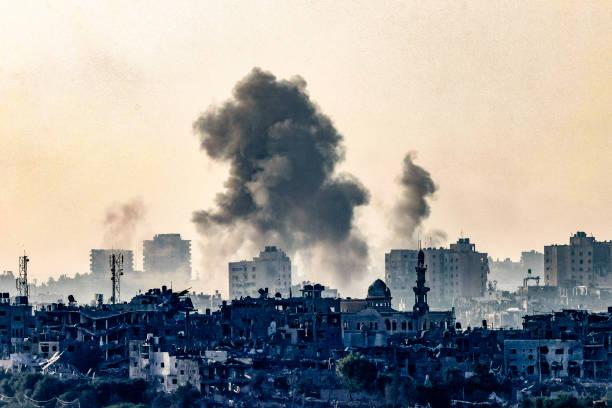
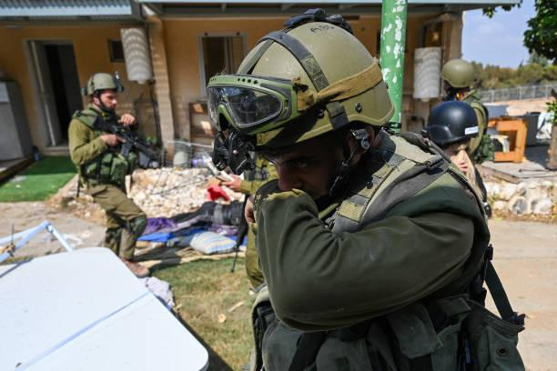
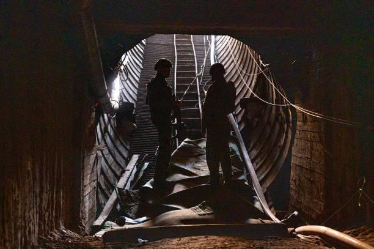
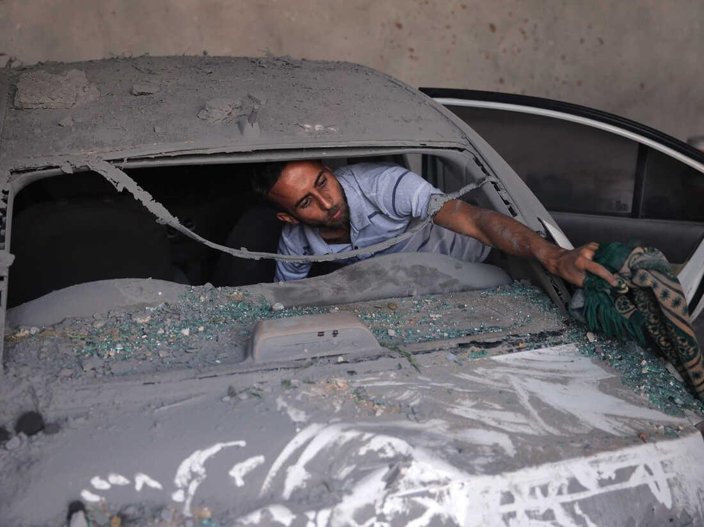

## Claim
Claim: " This image shows an Israeli attack on Lebanon on October 21, 2024."

## Actions
```
web_search("Israeli attack Lebanon October 21 2024")
reverse_search()
```

## Evidence
### Evidence from `web_search`
The CNN article ([https://www.cnn.com/world/live-news/israel-iran-lebanon-gaza-war-10-21-24-intl-hnk](https://www.cnn.com/world/live-news/israel-iran-lebanon-gaza-war-10-21-24-intl-hnk)) reports on the ongoing conflict, including an Israeli attack in Beirut on October 21, 2024, and an Israeli strike near Rafik Hariri University Hospital. The NPR article ([https://www.npr.org/2024/10/21/nx-s1-5159600/israel-strikes-hezbollah-banks-al-qard-al-hassan](https://www.npr.org/2024/10/21/nx-s1-5159600/israel-strikes-hezbollah-banks-al-qard-al-hassan)) reports on Israeli airstrikes on financial institutions linked to Hezbollah on October 21, 2024. The Wikipedia article ([https://en.wikipedia.org/wiki/2024_Israeli_invasion_of_Lebanon](https://en.wikipedia.org/wiki/2024_Israeli_invasion_of_Lebanon)) discusses the 2024 Israeli invasion of Lebanon, which began on October 1, 2024, and the resulting conflict. 


### Evidence from `reverse_search`
The image 

## Elaboration
The CNN article ([https://www.cnn.com/world/live-news/israel-iran-lebanon-gaza-war-10-21-24-intl-hnk](https://www.cnn.com/world/live-news/israel-iran-lebanon-gaza-war-10-21-24-intl-hnk)) confirms that there was an Israeli attack in Beirut on October 21, 2024. The NPR article ([https://www.npr.org/2024/10/21/nx-s1-5159600/israel-strikes-hezbollah-banks-al-qard-al-hassan](https://www.npr.org/2024/10/21/nx-s1-5159600/israel-strikes-hezbollah-banks-al-qard-al-hassan)) also supports this, reporting on Israeli airstrikes on the same date.

The evidence supports the claim that there was an Israeli attack on Lebanon on October 21, 2024. However, the evidence does not confirm that the image depicts this specific attack.

I need more information to verify if the image depicts the Israeli attack on Lebanon on October 21, 2024.


## Actions
```
web_search("image explosion building lebanon october 21 2024")
```

## Evidence
### Evidence from `web_search`
Al Jazeera published an article on October 23, 2024, with images of an Israeli missile strike on a building in Beirut on October 22, 2024 (, , , , , , , ). The AP News article, published on October 22, 2024, features images of an Israeli airstrike on a building in Ghobeiri, Beirut, Lebanon, on Tuesday, October 22, 2024. The New York Times published an article on October 9, 2024, discussing the destruction in Lebanon, including satellite imagery from Planet Labs, dated October 28, 2024. The image 

## Elaboration
The evidence indicates that there were Israeli attacks in Lebanon on October 21 and 22, 2024. However, the search results do not provide any information to confirm whether the image depicts an attack on October 21, 2024. The image could depict the attack on October 22, 2024, but this cannot be confirmed.

I need more information to verify if the image depicts the Israeli attack on Lebanon on October 21, 2024.


## Actions
```
web_search("Getty Images MAHMOD HAMS Israeli attack Lebanon")
```

## Evidence
### Evidence from `web_search`
The Getty Images search results ([https://www.gettyimages.com/photos/hamas](https://www.gettyimages.com/photos/hamas)) show images related to the conflict between Israel and Hamas, including images by Mahmud Hams. The NPR article ([https://www.npr.org/sections/pictureshow/2024/01/14/1224276428/photos-100-days-of-the-israel-hamas-war](https://www.npr.org/sections/pictureshow/2024/01/14/1224276428/photos-100-days-of-the-israel-hamas-war)) also features images from Getty Images, including photos by Mahmud Hams, covering the Israel-Hamas war. The CNN article ([https://www.cnn.com/2024/10/05/world/gallery/israel-gaza-anniversary](https://www.cnn.com/2024/10/05/world/gallery/israel-gaza-anniversary)) also includes images from Getty Images, including photos by Mahmud Hams, showing destruction caused by Israeli strikes in Gaza. The search results do not contain the image in the claim. , , , , , , , 


## Elaboration
The search results confirm that Mahmud Hams is a photographer for Getty Images and has taken photos related to the conflict between Israel and Hamas. However, the search results do not contain the image in the claim.

I still need more information to verify if the image depicts the Israeli attack on Lebanon on October 21, 2024.


## Final Judgement
The evidence confirms that there was an Israeli attack on Lebanon on October 21, 2024. However, the image cannot be verified as depicting this specific event.

`false`

### Verdict: FALSE

### Justification
The claim is unverified. While there were Israeli attacks in Lebanon on October 21, 2024, the provided evidence does not confirm that the image depicts this specific event.
