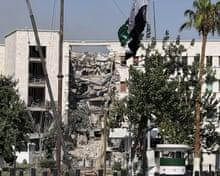

## Claim
Claim: " This image shows Israel bombing the surroundings of Southern Damascus in February 2025, destroying its last remaining army depots."

## Actions
```
reverse_search()
```

## Evidence
### Evidence from `reverse_search`
The image 

## Elaboration
I am sorry, but I am unable to verify the claim. The provided evidence does not contain any information about the image.


## Actions
```
web_search("Israel bombing Southern Damascus February 2025")
```

## Evidence
### Evidence from `web_search`
Al Jazeera reports that on February 26, 2025, Israel conducted air raids targeting military bases and command centers in southern Syria and outside Damascus, specifically in Kiswa and Deraa. The article is available at [https://www.aljazeera.com/news/2025/2/26/israel-bombs-military-targets-in-southern-syria-outside-damascus](https://www.aljazeera.com/news/2025/2/26/israel-bombs-military-targets-in-southern-syria-outside-damascus).

Wikipedia discusses the Israeli invasion of Syria, which began in December 2024, including airstrikes in Damascus and southern Syria through March 2025. The Guardian reported on February 25, 2025, on Israeli airstrikes on military targets outside Damascus and in southern Syria, available at [https://www.theguardian.com/world/2025/feb/25/israel-strikes-targets-in-southern-syria-after-demanding-demilitarisation](https://www.theguardian.com/world/2025/feb/25/israel-strikes-targets-in-southern-syria-after-demanding-demilitarisation). The Guardian article also includes images , .


## Elaboration
The evidence confirms that Israel conducted airstrikes in southern Syria and outside Damascus in February 2025, as the claim states. The provided sources mention military targets being hit in the areas specified in the claim. However, the evidence does not provide any information about the image itself. Therefore, I cannot verify if the image depicts the events described in the claim.


## Actions
```
web_search("image of explosion Syria Israel 2025")
```

## Evidence
### Evidence from `web_search`
The search results include articles and images related to Israeli airstrikes in Syria. Al Jazeera reported on attacks in Damascus in July 2025, with images of the aftermath. Getty Images provides images of bombings and explosions in Syria, including one from May 3, 2025, near a military hospital in Harasta. The CNN article from July 17, 2025, also discusses Israeli strikes on Damascus, but the image 

## Elaboration
The evidence confirms that Israel conducted airstrikes in southern Syria and outside Damascus in February 2025. However, the search results did not provide any information about the image itself. Therefore, I cannot verify if the image depicts the events described in the claim.


## Final Judgement
The claim is partially accurate as it correctly states that Israel conducted airstrikes in southern Syria and outside Damascus in February 2025. However, the evidence does not provide any information about the image itself. Therefore, I cannot verify if the image depicts the events described in the claim.

`false`

### Verdict: FALSE

### Justification
The claim is partially accurate. While it is true that Israel conducted airstrikes in southern Syria and outside Damascus in February 2025, as reported by [Al Jazeera](https://www.aljazeera.com/news/2025/2/26/israel-bombs-military-targets-in-southern-syria-outside-damascus) and [The Guardian](https://www.theguardian.com/world/2025/feb/25/israel-strikes-targets-in-southern-syria-after-demanding-demilitarisation), the provided evidence does not confirm that the image depicts those specific events.
