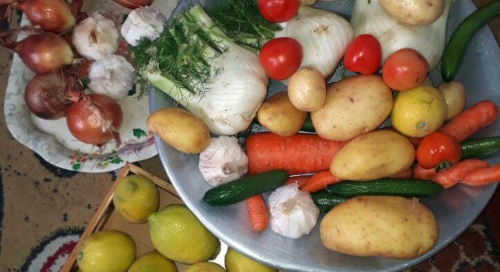
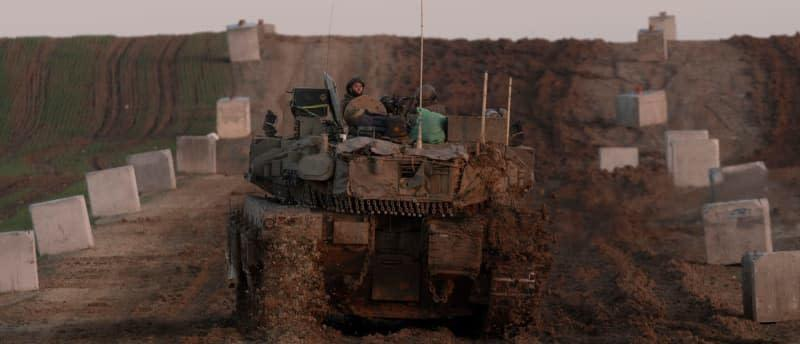

## Claim
Claim: " This image shows a vegetable stand in Gaza in January 2025 with a Merkava tank, the pride of the Israeli army, as its decor."

## Actions
```
reverse_search()
geolocate()
web_search("vegetable stand tank Gaza")
web_search("Merkava tank vegetable stand")
```

## Evidence
### Evidence from `reverse_search`
From [Source](https://en.haberler.com/in-syria-an-abandoned-tank-has-become-a-fruit-and-2027395/): Found exact image on website with title: In Syria, an abandoned tank has become a fruit and vegetable stand.
Content: The search result is from a Turkish news website and contains an image of a tank used as a fruit and vegetable stand.  The article states that the tank was abandoned by regime forces in Syria. The article was published on December 15, 2024. The article also mentions the Operation Dawn of Freedom. The website also contains other news articles.


### Evidence from `geolocate`
The most likely countries where the image was taken are: {'Turkey': 0.26, 'Ukraine': 0.13, 'Palestine': 0.11, 'Russia': 0.11, 'Tunisia': 0.07, 'Bulgaria': 0.06, 'Kyrgyzstan': 0.02, 'Macedonia': 0.02, 'Pakistan': 0.02, 'Albania': 0.01}

### Evidence from `web_search`
The search results discuss the humanitarian crisis in Gaza, including the destruction of the Mirage area, the collapse of the economy, and the lack of food and aid. One article mentions the reoccupation of Gaza and the presence of tanks. The articles include images of vegetables 

### Evidence from `web_search`
The image () shows a Syrian T-55 tank, not an Israeli Merkava tank, modified into a fruit stand. The image was taken in Syria, not Gaza. The article was published on February 3, 2025. ([https://www.aol.com/fact-check-image-claims-show-141025316.html](https://www.aol.com/fact-check-image-claims-show-141025316.html)) The Merkava tank is a series of main battle tanks used by the Israel Defense Forces (IDF). (, )

The Merkava series has been the centerpiece of Israel’s armored corps for more than four decades. The IDF introduced its fifth-generation “Barak” variant in 2023.


## Elaboration
The claim is inaccurate. The image depicts a T-55 tank, not a Merkava tank. The tank is located in Syria, not Gaza. The image was taken before January 2025, as the article was published on February 3, 2025.


## Final Judgement
The image shows a T-55 tank in Syria, not a Merkava tank in Gaza. The image was taken before January 2025.

`false`

### Verdict: FALSE

### Justification
The image depicts a T-55 tank used as a fruit and vegetable stand in Syria, not a Merkava tank in Gaza, as claimed. The image was taken before January 2025, and the tank is not an Israeli Merkava tank, but a Syrian T-55 tank, according to a fact-check from [AOL](https://www.aol.com/fact-check-image-claims-show-141025316.html).
