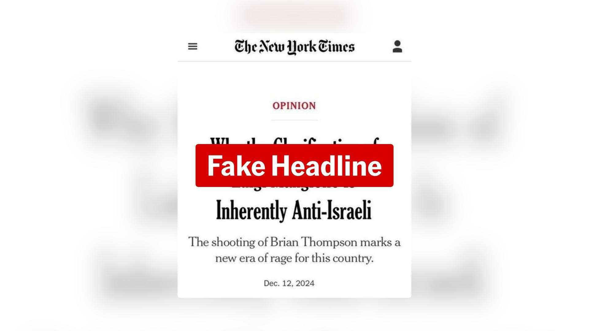

## Claim
Claim: " This image shows a screenshot of an authentic New York Times article from December, 12, 2024 with the title 'Why the Glorification of Luigi Mangione Is Inherently Anti-Israeli."

## Actions
```
web_search("New York Times \"Why the Glorification of Luigi Mangione Is Inherently Anti-Israeli\"")
```

## Evidence
### Evidence from `web_search`
The New York Times did not publish an article with the headline "Why the Glorification of Luigi Mangione Is Inherently Anti-Israeli" (). The image is an edited version of a real article from December 12, 2024. The actual headline is "What the Glorification of Luigi Mangione Reveals About America." The New York Times confirmed the headline was fabricated.

The claim has been debunked by multiple sources, including Yahoo News ([Source](https://www.yahoo.com/news/york-times-didnt-publish-anti-232547549.html)), AAP FactCheck ([Source](https://www.aap.com.au/factcheck/nyt-headline-slamming-anti-israeli-glorification-of-luigi-mangione-is-fake/)), and Media Bias Fact Check ([Source](https://mediabiasfactcheck.com/2024/12/17/mbfcs-daily-vetted-fact-checks-for-12-17-2024/)). , 


## Elaboration
The claim is false. The New York Times did not publish an article with the headline "Why the Glorification of Luigi Mangione Is Inherently Anti-Israeli." The headline was fabricated.


## Final Judgement
The claim is demonstrably false. Multiple reliable sources confirm that the headline in the image is fabricated and does not belong to an authentic New York Times article.

`false`

### Verdict: FALSE

### Justification
The claim is false. The image shows a fabricated headline from The New York Times. Multiple sources, including Yahoo News ([Source](https://www.yahoo.com/news/york-times-didnt-publish-anti-232547549.html)), AAP FactCheck ([Source](https://www.aap.com.au/factcheck/nyt-headline-slamming-anti-israeli-glorification-of-luigi-mangione-is-fake/)), and Media Bias Fact Check ([Source](https://mediabiasfactcheck.com/2024/12/17/mbfcs-daily-vetted-fact-checks-for-12-17-2024/)), confirm that the headline is not authentic.
